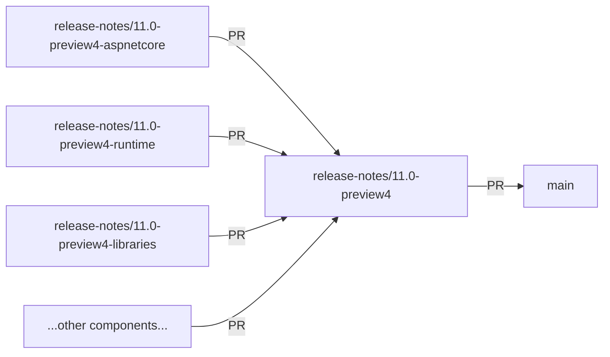

# PR Layout

How the release-notes workflow lays out branches and pull requests for a milestone.

## Goal

Each component team reviews and edits its own file in isolation, without
scanning a single large diff or colliding with other teams' edits on a shared
branch. Shared metadata (`changes.json`, `features.json`, `README.md`,
`build-metadata.json`) lives in one place that all component PRs build on.

## Branch layout per milestone

For a given milestone — example: .NET 11 Preview 4, with version path `11.0`
and milestone slug `preview4`:

| Branch | Contents | PR target |
| ------ | -------- | --------- |
| `release-notes/11.0-preview4` (the **base branch**) | `README.md`, `changes.json`, `features.json`, `build-metadata.json` | `main` |
| `release-notes/11.0-preview4-aspnetcore` | `aspnetcore.md` | base branch |
| `release-notes/11.0-preview4-runtime` | `runtime.md` | base branch |
| `release-notes/11.0-preview4-libraries` | `libraries.md` | base branch |
| `release-notes/11.0-preview4-sdk` | `sdk.md` | base branch |
| `release-notes/11.0-preview4-csharp` | `csharp.md` | base branch |
| `release-notes/11.0-preview4-fsharp` | `fsharp.md` | base branch |
| `release-notes/11.0-preview4-efcore` | `efcore.md` | base branch |
| `release-notes/11.0-preview4-winforms` | `winforms.md` | base branch |
| `release-notes/11.0-preview4-wpf` | `wpf.md` | base branch |
| `release-notes/11.0-preview4-msbuild` | `msbuild.md` | base branch |
| `release-notes/11.0-preview4-nuget` | `nuget.md` | base branch |
| `release-notes/11.0-preview4-containers` | `containers.md` | base branch |
| `release-notes/11.0-preview4-dotnetmaui` | `dotnetmaui.md` | base branch |
| `release-notes/11.0-preview4-visualbasic` (only if VB-specific changes exist) | `visualbasic.md` | base branch |

The set of component branches is derived from
[`component-mapping.md`](component-mapping.md). Components with no noteworthy
changes still get a branch and PR with a [minimal stub](format-template.md).

### Branch naming pattern

- Base branch: `release-notes/{version}-{milestone-slug}`
- Component branch: `release-notes/{version}-{milestone-slug}-{component-suffix}`

Where:

- `{version}` is the major.minor version (e.g. `11.0`)
- `{milestone-slug}` is the directory name under `release-notes/{version}/preview/` or `release-notes/{version}/`, for example `preview4`, `rc1`, or `ga`
- `{component-suffix}` is the component's branch suffix from `component-mapping.md`

### How the merge flows

When all component PRs merge into the base branch, the base PR becomes the
consolidation PR — its diff is the full milestone. There is no separate
consolidation PR to create.

## Pull request conventions

### Title

- Base PR: `[release-notes] .NET {version} {milestone-label}` (e.g. `[release-notes] .NET 11 Preview 4`)
- Component PR: `[release-notes] {Component name} in .NET {version} {milestone-label}` (e.g. `[release-notes] ASP.NET Core in .NET 11 Preview 4`)

### Body

- **Base PR** body: milestone summary, base/head VMR refs, list of component PRs (auto-updated as they open), open questions for human review.
- **Component PR** body: which features are covered, links to source PRs, anything the assignee should verify.

### Labels

All PRs carry `area-release-notes` and `automation` (set by the workflow's
`safe-outputs`). No additional per-component labels are required.

### Assignees

Component PRs are assigned to the default owner(s) listed in
[`component-mapping.md`](component-mapping.md). The base PR is left unassigned —
it merges once all component PRs merge.

### Draft state

Component PRs open as drafts. The agent marks each one ready for review when:

1. The component's section reaches the editorial quality bar
   ([`quality-bar.md`](quality-bar.md))
2. The multi-model review pass ([`review-release-notes`](../../review-release-notes/SKILL.md)) has completed for that file
3. No unresolved blocking comments remain

The base PR stays draft until every component PR is ready for review or merged.

## Reruns

See [`update-existing-branch`](../../update-existing-branch/SKILL.md) for the
incremental rerun protocol across the branch set. Key invariants:

- `changes.json`, `features.json`, and `build-metadata.json` are written to the
  **base branch only**. Component branches never modify them directly; they
  rebase or merge from the base branch to pick up refreshed data.
- Each component branch only ever modifies its own component file. The agent
  never edits another component's file from the wrong branch.
- Human edits on a component branch are preserved on follow-up runs. See the
  `update-existing-branch` skill for the diff/preserve protocol.

## Per-run cap

The agentic-workflow runtime caps each safe-output kind at **10 PRs per run**
(`safe-outputs.create-pull-request.max` and
`safe-outputs.push-to-pull-request-branch.max`). The standard branch set for a
milestone is the base branch plus 13 component branches; if VB-specific
changes exist, add `visualbasic` for a total of 14 component branches.

Implications:

- **Initial seed.** When a brand-new milestone first appears, a single run can
  open at most 10 draft PRs. That is the base PR plus 9 component PRs. The
  remaining component PRs are opened on the next scheduled run (the workflow
  is daily, so the full set is seeded within two runs).
- **Steady state.** Once the set is seeded, each run only pushes updates to
  branches that actually changed. 10 is more than enough headroom in practice
  — most reruns only touch a handful of components. Do not blindly merge or
  rebase the base branch into every component branch on every metadata
  refresh; only do that for components whose markdown is being edited in this
  run.
- **Seed order.** When the cap stops you mid-seed, open PRs in this order so
  the highest-traffic components are seeded first:

  1. `aspnetcore`
  2. `runtime`
  3. `libraries`
  4. `sdk`
  5. `csharp`
  6. `fsharp`
  7. `efcore`
  8. `winforms`
  9. `wpf`
  10. `msbuild`
  11. `nuget`
  12. `containers`
  13. `dotnetmaui`
  14. `visualbasic` (only if VB-specific changes exist)

  Continue from the next uncreated component on the following run.

## Completeness check

Treat a milestone's branch set as **complete** when the base branch exists and
every standard component from `component-mapping.md` has a corresponding
branch and PR (open, merged, or intentionally closed by a human). Skip
`visualbasic` from the completeness check unless VB-specific changes exist for
the milestone. If a component PR is missing because a previous run hit the
safe-output cap, the set is **partial**, not complete, and the next run should
create the missing PRs in seed order.

## README on the base branch

`README.md` lives on the base branch and may link to all planned component
files before those component PRs are merged. While the milestone is in
progress, broken links are expected — the base PR is draft until every
component PR is merged or intentionally closed, at which point the README's
links resolve against the merged-in component files.
