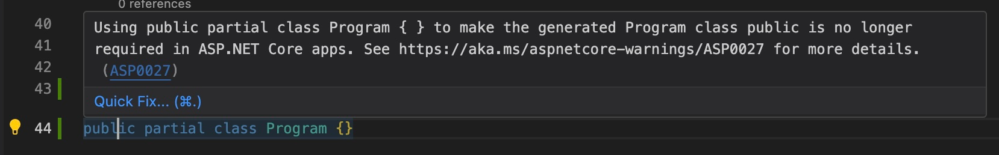

# ASP.NET Core in .NET 10 Preview 1 - Release Notes

Here's a summary of what's new in ASP.NET Core in this preview release:

- [OpenAPI 3.1 support](#openapi-31-support)
- [Generate OpenAPI documents in YAML format](#generate-openapi-documents-in-yaml-format)
- [Response description on `ProducesResponseType`](#response-description-on-producesresponsetype)
- [Detect if URL is local using `RedirectHttpResult.IsLocalUrl`](#detect-if-url-is-local-using-redirecthttpresultislocalurl)
- [Improvements to integration testing of apps with top-level statements](#improvements-to-integration-testing-of-apps-with-top-level-statements)
- [QuickGrid `RowClass` parameter](#quickgrid-rowclass-parameter)
- [Blazor script as a static web asset](#blazor-script-as-a-static-web-asset)
- [Route syntax highlighting for Blazor `RouteAttribute`](#route-syntax-highlighting-for-blazor-routeattribute)

ASP.NET Core updates in .NET 10 Preview 1:

- [Release notes](aspnetcore.md)
- [What's new in ASP.NET Core in .NET 10](https://learn.microsoft.com/aspnet/core/release-notes/aspnetcore-10.0) documentation.
- [Breaking changes](https://docs.microsoft.com/dotnet/core/compatibility/10.0#aspnet-core)
- [Roadmap](https://github.com/dotnet/aspnetcore/issues/59443)

.NET 10 Preview 1:

- [Discussion](https://aka.ms/dotnet/10/preview1)
- [Release notes](README.md)

## OpenAPI 3.1 support

ASP.NET Core has added support for generating [OpenAPI version 3.1](https://spec.openapis.org/oas/v3.1.1.html) documents in .NET 10. Despite the minor version bump, OpenAPI 3.1 is a significant update to the OpenAPI specification, with full support for [JSON Schema draft 2020-12](https://json-schema.org/specification-links#2020-12). For example, nullable types in OpenAPI 3.1 no longer have the `nullable: true` schema property, but instead have a `type` keyword whose value is an array that includes `null` as one of the types.

In .NET 10, the default OpenAPI version for generated documents will be 3.1, but you can easily change this by explicitly setting the `OpenApiVersion` property of the `OpenApiOptions` in the `configureOptions` delegate parameter of `AddOpenApi`.

```csharp
builder.Services.AddOpenApi(options =>
{
    // Specify the OpenAPI version to use.
    options.OpenApiVersion = Microsoft.OpenApi.OpenApiSpecVersion.OpenApi3_0;
});
```

If you are generating the OpenAPI document at build time, you can select the OpenAPI version by setting the `--openapi-version` in the `OpenApiGenerateDocumentsOptions` MSBuild property.

```xml
<!-- Configure build-time OpenAPI generation to produce an OpenAPI 3.0 document. -->
<OpenApiGenerateDocumentsOptions>--openapi-version OpenApi3_0</OpenApiGenerateDocumentsOptions>
```

### Breaking changes

Support for OpenAPI 3.1 requires an update to the underlying [OpenAPI.NET](https://github.com/microsoft/OpenAPI.NET) library to a new major version, 2.0. This new version has some breaking changes from the previous version that may impact your applications if you have any document, operation, or schema transformers. Perhaps the most significant change is that the `OpenApiAny` class has been dropped in favor of using `JsonNode` directly. If your transformers use `OpenApiAny`, you will need to update them to use `JsonNode` instead.

For example, a schema transformer to add an example in .NET 9 might look like this:

```csharp
options.AddSchemaTransformer((schema, context, cancellationToken) =>
{
    if (context.JsonTypeInfo.Type == typeof(WeatherForecast))
    {
        schema.Example = new OpenApiObject
        {
            ["date"] = new OpenApiString(DateTime.Now.AddDays(1).ToString("yyyy-MM-dd")),
            ["temperatureC"] = new OpenApiInteger(0),
            ["temperatureF"] = new OpenApiInteger(32),
            ["summary"] = new OpenApiString("Bracing"),
        };
    }
    return Task.CompletedTask;
});
```

In .NET 10 the transformer to do the same task looks like this:

```csharp
options.AddSchemaTransformer((schema, context, cancellationToken) =>
{
    if (context.JsonTypeInfo.Type == typeof(WeatherForecast))
    {
        schema.Example = new JsonObject
        {
            ["date"] = DateTime.Now.AddDays(1).ToString("yyyy-MM-dd"),
            ["temperatureC"] = 0,
            ["temperatureF"] = 32,
            ["summary"] = "Bracing",
        };
    }
    return Task.CompletedTask;
});
```

Note that these code changes will be necessary even if you configure the OpenAPI version to 3.0.

## Generate OpenAPI documents in YAML format

ASP.NET now supports serving the generated OpenAPI document in YAML format. YAML can be more concise than JSON, eliminating curly braces and quotation marks when these can be inferred. YAML also supports multi-line strings, which can be useful for long descriptions.

To configure your application to serve the generated OpenAPI document in YAML format, specify the endpoint in the MapOpenApi call with a ".yaml" or ".yml" suffix, as shown in this example:

```csharp
app.MapOpenApi("/openapi/{documentName}.yaml");
```

Support for YAML is currently only available when served at runtime from the OpenAPI endpoint. Support for generating OpenAPI documents in YAML format at build time will be added in a future preview.

## Response description on `ProducesResponseType`

`ProducesAttribute`, `ProducesResponseTypeAttribute`, and `ProducesDefaultResponseType` now accept an optional string parameter, `Description`, that will set the description of the response in the generated OpenAPI document.

For example:

```csharp
[HttpGet(Name = "GetWeatherForecast")]
[ProducesResponseType<IEnumerable<WeatherForecast>>(StatusCodes.Status200OK, Description = "The weather forecast for the next 5 days.")]
public IEnumerable<WeatherForecast> Get()
{
    ...
}
```

Generated OpenAPI response:

```json
"responses": {
  "200": {
    "description": "The weather forecast for the next 5 days.",
    "content": { ... }
  }
}
```

Thank you [sander1095](https://github.com/sander1095) for this contribution!

## Detect if URL is local using `RedirectHttpResult.IsLocalUrl`

Use the new `RedirectHttpResult.IsLocalUrl(url)` helper method to detect if a URL is local. A URL is considered local if it does not have the host or authority part and it has an absolute path. This method is useful for validating URLs before redirecting to them to prevent open redirection attacks.

```csharp
if (RedirectHttpResult.IsLocalUrl(url))
{
    return Results.LocalRedirect(url);
}
```

Thank you [@martincostello](https://github.com/martincostello) for this contribution!

## Improvements to integration testing of apps with top-level statements

.NET 10 now has better support for testing apps that use top-level statements. Previously developers had to manually add `public partial class Program` to the *Program.cs* file so that the test project could reference the `Program` class. This is because the top-level statement feature in C# 9 generated a `Program` class that was declared as internal.

In .NET 10, a source generator is used to generate the `public partial class Program` declaration if the developer did not declare it explicitly. In addition, an analyzer was added to detect when `public partial class Program` is declared explicitly and advise the developer to remove it.



## QuickGrid `RowClass` parameter

Apply a stylesheet class to a row of the grid based on the row item using the new `RowClass` parameter. In the following example, the `ApplyRowStyle` method is called on each row to conditionally apply a stylesheet class based on the row item:

```razor
<QuickGrid ... RowClass="ApplyRowStyle">
    ...
</QuickGrid>

@code {
    private string ApplyRowStyle({TYPE} rowItem) =>
        rowItem.{PROPERTY} == {VALUE} ? "{CSS STYLE CLASS}" : null;
}
```

For more information, see [Style a table row based on the row item](https://learn.microsoft.com/aspnet/core/blazor/components/quickgrid?view=aspnetcore-10.0&#style-a-table-row-based-on-the-row-item).

## Blazor script as a static web asset

In prior releases of .NET, the Blazor framework script is served from an embedded resource in the ASP.NET Core shared framework. In .NET 10, the Blazor script is now served as a static web asset with automatic precompression and fingerprinting enabled to reduce the download size and improve caching of the file.

Size comparison for *blazor.web.js* in .NET 10:

- **Uncompressed**: 183 KB
- **Precompressed**: 43 KB
- **Size reduction**: 76%

## Route syntax highlighting for Blazor `RouteAttribute`

The `RouteAttribute` in Blazor now supports route syntax highlighting to help visualize the structure of the route template.

Thank you [@IEvangelist](https://github.com/IEvangelist) for this contribution!

## Community contributors

Thank you contributors! ❤️

- [@AliKhalili](https://github.com/dotnet/aspnetcore/pulls?q=is%3Apr+is%3Amerged+milestone%3A10.0-preview1+author%3AAliKhalili)
- [@am11](https://github.com/dotnet/aspnetcore/pulls?q=is%3Apr+is%3Amerged+milestone%3A10.0-preview1+author%3Aam11)
- [@andrewjsaid](https://github.com/dotnet/aspnetcore/pulls?q=is%3Apr+is%3Amerged+milestone%3A10.0-preview1+author%3Aandrewjsaid)
- [@AshkanAfsharpour](https://github.com/dotnet/aspnetcore/pulls?q=is%3Apr+is%3Amerged+milestone%3A10.0-preview1+author%3AAshkanAfsharpour)
- [@bhaskarqlik](https://github.com/dotnet/aspnetcore/pulls?q=is%3Apr+is%3Amerged+milestone%3A10.0-preview1+author%3Abhaskarqlik)
- [@bradmarder](https://github.com/dotnet/aspnetcore/pulls?q=is%3Apr+is%3Amerged+milestone%3A10.0-preview1+author%3Abradmarder)
- [@bretthoes](https://github.com/dotnet/aspnetcore/pulls?q=is%3Apr+is%3Amerged+milestone%3A10.0-preview1+author%3Abretthoes)
- [@BurkusCat](https://github.com/dotnet/aspnetcore/pulls?q=is%3Apr+is%3Amerged+milestone%3A10.0-preview1+author%3ABurkusCat)
- [@chenguohui](https://github.com/dotnet/aspnetcore/pulls?q=is%3Apr+is%3Amerged+milestone%3A10.0-preview1+author%3Achenguohui)
- [@ChrisAnn](https://github.com/dotnet/aspnetcore/pulls?q=is%3Apr+is%3Amerged+milestone%3A10.0-preview1+author%3AChrisAnn)
- [@chrisoverzero](https://github.com/dotnet/aspnetcore/pulls?q=is%3Apr+is%3Amerged+milestone%3A10.0-preview1+author%3Achrisoverzero)
- [@ctolkien](https://github.com/dotnet/aspnetcore/pulls?q=is%3Apr+is%3Amerged+milestone%3A10.0-preview1+author%3Actolkien)
- [@david-acker](https://github.com/dotnet/aspnetcore/pulls?q=is%3Apr+is%3Amerged+milestone%3A10.0-preview1+author%3Adavid-acker)
- [@ErisApps](https://github.com/dotnet/aspnetcore/pulls?q=is%3Apr+is%3Amerged+milestone%3A10.0-preview1+author%3AErisApps)
- [@feiyun0112](https://github.com/dotnet/aspnetcore/pulls?q=is%3Apr+is%3Amerged+milestone%3A10.0-preview1+author%3Afeiyun0112)
- [@gnerkus](https://github.com/dotnet/aspnetcore/pulls?q=is%3Apr+is%3Amerged+milestone%3A10.0-preview1+author%3Agnerkus)
- [@hwoodiwiss](https://github.com/dotnet/aspnetcore/pulls?q=is%3Apr+is%3Amerged+milestone%3A10.0-preview1+author%3Ahwoodiwiss)
- [@ithline](https://github.com/dotnet/aspnetcore/pulls?q=is%3Apr+is%3Amerged+milestone%3A10.0-preview1+author%3Aithline)
- [@jgarciadelanoceda](https://github.com/dotnet/aspnetcore/pulls?q=is%3Apr+is%3Amerged+milestone%3A10.0-preview1+author%3Ajgarciadelanoceda)
- [@joegoldman2](https://github.com/dotnet/aspnetcore/pulls?q=is%3Apr+is%3Amerged+milestone%3A10.0-preview1+author%3Ajoegoldman2)
- [@JTeeuwissen](https://github.com/dotnet/aspnetcore/pulls?q=is%3Apr+is%3Amerged+milestone%3A10.0-preview1+author%3AJTeeuwissen)
- [@ladeak](https://github.com/dotnet/aspnetcore/pulls?q=is%3Apr+is%3Amerged+milestone%3A10.0-preview1+author%3Aladeak)
- [@marcominerva](https://github.com/dotnet/aspnetcore/pulls?q=is%3Apr+is%3Amerged+milestone%3A10.0-preview1+author%3Amarcominerva)
- [@martincostello](https://github.com/dotnet/aspnetcore/pulls?q=is%3Apr+is%3Amerged+milestone%3A10.0-preview1+author%3Amartincostello)
- [@MattyLeslie](https://github.com/dotnet/aspnetcore/pulls?q=is%3Apr+is%3Amerged+milestone%3A10.0-preview1+author%3AMattyLeslie)
- [@melotic](https://github.com/dotnet/aspnetcore/pulls?q=is%3Apr+is%3Amerged+milestone%3A10.0-preview1+author%3Amelotic)
- [@onurkanbakirci](https://github.com/dotnet/aspnetcore/pulls?q=is%3Apr+is%3Amerged+milestone%3A10.0-preview1+author%3Aonurkanbakirci)
- [@OrganizationUsername](https://github.com/dotnet/aspnetcore/pulls?q=is%3Apr+is%3Amerged+milestone%3A10.0-preview1+author%3AOrganizationUsername)
- [@OwnageIsMagic](https://github.com/dotnet/aspnetcore/pulls?q=is%3Apr+is%3Amerged+milestone%3A10.0-preview1+author%3AOwnageIsMagic)
- [@paulomorgado](https://github.com/dotnet/aspnetcore/pulls?q=is%3Apr+is%3Amerged+milestone%3A10.0-preview1+author%3Apaulomorgado)
- [@polatengin](https://github.com/dotnet/aspnetcore/pulls?q=is%3Apr+is%3Amerged+milestone%3A10.0-preview1+author%3Apolatengin)
- [@RobCannon](https://github.com/dotnet/aspnetcore/pulls?q=is%3Apr+is%3Amerged+milestone%3A10.0-preview1+author%3ARobCannon)
- [@rsandbach](https://github.com/dotnet/aspnetcore/pulls?q=is%3Apr+is%3Amerged+milestone%3A10.0-preview1+author%3Arsandbach)
- [@sander1095](https://github.com/dotnet/aspnetcore/pulls?q=is%3Apr+is%3Amerged+milestone%3A10.0-preview1+author%3Asander1095)
- [@scottlwalker](https://github.com/dotnet/aspnetcore/pulls?q=is%3Apr+is%3Amerged+milestone%3A10.0-preview1+author%3Ascottlwalker)
- [@shethaadit](https://github.com/dotnet/aspnetcore/pulls?q=is%3Apr+is%3Amerged+milestone%3A10.0-preview1+author%3Ashethaadit)
- [@S-Luiten](https://github.com/dotnet/aspnetcore/pulls?q=is%3Apr+is%3Amerged+milestone%3A10.0-preview1+author%3AS-Luiten)
- [@Smaug123](https://github.com/dotnet/aspnetcore/pulls?q=is%3Apr+is%3Amerged+milestone%3A10.0-preview1+author%3ASmaug123)
- [@tikap](https://github.com/dotnet/aspnetcore/pulls?q=is%3Apr+is%3Amerged+milestone%3A10.0-preview1+author%3Atikap)
- [@v-firzha](https://github.com/dotnet/aspnetcore/pulls?q=is%3Apr+is%3Amerged+milestone%3A10.0-preview1+author%3Av-firzha)
- [@WeihanLi](https://github.com/dotnet/aspnetcore/pulls?q=is%3Apr+is%3Amerged+milestone%3A10.0-preview1+author%3AWeihanLi)
- [@WhatzGames](https://github.com/dotnet/aspnetcore/pulls?q=is%3Apr+is%3Amerged+milestone%3A10.0-preview1+author%3AWhatzGames)
- [@whoaskedfrfr](https://github.com/dotnet/aspnetcore/pulls?q=is%3Apr+is%3Amerged+milestone%3A10.0-preview1+author%3Awhoaskedfrfr)
- [@whysocket](https://github.com/dotnet/aspnetcore/pulls?q=is%3Apr+is%3Amerged+milestone%3A10.0-preview1+author%3Awhysocket)
- [@wokket](https://github.com/dotnet/aspnetcore/pulls?q=is%3Apr+is%3Amerged+milestone%3A10.0-preview1+author%3Awokket)
- [@WretchedDade](https://github.com/dotnet/aspnetcore/pulls?q=is%3Apr+is%3Amerged+milestone%3A10.0-preview1+author%3AWretchedDade)
- [@xC0dex](https://github.com/dotnet/aspnetcore/pulls?q=is%3Apr+is%3Amerged+milestone%3A10.0-preview1+author%3AxC0dex)
