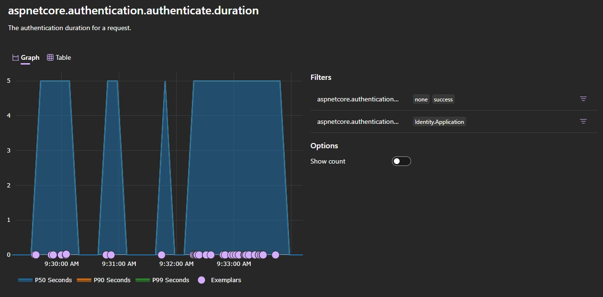

# ASP.NET Core in .NET 10 Preview 2 - Release Notes

Here's a summary of what's new in ASP.NET Core in this preview release:

- [Reconnection UI component added to the Blazor Web App project template](#reconnection-ui-component-added-to-the-blazor-web-app-project-template)
- [`NavigateTo` no longer scrolls to the top for same page navigations](#navigateto-no-longer-scrolls-to-the-top-for-same-page-navigations)
- [Ignore query string and fragment when using `NavLinkMatch.All`](#ignore-query-string-and-fragment-when-using-navlinkmatchall)
- [Close `QuickGrid` column options](#close-quickgrid-column-options)
- [Populate XML doc comments into OpenAPI document](#populate-xml-doc-comments-into-openapi-document)
- [Upgrade to OpenAPI.NET v2.0.0-preview7](#upgrade-to-openapinet-v200-preview7)
- [Treat empty strings in form posts as `null` for nullable value types](#treat-empty-strings-in-form-posts-as-null-for-nullable-value-types)
- [New authentication and authorization metrics](#new-authentication-and-authorization-metrics)

ASP.NET Core updates in .NET 10 Preview 2:

- [What's new in ASP.NET Core in .NET 10](https://learn.microsoft.com/aspnet/core/release-notes/aspnetcore-10.0) documentation.
- [Breaking changes](https://docs.microsoft.com/dotnet/core/compatibility/10.0#aspnet-core)
- [Roadmap](https://github.com/dotnet/aspnetcore/issues/59443)

.NET 10 Preview 2:

- [Discussion](https://aka.ms/dotnet/10/preview2)
- [Release notes](README.md)

## Reconnection UI component added to the Blazor Web App project template

The Blazor Web App project template now includes a `ReconnectModal` component, including collocated stylesheet and JavaScript files, for improved developer control over the reconnection UI when the client loses the WebSocket connection to the server. The component doesn't insert styles programmatically, ensuring compliance with stricter Content Security Policy (CSP) settings for the `style-src` policy. A default reconnection UI is still used as fallback when the app doesn't define its own reconnection UI.

New reconnection UI features:

- Apart from indicating the reconnection state by setting a specific CSS class on the reconnection UI element, the new `components-reconnect-state-changed` event is dispatched for reconnection state changes.
- Code can better differentiate the stages of the reconnection process with the new reconnection state "`retrying`," indicated by both the CSS class and the new event.

## `NavigateTo` no longer scrolls to the top for same page navigations

Previously, when using `NavigateTo` to navigate to the same page in a Blazor app with an interactive router, the browser would scroll to the top of the page. This behavior has been changed in .NET 10 so that the browser will no longer scroll to the top of the page when navigating to the same page. This means the viewport will no longer be reset when making updates to the address for the current page, such as changing the query string or fragment. Similarly, the scroll position will be preserved for backwards and forwards navigations.

## Ignore query string and fragment when using `NavLinkMatch.All`

The `NavLink` component will now ignore the query string and fragment when using the `NavLinkMatch.All` value for the `Match` parameter. This means that the link will still have the `active` class if the URL path matches but the query string or fragment change. To revert to the original behavior, use the `Microsoft.AspNetCore.Components.Routing.NavLink.DisableMatchAllIgnoresLeftUriPart` [AppContext](https://learn.microsoft.com/dotnet/fundamentals/runtime-libraries/system-appcontext) switch.

You can also now override the `ShouldMatch` method on `NavLink` to customize the matching behavior:

```csharp
public class MyNavLink : NavLink
{
    protected override bool ShouldMatch(string currentUriAbsolute)
    {
        // Custom matching logic.
    }
}
```

## Close `QuickGrid` column options

You can now close the `QuickGrid` column options UI using the new `CloseColumnOptionsAsync` method.

The following example uses `CloseColumnOptionsAsync` method to close the column options UI as soon as the title filter is applied:

```razor
<QuickGrid @ref="movieGrid" Items="movies">
    <PropertyColumn Property="@(m => m.Title)" Title="Title">
        <ColumnOptions>
            <input type="search" @bind="titleFilter" placeholder="Filter by title" 
                @bind:after="@(() => movieGrid.CloseColumnOptionsAsync())" />
        </ColumnOptions>
    </PropertyColumn>
    <PropertyColumn Property="@(m => m.Genre)" Title="Genre" />
    <PropertyColumn Property="@(m => m.ReleaseYear)" Title="Release Year" />
</QuickGrid>

@code {
    private QuickGrid<Movie>? movieGrid;
    private string titleFilter = string.Empty;
    private IQueryable<Movie> movies = new List<Movie> { ... }.AsQueryable();
    private IQueryable<Movie> filteredMovies => 
        movies.Where(m => m.Title!.Contains(titleFilter));
}
```

Thank you [@matthetherington](https://github.com/matthetherington) for this contribution!

## Populate XML doc comments into OpenAPI document

ASP.NET Core OpenAPI document generation will now include metadata from XML doc comments on  method, class, and member definitions in the OpenAPI document. You must enable XML doc comments in your project file to use this feature. You can do this by adding the following property to your project file:

```xml
<PropertyGroup>
  <GenerateDocumentationFile>true</GenerateDocumentationFile>
</PropertyGroup>
```

At build-time, the OpenAPI package will leverage a source generator to discover XML comments in the current app assembly and any project references and emit source code to insert them into the document via an OpenAPI document transformer.

Note that the C# build process doesn't capture XML doc comments placed on lambda expressions; so to use XML doc comments to add metadata to a minimal API endpoint, you must define the endpoint handler as a method, put the XML doc comments on the method, and then reference that method from the `MapXXX` method.

For example, to use XML doc comments to add metadata to this minimal API endpoint originally defined as a lambda expression:

```csharp
app.MapGet("/hello", (string name) =>$"Hello, {name}!");
```

Change the `MapGet` call to reference a method:

```csharp
app.MapGet("/hello", Hello);
```

Then define the `Hello` method with XML doc comments:

```csharp
static partial class Program
{
    /// <summary>
    /// Sends a greeting.
    /// </summary>
    /// <remarks>
    /// Greeting a person by their name.
    /// </remarks>
    /// <param name="name">The name of the person to greet.</param>
    /// <returns>A greeting.</returns>
    public static string Hello(string name)
    {
        return $"Hello, {name}!";
    }
}
```

Here the `Hello` method is added to the `Program` class, but you can add it to any class in your project.

The example above illustrates the `<summary>`, `<remarks>`, and `<param>` XML doc comments. For more information about XML doc comments, including all the supported tags, see the [C# documentation](https://learn.microsoft.com/dotnet/csharp/language-reference/xmldoc/recommended-tags).

Since the core functionality is provided via a source generator, it can be disabled by adding the following MSBuild configuration to your project file:

```xml
<ItemGroup>
  <PackageReference Include="Microsoft.AspNetCore.OpenApi" Version="10.0.0-preview.2.*" GeneratePathProperty="true" />
</ItemGroup>

<Target Name="DisableCompileTimeOpenApiXmlGenerator" BeforeTargets="CoreCompile">
  <ItemGroup>
    <Analyzer Remove="$(PkgMicrosoft_AspNetCore_OpenApi)/analyzers/dotnet/cs/Microsoft.AspNetCore.OpenApi.SourceGenerators.dll" />
  </ItemGroup>
</Target>
```

The source generator processes XML files included in the `AdditionalFiles` property. To add (or remove) sources, modify the property as follows:

```xml
<Target Name="AddXmlSources" BeforeTargets="CoreCompile">
  <ItemGroup>
    <AdditionalFiles Include="$(PkgSome_Package)/lib/net10.0/Some.Package.xml" />
  </ItemGroup>
</Target>
```

## Upgrade to OpenAPI.NET v2.0.0-preview7

The OpenAPI.NET library used in ASP.NET Core OpenAPI document generation has been upgraded to [v2.0.0-preview7](https://www.nuget.org/packages/Microsoft.OpenApi/2.0.0-preview7). This version includes a number of bug fixes and improvements and also introduces some breaking changes. The breaking changes should only impact users that use document, operation, or schema transformers. Breaking changes in this iteration include the following:

- Entities within the OpenAPI document, such as operations and parameters, are typed as interfaces. Concrete implementations exist for the inlined and referenced variants of an entity. For example, an `IOpenApiSchema` can be an inlined `OpenApiSchema` or an `OpenApiSchemaReference` that points to a schema defined elsewhere in the document.
- The `Nullable` property has been removed from the `OpenApiSchema` type. To determine if a type is nullable, evaluate if the `OpenApiSchema.Type` property sets `JsonSchemaType.Null`.

## Treat empty strings in form posts as `null` for nullable value types

When using the `[FromForm]` attribute with a complex object in minimal APIs, empty string values in a form post are now converted to `null` rather than causing a parse failure. This behavior matches the processing logic for form posts not associated with complex object's in minimal APIs.

```csharp
using Microsoft.AspNetCore.Http;

var builder = WebApplication.CreateBuilder(args);

var app = builder.Build();

app.MapPost("/todo", ([FromForm] Todo todo) => TypedResults.Ok(todo));

app.Run();

public class Todo
{
  public int Id { get; set; }
  public DateOnly? DueDate { get; set; } // Empty strings map to `null`
  public string Title { get; set; }
  public bool IsCompleted { get; set; }
}
```

Thank you [@nvmkpk](https://github.com/nvmkpk) for this contribution!

## New authentication and authorization metrics

We added metrics for the following authentication and authorization events in ASP.NET Core:

- Authentication:
  - Authenticated request duration
  - Challenge count
  - Forbid count
  - Sign in count
  - Sign out count
- Authorization:
  - Count of requests requiring authorization

The following image shows an example of the Authenticated request duration metric in the Aspire dashboard:



## Community contributors

Thank you contributors! ❤️

- [@JelleHissink](https://github.com/dotnet/aspnetcore/pulls?q=is%3Apr+is%3Amerged+milestone%3A10.0-preview2+author%3AJelleHissink)
- [@WeihanLi](https://github.com/dotnet/aspnetcore/pulls?q=is%3Apr+is%3Amerged+milestone%3A10.0-preview2+author%3AWeihanLi)
- [@am11](https://github.com/dotnet/aspnetcore/pulls?q=is%3Apr+is%3Amerged+milestone%3A10.0-preview2+author%3Aam11)
- [@clegoz](https://github.com/dotnet/aspnetcore/pulls?q=is%3Apr+is%3Amerged+milestone%3A10.0-preview2+author%3Aclegoz)
- [@dlosch](https://github.com/dotnet/aspnetcore/pulls?q=is%3Apr+is%3Amerged+milestone%3A10.0-preview2+author%3Adlosch)
- [@gekka](https://github.com/dotnet/aspnetcore/pulls?q=is%3Apr+is%3Amerged+milestone%3A10.0-preview2+author%3Agekka)
- [@lextm](https://github.com/dotnet/aspnetcore/pulls?q=is%3Apr+is%3Amerged+milestone%3A10.0-preview2+author%3Alextm)
- [@marcusber](https://github.com/dotnet/aspnetcore/pulls?q=is%3Apr+is%3Amerged+milestone%3A10.0-preview2+author%3Amarcusber)
- [@marleypowell](https://github.com/dotnet/aspnetcore/pulls?q=is%3Apr+is%3Amerged+milestone%3A10.0-preview2+author%3Amarleypowell)
- [@martincostello](https://github.com/dotnet/aspnetcore/pulls?q=is%3Apr+is%3Amerged+milestone%3A10.0-preview2+author%3Amartincostello)
- [@matthetherington](https://github.com/dotnet/aspnetcore/pulls?q=is%3Apr+is%3Amerged+milestone%3A10.0-preview2+author%3Amatthetherington)
- [@murshex](https://github.com/dotnet/aspnetcore/pulls?q=is%3Apr+is%3Amerged+milestone%3A10.0-preview2+author%3Amurshex)
- [@nvmkpk](https://github.com/dotnet/aspnetcore/pulls?q=is%3Apr+is%3Amerged+milestone%3A10.0-preview2+author%3Anvmkpk)
- [@sgarnovsky](https://github.com/dotnet/aspnetcore/pulls?q=is%3Apr+is%3Amerged+milestone%3A10.0-preview2+author%3Asgarnovsky)
- [@shethaadit](https://github.com/dotnet/aspnetcore/pulls?q=is%3Apr+is%3Amerged+milestone%3A10.0-preview2+author%3Ashethaadit)
- [@xC0dex](https://github.com/dotnet/aspnetcore/pulls?q=is%3Apr+is%3Amerged+milestone%3A10.0-preview2+author%3AxC0dex)
- [@zuizuihao](https://github.com/dotnet/aspnetcore/pulls?q=is%3Apr+is%3Amerged+milestone%3A10.0-preview2+author%3Azuizuihao)
