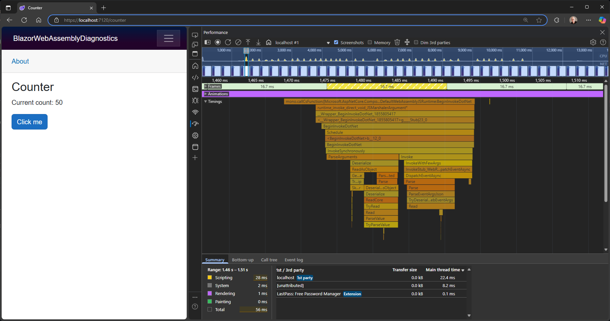

# ASP.NET Core in .NET 10 Preview 4 - Release Notes

Here's a summary of what's new in ASP.NET Core in this preview release:

- [JSON Patch with System.Text.Json](#json-patch-with-systemtextjson)
- [Minimal API validation for record types](#minimal-api-validation-for-record-types)
- [Generate OpenAPI schemas in transformers](#generate-openapi-schemas-in-transformers)
- [Improved OpenAPI XML documentation support](#improved-openapi-xml-documentation-support)
- [Access the OpenAPI document with `IOpenApiDocumentProvider`](#access-the-openapi-document-with-iopenapidocumentprovider)
- [OpenAPI.NET updated to Preview.17](#openapinet-updated-to-preview17)
- [JavaScript interop for constructors and properties](#javascript-interop-for-constructors-and-properties)
- [Reference a JavaScript function with `IJSObjectReference`](#reference-a-javascript-function-with-ijsobjectreference)
- [Blazor WebAssembly runtime diagnostics](#blazor-webassembly-runtime-diagnostics)
- [Signal Not Found responses using `NavigationManager`](#signal-not-found-responses-using-navigationmanager)
- [`NavigationManager.NavigateTo` no longer throws a `NavigationException`](#navigationmanagernavigateto-no-longer-throws-a-navigationexception)
- [`QuickGrid` method `CloseColumnOptionsAsync` renamed to `HideColumnOptionsAsync`](#quickgrid-method-closecolumnoptionsasync-renamed-to-hidecolumnoptionsasync)
- [`WriteImportMapToHtml` renamed to `OverrideHtmlAssetPlaceholders`](#writeimportmaptohtml-renamed-to-overridehtmlassetplaceholders)
- [Preload Blazor framework static assets](#preload-blazor-framework-static-assets)
- [Blazor WebAssembly Standalone App template updates](#blazor-webassembly-standalone-app-template-updates)
- [Blazor boot manifest merged into dotnet.js](#blazor-boot-manifest-merged-into-dotnetjs)
- [Use `WebApplicationFactory` with Kestrel for integration testing](#use-webapplicationfactory-with-kestrel-for-integration-testing)

ASP.NET Core updates in .NET 10:

- [What's new in ASP.NET Core in .NET 10](https://learn.microsoft.com/aspnet/core/release-notes/aspnetcore-10.0) documentation.
- [Breaking changes](https://docs.microsoft.com/dotnet/core/compatibility/10.0#aspnet-core)
- [Roadmap](https://github.com/dotnet/aspnetcore/issues/59443)

## JSON Patch with System.Text.Json

JSON Patch is a standard format for describing changes to apply to a JSON document, defined in [RFC 6902](https://tools.ietf.org/html/rfc6902). It represents a sequence of operations (e.g., add, remove, replace, move, copy, test) that can be applied to modify a JSON document. In web applications, JSON Patch is commonly used in a PATCH operation to perform partial updates of a resource. Instead of sending the entire resource for an update, clients can send a JSON Patch document containing only the changes. This reduces payload size and improves efficiency.

This release introduces a new implementation of [JSON Patch (RFC 6902)](https://tools.ietf.org/html/rfc6902) for ASP.NET Core based on `System.Text.Json`. This new implementation provides improved performance and reduced memory usage compared to the existing `Newtonsoft.Json` based implementation.

To enable JSON Patch support with `System.Text.Json`, use the `Microsoft.AspNetCore.JsonPatch.SystemTextJson` NuGet package. This package provides a `JsonPatchDocument<T>` class to represent a JSON Patch document for objects of type `T` and custom logic for serializing and deserializing JSON Patch documents using `System.Text.Json`. The key method of the `JsonPatchDocument<T>` class is `ApplyTo`, which applies the patch operations to a target object of type `T`.

Note that the new `System.Text.Json` implementation of JSON Patch isn't a complete drop-in replacement for the existing `Newtonsoft.Json` based implementation. In particular, the new implementation doesn't support dynamic types (like `ExpandoObject`).

The following examples demonstrate how to use the `ApplyTo` method to apply a JSON Patch document to an object.

The example demonstrates:

1. The "add", "replace", and "remove" operations.
2. Operations on nested properties.
3. Adding a new item to an array.
4. Using a JSON String Enum Converter in a JSON patch document.

```csharp
// Original object
var person = new Person
{
    FirstName = "John",
    LastName = "Doe",
    Email = "johndoe@gmail.com",
    PhoneNumbers = [new() { Number = "123-456-7890", Type = PhoneNumberType.Mobile }],
    Address = new Address
    {
        Street = "123 Main St",
        City = "Anytown",
        State = "TX"
    }
};

// Raw JSON patch document
string jsonPatch = """
[
    { "op": "replace", "path": "/FirstName", "value": "Jane" },
    { "op": "remove", "path": "/Email"},
    { "op": "add", "path": "/Address/ZipCode", "value": "90210" },
    { "op": "add", "path": "/PhoneNumbers/-", "value": { "Number": "987-654-3210", "Type": "Work" } }
]
""";

// Deserialize the JSON patch document
var patchDoc = JsonSerializer.Deserialize<JsonPatchDocument<Person>>(jsonPatch);

// Apply the JSON patch document
patchDoc!.ApplyTo(person);

// Output updated object
Console.WriteLine(JsonSerializer.Serialize(person, serializerOptions));

// Output:
// {
//   "firstName": "Jane",
//   "lastName": "Doe",
//   "address": {
//     "street": "123 Main St",
//     "city": "Anytown",
//     "state": "TX",
//     "zipCode": "90210"
//   },
//   "phoneNumbers": [
//     {
//       "number": "123-456-7890",
//       "type": "Mobile"
//     },
//     {
//       "number": "987-654-3210",
//       "type": "Work"
//     }
//   ]
// }
```

## Minimal API validation for record types

Minimal APIs now automatically validate record type parameters, similar to class types.

## Generate OpenAPI schemas in transformers

Developers can now generate a schema for a C# type, using the same logic as ASP.NET Core OpenAPI document generation, and add it to the OpenAPI document. The schema can then be referenced from elsewhere in the OpenAPI document.

The context passed to document, operation, and schema transformers now has a `GetOrCreateSchemaAsync` method that can be used to generate a schema for a type.
This method also has an optional `ApiParameterDescription` parameter to specify additional metadata for the generated schema.

To support adding the schema to the OpenAPI document, a `Document` property has been added to the Operation and Schema transformer contexts. This allows any transformer to add a schema to the OpenAPI document using the document's `AddComponent` method.

To use this feature in a document, operation, or schema transformer, create the schema using the `GetOrCreateSchemaAsync` method provided in the context
and add it to the OpenAPI document using the document's `AddComponent` method.

<!-- In the docs, highlight the lines with the call to "GetOrCreateSchemaAsync" and "AddComponent" -->
```csharp
builder.Services.AddOpenApi(options =>
{
    options.AddOperationTransformer(async (operation, context, cancellationToken) =>
    {
        // Generate schema for error responses
        var errorSchema = await context.GetOrCreateSchemaAsync(typeof(ProblemDetails), null, cancellationToken);
        context.Document?.AddComponent("Error", errorSchema);

        operation.Responses ??= new OpenApiResponses();
        // Add a "4XX" response to the operation with the newly created schema
        operation.Responses["4XX"] = new OpenApiResponse
        {
            Description = "Bad Request",
            Content = new Dictionary<string, OpenApiMediaType>
            {
                ["application/problem+json"] = new OpenApiMediaType
                {
                    Schema = new OpenApiSchemaReference("Error", context.Document)
                }
            }
        };
    });
});
```

## Improved OpenAPI XML documentation support

ASP.NET Core now provides enhanced support for OpenAPI XML documentation comments, particularly for complex types. The updated generator also skips processing problematic complex types, preventing build errors and ensuring smoother builds. Note that this may result in missing metadata in some cases.

You can also now configure XML documentation processing to include comments from other assemblies. This is helpful for documenting types defined outside the current assembly, like `ProblemDetails` from the ASP.NET Core shared framework.

The following example demonstrates how to include XML comments for types in the `Microsoft.AspNetCore.Http` assembly:

```xml
<Target Name="AddOpenApiDependencies" AfterTargets="ResolveReferences">
    <ItemGroup>
        <!-- Include XML documentation for ProblemDetails -->
        <AdditionalFiles
                Include="@(ReferencePath->'%(RootDir)%(Directory)%(Filename).xml')"
                Condition="'%(ReferencePath.Filename)' == 'Microsoft.AspNetCore.Http.Abstractions'"
                KeepMetadata="Identity;HintPath" />
    </ItemGroup>
</Target>
```

In future previews we expect to include XML comments from key assemblies in the shared framework, reducing the need for manual configuration.

## Access the OpenAPI document with `IOpenApiDocumentProvider`

ASP.NET Core now supports injecting `IOpenApiDocumentProvider` via dependency injection. This enables accessing the OpenAPI document in scenarios like background services or custom middleware, beyond the context of an HTTP request.

```csharp
public class MyService(IOpenAPiDocumentProvider openApiDocumentProvider)
{
    public async Task DoSomething()
    {
        OpenApiDocument document = await openApiDocumentProvider.GetOpenApiDocumentAsync();
    }
}
```

## OpenAPI.NET updated to Preview.17

The OpenAPI.NET library used in ASP.NET Core OpenAPI document generation has been upgraded to [v2.0.0-preview.17](https://www.nuget.org/packages/Microsoft.OpenApi/2.0.0-preview.17). This version includes a number of bug fixes and improvements and also introduces some breaking changes. The breaking changes should only impact users that use document, operation, or schema transformers. Breaking changes in this iteration that may impact developers include the following:

- [Ephemeral object properties are now in Metadata](https://github.com/microsoft/OpenAPI.NET/blob/main/docs/upgrade-guide-2.md#ephemeral-object-properties-are-now-in-metadata)
- [Use HTTP Method Object Instead of Enum](https://github.com/microsoft/OpenAPI.NET/blob/main/docs/upgrade-guide-2.md#use-http-method-object-instead-of-enum)

## JavaScript interop for constructors and properties

Use the new `InvokeNewAsync` and `GetValueAsync`/`SetValueAsync` methods to call JavaScript constructors and properties from .NET. The new methods are available on `IJSRuntime` and `IJSObjectReference` for asynchronous calls. Synchronous versions available on `IJSInProcessRuntime` and `IJSInProcessObjectReference`.

The following example shows creating an instance of a JavaScript class and calling its properties and methods:

```javascript
window.TestClass = class {
  constructor(text) {
    this.text = text;
  }

  getTextLength() {
    return this.text.length;
  }
}
```

```csharp
var jsObj = await JSRuntime.InvokeNewAsync("jsInterop.TestClass", "Blazor!");
var text = await jsObj.GetValueAsync<string>("text");
var textLength = await jsObj.InvokeAsync<int>("getTextLength");
```

## Reference a JavaScript function with `IJSObjectReference`

You can now use JavaScript interop to retrieve an `IJSObjectReference` pointing to a JavaScript function, for example via `GetValueAsync<IJSObjectReference>` or `InvokeAsync<IJObjectReference>`. You can then use this reference to set a JavaScript handler.

## Blazor WebAssembly runtime diagnostics

You can now collect runtime diagnostic information from Blazor WebAssembly apps, including performance profiles, memory dumps, and runtime metrics.

To collect runtime diagnostic information from a Blazor WebAssembly app, first ensure you have the .NET WebAssembly build tools installed:

```console
dotnet workload install wasm-tools
```

The following MSBuild properties together enable support in the runtime for collecting diagnostics:

Property | Default | Set value to&hellip; | Description
--- | :---: | :---: | ---
`<WasmPerfTracing>` | `false` | `true` | Enables support for WebAssembly performance tracing.
`<WasmPerfInstrumentation>` | `none` | `all` | Enables instrumentation necessary for the sampling profiler.
`<EventSourceSupport>` | `false`| `true` | Enables `EventPipe` support.
`<MetricsSupport>` | `false` | `true` | Enables `System.Diagnostics.Metrics` support.

Note that enabling runtime diagnostics may negatively impact app size and performance. Publishing an app to production with profilers enabled is not recommended.

You can then use the following JavaScript APIs to collect runtime diagnostics, which will be downloaded in a *.nettrace* file:

```javascript
// Collect a performance profile using CPU sampling for a specified duration.
globalThis.getDotnetRuntime(0).collectCpuSamples({durationSeconds: 60});

// Collect metrics for a specified duration.
globalThis.getDotnetRuntime(0).collectPerfCounters({durationSeconds: 5});

// Collect a memory dump.
globalThis.getDotnetRuntime(0).collectGcDump();
```

Note that to enable loading the collected memory dump in Visual Studio, you can convert the downloaded *.nettrace* file to a *.gcdump* file using the `dotnet-gcdump convert` command.

You can also use the browser performance profiler to collect and view performance traces. To enable the browser performance profiler, add the following to your project file:

Property | Default | Set value to&hellip; | Description
--- | :---: | :---: | ---
`<WasmProfilers>` | No value | `browser` | Specifies the profilers to use. The `browser` profiler enables integration with the browser's developer tools profiler.
`<WasmNativeStrip>` | `true` | `false` | Disables stripping the native executable.
`<WasmNativeDebugSymbols>` | `true` | `true` | Enables building with native debug symbols.

Once the Blazor WebAssebly app has loaded, use the Performance tab in the browser developer tools to record runtime performance while interacting with the app. Analyze the recorded performance data for .NET using the Timings section:



## Signal Not Found responses using `NavigationManager`

The `NavigationManager` class now includes a `NotFound` method to handle scenarios where a requested resource is not found:

- **Static server-side rendering**: Calling `NotFound` sets the HTTP status code to 404.
- **Streaming rendering**: Throws an exception if the response has already started.
- **Interactive rendering**: Signals the `Router` to render a Not Found page.

You can use the `OnNotFound` event on `NavigationManager` to be notified when `NotFound` is invoked.

## `NavigationManager.NavigateTo` no longer throws a `NavigationException`

Previously, calling `NavigationManager.NavigateTo` during static server-side rendering (SSR) would throw a `NavigationException`, interrupting execution before being converted to a redirection response. This caused confusion during debugging and was inconsistent with interactive rendering, where code after `NavigateTo` continues to execute normally.

Calling `NavigationManager.NavigateTo` during static SSR no longer throws a `NavigationException`. Instead, it behaves consistently with interactive rendering by performing the navigation without throwing an exception.

Code that previously relied on `NavigationException` being thrown should be updated. For example, in the default Blazor Identity UI, the `IdentityRedirectManager` throws an `InvalidOperationException` after calling `RedirectTo` to ensure it wasn't invoked during interactive rendering. This exception and the `[DoesNotReturn]` attributes should now be removed. For now, this manual update is required when using the Blazor Web App template with Individual Accounts authentication. A future template update will address this change.

To revert to the previous behavior of throwing a `NavigationException`, set the following `AppContext` switch:

```csharp
AppContext.SetSwitch("Microsoft.AspNetCore.Components.Endpoints.NavigationManager.EnableThrowNavigationException", isEnabled: true);
```

## `QuickGrid` method `CloseColumnOptionsAsync` renamed to `HideColumnOptionsAsync`

The `CloseColumnOptionsAsync` method on the `QuickGrid` component has been renamed to `HideColumnOptionsAsync`.

## `WriteImportMapToHtml` renamed to `OverrideHtmlAssetPlaceholders`

The `WriteImportMapToHtml` MSBuild property has been renamed to `OverrideHtmlAssetPlaceholders`.

The `OverrideHtmlAssetPlaceholders` property enables the following build-time replacements in the root *index.html* file:

- Replacing the `importmap` placeholder in the HTML file with a generated import map.
- Replacing the `<link rel="preload" id="webassembly" />` tag with `link` tags for preloading static framework assets.
- Replacing the `#[.{fingerprint}]` placeholder with the appropriate fingerprint for the static web asset.

## Preload Blazor framework static assets

In Blazor Web Apps, framework static assets are now automatically preloaded using [`Link` headers](https://developer.mozilla.org/docs/Web/HTTP/Reference/Headers/Link), which allows the browser to preload resources before the initial page is fetched and rendered.

In standalone Blazor WebAssembly apps, framework assets can be preloaded using `link` tags generated from a `<link rel="preload" id="webassembly" />` placeholder using the `OverrideHtmlAssetPlaceholders` MSBuild property setting.

## Blazor WebAssembly Standalone App template updates

The Blazor WebAssembly Standalone app template has been updated to enable preloading of state framework assets, include a generated JavaScript import map, and fingerprinting for *blazor.webassembly.js* using the `OverrideHtmlAssetPlaceholders` setting.

index.html:

```html
<!DOCTYPE html>
<html lang="en">

<head>
    <meta charset="utf-8" />
    <meta name="viewport" content="width=device-width, initial-scale=1.0" />
    <title>BlazorApp1</title>
    <base href="/" />
    <link rel="preload" id="webassembly" />
    <link rel="stylesheet" href="lib/bootstrap/dist/css/bootstrap.min.css" />
    <link rel="stylesheet" href="css/app.css" />
    <link rel="icon" type="image/png" href="favicon.png" />
    <link href="BlazorApp1.styles.css" rel="stylesheet" />
    <script type="importmap"></script>
</head>

<body>
    <div id="app">...</div>
    <div id="blazor-error-ui">...</div>
    <script src="_framework/blazor.webassembly#[.{fingerprint}].js"></script>
</body>

</html>
```

BlazorApp1.csproj:

```xml
<Project Sdk="Microsoft.NET.Sdk.BlazorWebAssembly">

  <PropertyGroup>
    <TargetFramework>net10.0</TargetFramework>
    <Nullable>enable</Nullable>
    <ImplicitUsings>enable</ImplicitUsings>
    <OverrideHtmlAssetPlaceholders>true</OverrideHtmlAssetPlaceholders>
  </PropertyGroup>

  <ItemGroup>...</ItemGroup>

</Project>
```

## Blazor boot manifest merged into dotnet.js

The Blazor boot manifest (*blazor.boot.json*) is now integrated into the `dotnet.js` framework file. This reduces HTTP requests and improves Blazor WebAssembly runtime performance. Remove any dependencies on *blazor.boot.json* in existing apps.

## Use `WebApplicationFactory` with Kestrel for integration testing

You can now use `WebApplicationFactory` with Kestrel for integration testing instead of the in-memory `TestServer`. This allows you to run integration tests against a real Kestrel server, including automated browser testing.

To use Kestrel with `WebApplicationFactory`, first call `UseKestrel` and then `StartServer()` to start the server. Use overloads of `UseKestrel` to optionally configure the port or other Kestrel options.

The following example shows testing an web app using `WebApplicationFactory`, Kestrel, xUnit.net, and Playwright:

```csharp
public class BlazorWebAppFactory : WebApplicationFactory<Program>
{
    protected override void ConfigureWebHost(IWebHostBuilder builder)
    {
        builder.ConfigureTestServices(svc =>
        {
            svc.AddTransient<IWeatherService, TestWeatherService>();
        });
    }
}

public class WeatherPageTests : PageTest
{
    [Fact]
    public async Task Page_LoadsSuccessfully()
    {
        using var waf = new BlazorWebAppFactory();

        waf.UseKestrel();
        waf.StartServer();

        await Task.Delay(30000);
        var privacyPagePath = waf.ClientOptions.BaseAddress.ToString() + "weather";
        var response = await Page.GotoAsync(privacyPagePath);
        var content = await response!.TextAsync();

        await Expect(Page).ToHaveTitleAsync("Weather");
        Assert.Contains(TestWeatherService.TestWeatherSummary, content);
    }
}
```

## Contributors

Thank you contributors! ❤️

- [@benhopkinstech](https://github.com/dotnet/aspnetcore/pulls?q=is%3Apr+is%3Amerged+milestone%3A10.0-preview4+author%3Abenhopkinstech)
- [@clintwar](https://github.com/dotnet/aspnetcore/pulls?q=is%3Apr+is%3Amerged+milestone%3A10.0-preview4+author%3Aclintwar)
- [@rdeveen](https://github.com/dotnet/aspnetcore/pulls?q=is%3Apr+is%3Amerged+milestone%3A10.0-preview4+author%3Ardeveen)
- [@Regenhardt](https://github.com/dotnet/aspnetcore/pulls?q=is%3Apr+is%3Amerged+milestone%3A10.0-preview4+author%3ARegenhardt)
- [@sander1095](https://github.com/dotnet/aspnetcore/pulls?q=is%3Apr+is%3Amerged+milestone%3A10.0-preview4+author%3Asander1095)
- [@WereWind1](https://github.com/dotnet/aspnetcore/pulls?q=is%3Apr+is%3Amerged+milestone%3A10.0-preview4+author%3AWereWind1)
- [@yannic-hamann-abb](https://github.com/dotnet/aspnetcore/pulls?q=is%3Apr+is%3Amerged+milestone%3A10.0-preview4+author%3Ayannic-hamann-abb)
