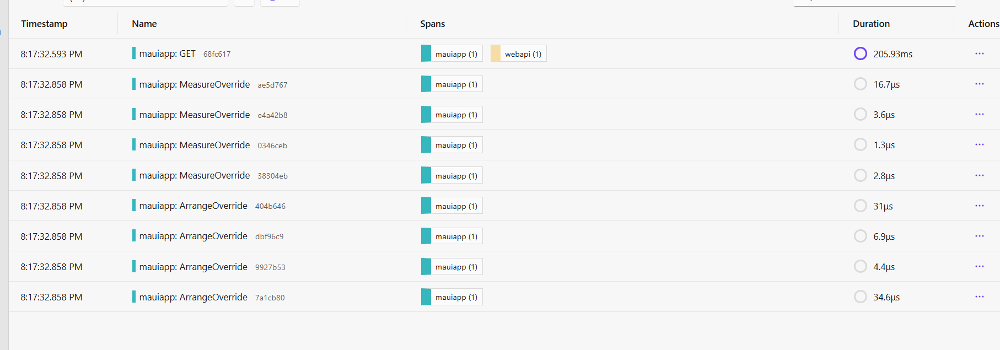
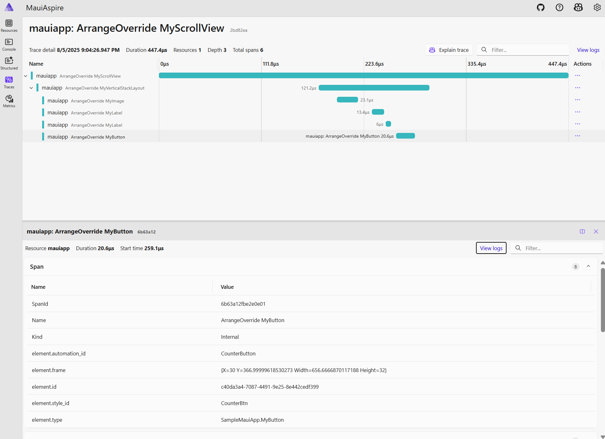

# .NET MAUI in .NET 10 RC 1 - Release Notes

Here's a summary of what's new in .NET MAUI in this release:

- .NET MAUI
  - [Diagnostics](#diagnostics)
  - [HybridWebView events](#hybridwebview-events)
  - [RefreshView IsRefreshEnabled](#refreshview-isrefreshenabled)
  - [Deprecated APIs](#deprecated-apis)
- [.NET for Android](#net-for-android)
- [.NET for iOS, Mac Catalyst, macOS, tvOS](#net-for-ios-mac-catalyst-macos-tvos)

.NET MAUI updates in .NET 10:

- [What's new in .NET MAUI in .NET 10](https://learn.microsoft.com/dotnet/maui/whats-new/dotnet-10) documentation.

## Diagnostics

We've added comprehensive diagnostics and metrics tracking for .NET MAUI applications, focusing on layout performance monitoring with an extensible architecture for future observability needs.





**Core Diagnostics Infrastructure:**

- **ActivitySource**: `"Microsoft.Maui"` - Tracks layout operations with detailed timing
- **Metrics**: `"Microsoft.Maui"` - Records counters and histograms for performance analysis
- **Feature Switch**: `System.Diagnostics.Metrics.Meter.IsSupported` - Runtime enable/disable for AOT/trimming

**Layout Performance Tracking:**

- Instruments `IView.Measure()` and `IView.Arrange()` operations
- Records timing data and operation counts with rich contextual tags
- Zero-allocation struct-based instrumentation using `using` pattern

| Metric Name | Type | Description |
|-------------|------|-------------|
| `maui.layout.measure_count` | Counter | Number of measure operations |
| `maui.layout.measure_duration` | Histogram | Time spent measuring (ns) |
| `maui.layout.arrange_count` | Counter | Number of arrange operations |
| `maui.layout.arrange_duration` | Histogram | Time spent arranging (ns) |

See [pull request #31058](https://github.com/dotnet/maui/pull/31058) for more details.

## HybridWebView events

Adds initialization events to `HybridWebView` following the same pattern as `BlazorWebView`, enabling platform-specific customization before and after initialization.

### New Events

- `WebViewInitializing` - Fired before `WebView` creation, allows configuration of platform-specific initialization parameters
- `WebViewInitialized` - Fired after `WebView` creation, provides access to the native `WebView` instance and settings

## RefreshView IsRefreshEnabled

Added `IsRefreshEnabled` property to be distinct from `IsEnabled` and make the behavior consistent across platforms.

```xml
<RefreshView IsRefreshEnabled="false">
    <!-- Login form remains usable -->
    <StackLayout>
        <Entry Placeholder="Username" />
        <Entry Placeholder="Password" />
        <Button Text="Login" />
    </StackLayout>
</RefreshView>
```

## Deprecated APIs

Compressed layout APIs are now marked obsolete. Avoid unnecessary layout nesting instead.

`Performance` and `IPerformanceProvider` types are marked obsolete.

## .NET for Android

This release includes continued integration with multiple .NET runtimes, and several bug fixes.

### (Experimental) CoreCLR

Enables Android apps to run on the CoreCLR runtime (instead of Mono). To use it, add the following to your project file for Android builds:

```xml
<!-- Use CoreCLR on Android -->
<PropertyGroup Condition="$([MSBuild]::GetTargetPlatformIdentifier('$(TargetFramework)')) == 'android'">
    <UseMonoRuntime>false</UseMonoRuntime>
</PropertyGroup>
```

Please try this in your applications and report any issues; when filing feedback, state that you are using UseMonoRuntime=false. Expect that application size is currently larger than with Mono and that debugging and some runtime diagnostics are not fully functional yet; these areas are actively being improved. This is an experimental feature and not intended for production use.

A detailed list of Android changes can be found on the [dotnet/android GitHub releases](https://github.com/dotnet/android/releases/).


## .NET for iOS, Mac Catalyst, macOS, tvOS

This release includes continued integration with multiple .NET runtimes, and several bug fixes.

## Contributors

Thank you contributors! ❤️
