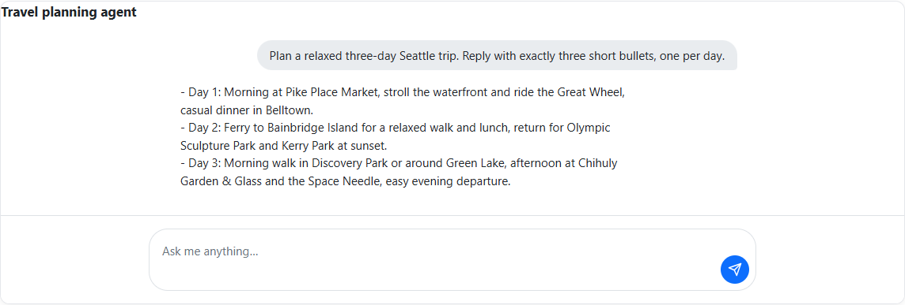
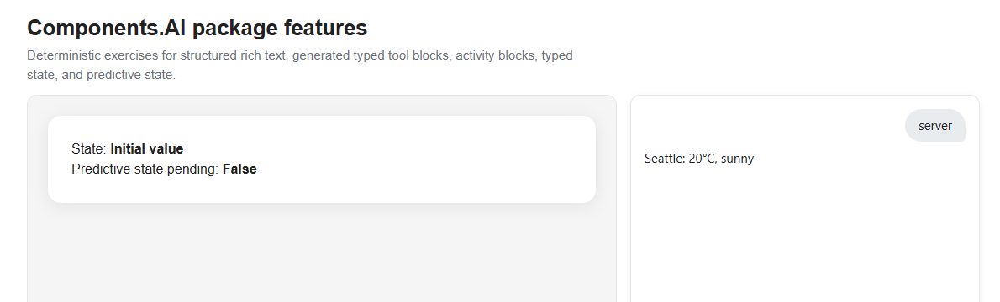
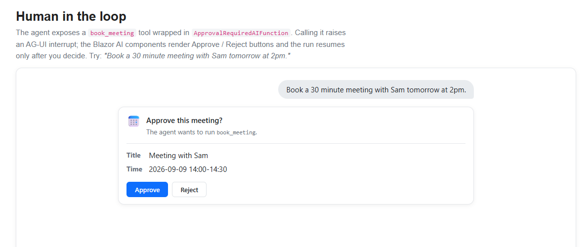
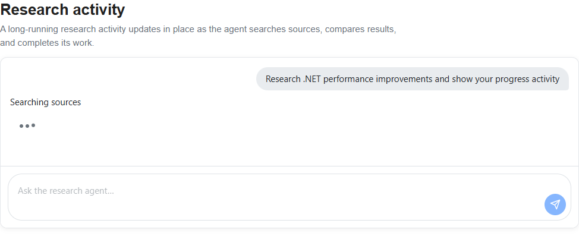
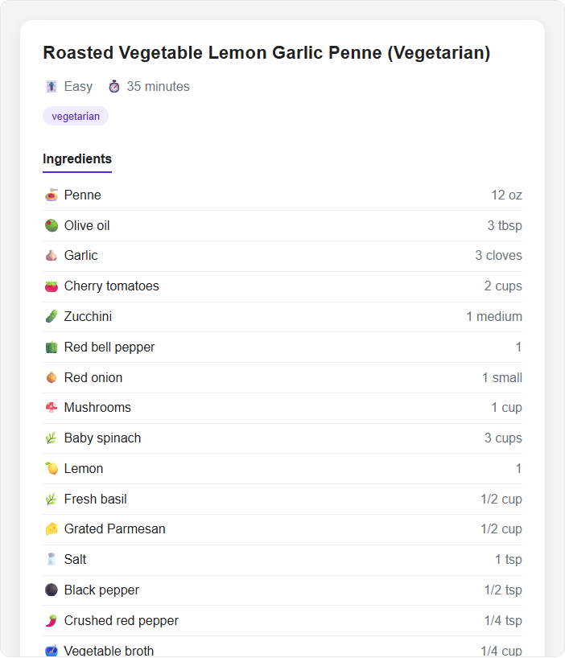
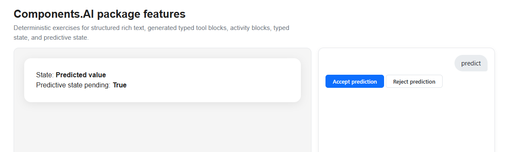

# ASP.NET Core in .NET 11 Release Candidate 1 (RC1) - Release Notes

.NET 11 RC1 includes new ASP.NET Core features and improvements:

- [SignalR authentication refresh APIs are finalized](#signalr-authentication-refresh-apis-are-finalized)
- [SignalR TypeScript client supports authentication refresh](#signalr-typescript-client-supports-authentication-refresh)
- [Blazor Server circuits update after authentication refresh](#blazor-server-circuits-update-after-authentication-refresh)
- [OpenAPI reflects obsolete APIs](#openapi-reflects-obsolete-apis)
- [Validation localization uses message conventions](#validation-localization-uses-message-conventions)
- [Blazor browser options are finalized](#blazor-browser-options-are-finalized)
- [Select an environment for build-time OpenAPI](#select-an-environment-for-build-time-openapi)
- [Negotiate authentication uses TLS channel binding](#negotiate-authentication-uses-tls-channel-binding)
- [Experimental Device Bound Session Credentials support](#experimental-device-bound-session-credentials-support)
- [Experimental Blazor AI components for agentic user interfaces](#experimental-blazor-ai-components-for-agentic-user-interfaces)
- [Breaking changes](#breaking-changes)
- [Bug fixes](#bug-fixes)
- [Community contributors](#community-contributors)

ASP.NET Core updates in .NET 11:

- [What's new in ASP.NET Core in .NET 11](https://learn.microsoft.com/aspnet/core/release-notes/aspnetcore-11)

## SignalR authentication refresh APIs are finalized

[.NET 11 Preview 6 introduced authentication refresh](../preview6/aspnetcore.md#signalr-authentication-refresh) so a SignalR client can replace an expiring access token without dropping its connection. RC1 finalizes the server and .NET client API shapes ([dotnet/aspnetcore #68702](https://github.com/dotnet/aspnetcore/pull/68702)).

When upgrading from Preview 7:

- In the .NET client, move the `OnAuthenticationRefreshed` and `OnAuthenticationRefreshFailed` callbacks from `AuthenticationRefreshOptions` to the `HubConnection.AuthenticationRefreshed` and `HubConnection.AuthenticationRefreshFailed` events.
- Update references to `Microsoft.AspNetCore.Http.Connections.AuthenticationRefreshContext` to use `Microsoft.AspNetCore.Connections.Features.AuthenticationRefreshContext`.
- Replace `IConnectionUserRefreshFeature` with `IConnectionAuthenticationRefreshFeature` if your transport integration uses the lower-level connection feature.

The server opts in for each hub and can inspect or reject a refreshed identity:

```csharp
using System.Security.Claims;

app.MapHub<ClockHub>("/clock", options =>
{
    options.EnableAuthenticationRefresh = true;
    options.CloseOnAuthenticationExpiration = true;
    options.OnAuthenticationRefresh = context =>
    {
        var previousSubject = context.PreviousUser.FindFirstValue("sub")
            ?? context.PreviousUser.FindFirstValue(ClaimTypes.NameIdentifier);
        var newSubject = context.NewUser.FindFirstValue("sub")
            ?? context.NewUser.FindFirstValue(ClaimTypes.NameIdentifier);

        return Task.FromResult(
            previousSubject is not null &&
            string.Equals(previousSubject, newSubject, StringComparison.Ordinal));
    };
});
```

The .NET client can refresh automatically before expiration or immediately after the app obtains new claims. Refresh notifications are events on `HubConnection`:

```csharp
await using var connection = new HubConnectionBuilder()
    .WithUrl(serverUrl, options =>
        options.AccessTokenProvider = GetAccessTokenAsync)
    .WithAuthenticationRefresh(options =>
    {
        options.EnableAutoRefresh = true;
        options.RefreshBeforeExpiration = TimeSpan.FromMinutes(2);
    })
    .Build();

connection.AuthenticationRefreshed += context =>
{
    Console.WriteLine($"New token lifetime: {context.NewTokenLifetime}");
    return Task.CompletedTask;
};

connection.AuthenticationRefreshFailed += context =>
{
    Console.WriteLine(context.Exception.Message);
    return Task.CompletedTask;
};

await connection.StartAsync();

// Refresh immediately after acquiring a token with updated claims.
await connection.RefreshAuthenticationAsync();
```

## SignalR TypeScript client supports authentication refresh

The SignalR TypeScript client now supports refreshing an access token without reconnecting ([dotnet/aspnetcore #67964](https://github.com/dotnet/aspnetcore/pull/67964), [dotnet/aspnetcore #68702](https://github.com/dotnet/aspnetcore/pull/68702)). It can schedule a refresh from the token lifetime reported by the server or refresh immediately after the application obtains updated claims.

Configure automatic refresh with `withAuthenticationRefresh`, register success and failure handlers on the built connection, and call `refreshAuthentication` to request a manual refresh:

```typescript
const connection = new signalR.HubConnectionBuilder()
  .withUrl("/clock", { accessTokenFactory: getAccessToken })
  .withAuthenticationRefresh({
    enableAutoRefresh: true,
    refreshBeforeExpirationInMilliseconds: 120_000,
  })
  .build();

connection.onAuthenticationRefreshed((context) => {
  console.log(`New token lifetime: ${context.newTokenLifetimeInSeconds}`);
});

connection.onAuthenticationRefreshFailed((context) => {
  console.error(context.error);
});

await connection.start();

// Refresh immediately after acquiring a token with updated claims.
await connection.refreshAuthentication();
```

## Blazor Server circuits update after authentication refresh

Interactive Server components can now receive the refreshed `ClaimsPrincipal` without reconnecting the circuit ([dotnet/aspnetcore #68221](https://github.com/dotnet/aspnetcore/pull/68221)). The Blazor component hub and client enable authentication refresh automatically, so no additional configuration is required ([dotnet/aspnetcore #68593](https://github.com/dotnet/aspnetcore/pull/68593)).

After the connection refreshes its authentication, Blazor updates the authentication state and raises `AuthenticationStateChanged`. Components that consume `AuthenticationStateProvider`, including `AuthorizeView`, re-render using the refreshed identity and claims. This behavior is useful when a user's roles or permissions change during an active circuit, or when a component needs to reload user-specific content after claims are refreshed. The UI can reflect the new authentication state without forcing the user to reconnect or reload the page.

## OpenAPI reflects obsolete APIs

ASP.NET Core OpenAPI generation now maps `[Obsolete]` to `deprecated: true` automatically for operations, schema types, and schema properties ([dotnet/aspnetcore #66355](https://github.com/dotnet/aspnetcore/pull/66355)). API clients and documentation tools can therefore surface the same deprecation information as .NET callers without a custom OpenAPI transformer.

```csharp
app.MapGet("/catalog/{id}", GetCatalogItem);

#pragma warning disable CS0618 // This example intentionally declares and maps obsolete APIs.
app.MapGet("/catalog/legacy/{id}", GetLegacyCatalogItem);

[Obsolete("Use /catalog/{id}.")]
static LegacyCatalogItem GetLegacyCatalogItem(int id) =>
    new(id, $"Product {id}", $"SKU-{id:D4}");

static CatalogItem GetCatalogItem(int id) =>
    new(id, $"Product {id}", $"SKU-{id:D4}");

public sealed record CatalogItem(
    int Id,
    string Name,
    string StockKeepingUnit);

[Obsolete("Use CatalogItem.")]
public sealed record LegacyCatalogItem(
    int Id,
    string Name,
    [property: Obsolete("Use StockKeepingUnit.")] string Sku);

#pragma warning restore CS0618
```

The legacy operation, its response schema, and the `Sku` property are marked deprecated in the generated document:

```json
{
  "paths": {
    "/catalog/legacy/{id}": {
      "get": {
        "deprecated": true
      }
    }
  },
  "components": {
    "schemas": {
      "LegacyCatalogItem": {
        "deprecated": true,
        "properties": {
          "sku": {
            "deprecated": true
          }
        }
      }
    }
  }
}
```

An `IOpenApiOperationTransformer` or `IOpenApiSchemaTransformer` can override the generated value for a specific API.

Thank you [@fickleEfrit](https://github.com/fickleEfrit) for this contribution!

## Validation localization uses message conventions

[Preview 7 integrated localization directly into `Microsoft.Extensions.Validation`](../preview7/aspnetcore.md#validation-localization-is-built-in). RC1 replaces the preview-only `MessageKeyProvider` API with built-in resource-name conventions ([dotnet/aspnetcore #68202](https://github.com/dotnet/aspnetcore/pull/68202)).

When upgrading from Preview 7, remove assignments to `ValidationOptions.MessageKeyProvider` and rename the corresponding resource keys to match one of the built-in conventions below. The `ValidationMessageKeyContext` type was also removed because custom key providers are no longer used.

When a validation attribute doesn't specify `ErrorMessage`, localization tries these keys from most to least specific:

1. `{DeclaringType}_{MemberName}_{AttributeType}_Error`
2. `{DeclaringType}_{AttributeType}_Error`
3. `{AttributeType}_Error`

For example, this model can use `RegistrationModel_Username_RequiredAttribute_Error`, `RegistrationModel_RequiredAttribute_Error`, or the shared `RequiredAttribute_Error` resource:

```csharp
using System.ComponentModel.DataAnnotations;
using Microsoft.Extensions.Validation;

builder.Services.AddLocalization();
builder.Services.AddValidation(options =>
{
    options.LocalizerProvider = (_, factory) =>
        factory.Create(typeof(MyApp.Resources.ValidationMessages));
});

[ValidatableType]
public sealed class RegistrationModel
{
    [Required]
    [StringLength(20, MinimumLength = 4)]
    [Display(Name = "Username")]
    public string Username { get; set; } = "";
}

namespace MyApp.Resources
{
    // Resources/ValidationMessages.resx uses this type's namespace and name.
    public sealed class ValidationMessages
    {
    }
}
```

An explicit `ErrorMessage` remains the first resource key to try. If no resource resolves, validation falls back to the non-localized message. The same conventions apply to Blazor static SSR client validation.

## Blazor browser options are finalized

The [server-to-client configuration API introduced in Preview 6](../preview6/aspnetcore.md#configure-blazor-client-behavior-from-the-server) now uses its final RC1 names ([dotnet/aspnetcore #67918](https://github.com/dotnet/aspnetcore/pull/67918)).

When upgrading from Preview 7, update the following APIs:

| Preview 7                         | RC1                                             |
| --------------------------------- | ----------------------------------------------- |
| `BrowserOptions.Server`           | `BrowserOptions.InteractiveServer`              |
| `BrowserOptions.Ssr`              | `BrowserOptions.StaticServer`                   |
| `BrowserOptions.WebAssembly`      | `BrowserOptions.InteractiveWebAssembly`         |
| `SsrBrowserOptions`               | `StaticServerBrowserOptions`                    |
| `WebAssemblyBrowserOptions`       | `InteractiveWebAssemblyBrowserOptions`          |
| `httpContext.GetBrowserOptions()` | `BrowserOptions.GetBrowserOptions(httpContext)` |

Configure browser startup behavior in C# with `WithBrowserOptions`:

```csharp
app.MapRazorComponents<App>()
    .AddInteractiveServerRenderMode()
    .WithBrowserOptions(options =>
    {
        options.LogLevel = LogLevel.Information;
        options.InteractiveServer.ReconnectionMaxRetries = 10;
        options.InteractiveServer.ReconnectionRetryInterval =
            TimeSpan.FromSeconds(1.5);
        options.StaticServer.PreserveDom = true;
        options.InteractiveWebAssembly.EnvironmentVariables["OTEL_ENDPOINT"] =
            "https://localhost:4318";
    });
```

The finalized properties are `InteractiveServer`, `StaticServer`, and `InteractiveWebAssembly`. Server code can read the resolved configuration with `BrowserOptions.GetBrowserOptions(HttpContext)`.

## Select an environment for build-time OpenAPI

Build-time OpenAPI generation can now run the app under a specified hosting environment ([dotnet/aspnetcore #63856](https://github.com/dotnet/aspnetcore/pull/63856)). For projects that use the `Microsoft.Extensions.ApiDescription.Server` package to generate OpenAPI documents at build time, set `OpenApiGenerationEnvironment` when environment-specific services, endpoints, or transformers affect the generated document:

```xml
<PropertyGroup>
  <OpenApiGenerateDocuments>true</OpenApiGenerateDocuments>
  <OpenApiGenerationEnvironment>Development</OpenApiGenerationEnvironment>
</PropertyGroup>
```

The value is passed to the application host in the same role as `ASPNETCORE_ENVIRONMENT` or `DOTNET_ENVIRONMENT`.

Thank you [@ldsenow](https://github.com/ldsenow) for this contribution!

## Negotiate authentication uses TLS channel binding

Negotiate authentication on Kestrel now uses the TLS endpoint channel binding token for HTTPS connections ([dotnet/aspnetcore #68317](https://github.com/dotnet/aspnetcore/pull/68317)). The authentication handler supplies the token to the underlying Kerberos or NTLM exchange and retains it across multi-round authentication.

No configuration changes are required. Non-HTTPS connections and HTTPS connections where a channel binding token isn't available continue to use the existing behavior.

## Experimental Device Bound Session Credentials support

> [!IMPORTANT]
> The `Microsoft.AspNetCore.Authentication.DeviceBoundSessions` package is experimental and will remain prerelease throughout .NET 11 and until the specification stabilizes. For .NET 11 RC1, use version `0.11.0-rc.1.26427.112` of the package.

The [DBSC specification](https://w3c.github.io/webappsec-dbsc/) defines a protocol that binds session refresh to a private key held by the browser. The app issues a short-lived session cookie, and the browser must provide a signed proof of possession to refresh it. A copied session cookie might remain usable until it expires, but an attacker without the device key can't use it to extend the session.

ASP.NET Core in .NET 11 RC1 adds an experimental server-side DBSC implementation in the `Microsoft.AspNetCore.Authentication.DeviceBoundSessions` package ([dotnet/aspnetcore #67388](https://github.com/dotnet/aspnetcore/pull/67388)). The authentication component layers over an existing cookie authentication scheme and manages the registration and refresh endpoints, a path-scoped refresh cookie, and the short-lived session cookie.

After adding the `Microsoft.AspNetCore.Authentication.DeviceBoundSessions` package, configure DBSC over an existing cookie authentication scheme:

```csharp
builder.Services
    .AddAuthentication("Application")
    .AddCookie("Application")
    .AddDeviceBoundSession("Application", options =>
    {
        options.ShortLivedCookieExpiration = TimeSpan.FromMinutes(10);
    });
```

Browser support currently requires an experimental DBSC implementation. See [Chrome's DBSC documentation](https://developer.chrome.com/docs/web-platform/device-bound-session-credentials) for implementation and enablement details.

## Experimental Blazor AI components for agentic user interfaces

Modern AI apps increasingly provide rich interactions with agents. A complete agentic user interface may need to stream ongoing work, visualize agent reasoning and progress, request approval before tools act, accept multimodal input, and synchronize state between the app and the agent. The Blazor AI components are designed to provide building blocks for creating these experiences using Blazor's component model.

The new [Microsoft.AspNetCore.Components.AI](https://nuget.org/packages/microsoft.aspnetcore.components.ai) package includes an initial set of Blazor AI components for streaming chat, rich-text and tool rendering, human approval flows, and typed, shared, and predictive UI state.

### Get started

> [!IMPORTANT]
> The `Microsoft.AspNetCore.Components.AI` package is experimental and will remain prerelease throughout .NET 11. For .NET 11 RC1, use version `0.1.0-preview.1.26459.102`.

Add the package to a Blazor app:

```dotnetcli
dotnet add package Microsoft.AspNetCore.Components.AI --version 0.1.0-preview.1.26459.102
```

Basic chat and the Components.AI block model work with any `IChatClient`. To connect the Blazor app to a remote agent over the [Agent User Interaction Protocol (AG-UI)](https://ag-ui.com), register an [`AGUIChatClient`](https://docs.ag-ui.com/sdk/dotnet/client/chat-client) as the app's `IChatClient`:

```csharp
using AGUI.Client;
using Microsoft.Extensions.AI;

builder.Services.AddHttpClient<IChatClient>(httpClient =>
    new AGUIChatClient(new(httpClient, "https://api.example.com/agent")));
```

`AGUIChatClient` streams AG-UI events as `ChatResponseUpdate` values. The Blazor AI components render the conversational content from these updates, while apps can use the additional AG-UI event information to build richer agentic interactions. While basic chat functionality is supported with any `IChatClient`, AG-UI is required when a remote server and the Blazor client need to exchange frontend tool declarations, backend tool events, approval interrupts, shared-state events, or AG-UI conversation identifiers.

Microsoft Agent Framework (MAF) can expose an `AIAgent` through an ASP.NET Core AG-UI endpoint. For the server-side setup, see [AG-UI integration with Agent Framework](https://learn.microsoft.com/agent-framework/integrations/by-component/ui/ag-ui/) and its [.NET getting-started guide](https://learn.microsoft.com/agent-framework/integrations/by-component/ui/ag-ui/getting-started).

### Build a basic streaming conversation

The first step in an agentic UI is often a basic conversation that streams responses and retains message history across turns. The initial chat support ([dotnet/aspnetcore #68323](https://github.com/dotnet/aspnetcore/pull/68323)) is provider- and protocol-neutral: apps supply an `IChatClient` from `Microsoft.Extensions.AI`, and `UIAgent` converts its streaming responses into observable content blocks.

`ChatPage` is a complete chat shell that combines three lower-level components:

- `AgentBoundary` creates and cascades the conversation state.
- `MessageList` renders each turn as it streams and provides default typing, error, and retry UI.
- `MessageInput` sends messages from a text area and disables input while a response is streaming.

The following component creates a `UIAgent` over an app-provided `IChatClient` and renders the conversation with `ChatPage`:

```razor
@using Microsoft.AspNetCore.Components.AI
@using Microsoft.Extensions.AI
@rendermode InteractiveServer
@implements IDisposable
@inject IChatClient ChatClient

<ChatPage Agent="_agent" Placeholder="Type a message...">
    <WelcomeContent>
        <p>Ask the agent a question.</p>
    </WelcomeContent>
</ChatPage>

@code {
    private UIAgent _agent = default!;

    protected override void OnInitialized()
    {
        _agent = new UIAgent(ChatClient);
    }

    public void Dispose() => _agent.Dispose();
}
```

`Placeholder` sets the hint shown in the empty message input. `WelcomeContent` supplies the content shown before the first message is sent.

Include the component styles in `App.razor`:

```razor
<link rel="stylesheet" href="@Assets["_content/Microsoft.AspNetCore.Components.AI/ai-chat.css"]" />
```



### Render content blocks

An `IChatClient` streams model-facing content, such as `TextContent`, `RichTextContent`, and `FunctionCallContent`, in `ChatResponseUpdate` values. `UIAgent` maps this response content into UI-facing `ContentBlock` objects that retain rendering state and can update in place while the response streams. For example, both plain-text fragments and structured rich-text snapshots map to a `RichContentBlock`.

The built-in block types include:

- `RichContentBlock` for streamed text and structured rich content.
- `FunctionInvocationContentBlock` for a server function call and its eventual result.
- `UIActionBlock` for a function that runs in the Blazor app.
- `FunctionApprovalBlock` for a function call that is waiting for user approval.
- `ActivityContentBlock` for application-defined progress that updates in place.

`ChatPage` and `MessageList` include default rendering for `RichContentBlock` and `FunctionApprovalBlock`. Add a `BlockRenderer<TBlock>` to `ChatPage.MessageListContent` to replace this default rendering or render another block type. Its child content receives the matching block as `context`, including its current properties as they change during streaming.

The following example replaces the default rendering for conversational content:

```razor
<ChatPage Agent="agent">
    <MessageListContent>
        <BlockRenderer TBlock="RichContentBlock" Context="block">
            <div class="agent-response">@block.RawText</div>
        </BlockRenderer>
    </MessageListContent>
</ChatPage>
```

Use the renderer's `When` predicate to handle only selected blocks of a type. If multiple renderers match, the most recently registered renderer takes precedence. Apps can also define custom `ContentBlock` types and map response content to them with a `ContentBlockHandler<TState>`.

### Render structured rich text

The rich-text support ([dotnet/aspnetcore #68324](https://github.com/dotnet/aspnetcore/pull/68324)) lets an agent return a structured presentation model instead of plain text. `RichTextContent` is response content that contains both plain text and `RichTextNode` values for headings, paragraphs, emphasis, links, lists, code blocks, tables, and other presentation elements. `UIAgent` maps it to the same `RichContentBlock` used for plain `TextContent`, but uses the supplied node tree instead of creating simple paragraphs.

For example, suppose an agent streams a Markdown response like this:

```markdown
## Blazor components

Blazor renders **interactive UI** with `C#`.

- [Server rendering](https://learn.microsoft.com/aspnet/core/blazor/)
- WebAssembly rendering
```

An app can wrap its model client in a `DelegatingChatClient` that accumulates text fragments with the same message ID. After each fragment, the wrapper parses all the Markdown received so far and inserts a complete `RichTextContent` snapshot:

```csharp
using System.Runtime.CompilerServices;
using System.Text;
using Microsoft.AspNetCore.Components.AI;
using Microsoft.Extensions.AI;

sealed class FormattedChatClient : DelegatingChatClient
{
    public FormattedChatClient(IChatClient innerClient)
        : base(innerClient)
    {
    }

    public override async IAsyncEnumerable<ChatResponseUpdate> GetStreamingResponseAsync(
        IEnumerable<ChatMessage> messages,
        ChatOptions? options = null,
        [EnumeratorCancellation] CancellationToken cancellationToken = default)
    {
        var textByMessageId =
            new Dictionary<string, StringBuilder>(StringComparer.Ordinal);

        await foreach (var update in base.GetStreamingResponseAsync(
            messages,
            options,
            cancellationToken))
        {
            if (string.IsNullOrEmpty(update.MessageId))
            {
                yield return update;
                continue;
            }

            var firstTextIndex = -1;
            var chunks = new List<string>();
            for (var i = 0; i < update.Contents.Count; i++)
            {
                if (update.Contents[i] is not TextContent textContent)
                {
                    continue;
                }

                if (firstTextIndex < 0)
                {
                    firstTextIndex = i;
                }
                chunks.Add(textContent.Text ?? string.Empty);
            }

            if (firstTextIndex >= 0)
            {
                if (!textByMessageId.TryGetValue(update.MessageId, out var text))
                {
                    text = new StringBuilder();
                    textByMessageId.Add(update.MessageId, text);
                }

                foreach (var chunk in chunks)
                {
                    text.Append(chunk);
                }

                var markdown = text.ToString();
                update.Contents.Insert(
                    firstTextIndex,
                    new RichTextContent(
                        markdown,
                        MarkdownRichTextParser.Parse(markdown)));
            }

            yield return update;
        }
    }
}
```

`MarkdownRichTextParser` represents an app-provided adapter from a Markdown parser to `RichTextNode` values; the package doesn't require or include a particular Markdown implementation. Wrap the original client with `new FormattedChatClient(innerClient)` before passing it to `UIAgent`. Each `RichTextContent` is a complete snapshot, so it atomically replaces the previous content for the same message as streaming progresses. `ChatPage` and `MessageList` then render the heading, emphasis, inline code, link, and list without requiring a custom `BlockRenderer`.

### Render server tool calls

An agent can call a tool that runs on its server while the Blazor app renders the operation using app-specific UI. For example, the agent can call a weather tool and the app can show the requested location immediately, followed by a weather card when the server returns the result.

Server tool calls become `FunctionInvocationContentBlock` instances, which pair the `FunctionCallContent` with its eventual `FunctionResultContent` and expose the tool name, arguments, and completion state.

The package's source generator creates a strongly typed block handler from a class annotated with `ToolBlock`, `ToolParameter`, and `ToolResult` ([dotnet/aspnetcore #68327](https://github.com/dotnet/aspnetcore/pull/68327)):

```csharp
[ToolBlock("get_weather")]
public partial class WeatherToolBlock : FunctionInvocationContentBlock
{
    [ToolParameter(Name = "location")]
    public string? Location { get; set; }

    [ToolResult]
    public WeatherInfo? Weather { get; set; }
}
```

Register the generated handlers when constructing the `UIAgent`:

```csharp
var agent = new UIAgent(
    chatClient,
    options => options.AddGeneratedToolBlocks());
```

Then render the generated block in `MessageListContent`:

```razor
<ChatPage Agent="agent">
    <MessageListContent>
        <BlockRenderer TBlock="WeatherToolBlock">
            @if (context.HasResult)
            {
                <p>@context.Location: @context.Weather?.Temperature&deg;C</p>
            }
            else
            {
                <p>Checking the weather for @context.Location...</p>
            }
        </BlockRenderer>
    </MessageListContent>
</ChatPage>
```

As the call arguments stream, the generated handler updates `Location` while `HasResult` remains `false`. When the result arrives, it populates `Weather`, sets `HasResult` to `true`, and rerenders the same block as the completed weather card.



When MAF hosts the remote agent, backend tools use its normal tool pipeline and AG-UI transports the call and result to the client. See [Backend tool rendering with AG-UI](https://learn.microsoft.com/agent-framework/integrations/by-component/ui/ag-ui/backend-tool-rendering).

### Run frontend tools

Frontend tools run in the client application rather than on the agent server. For example, a Blazor app can expose a tool that changes UI state, reads a local preference, or asks the user for input. Create the tool with `AIFunctionFactory` from `Microsoft.Extensions.AI`, then register it with `UIAgentOptions.RegisterUIAction` ([dotnet/aspnetcore #68325](https://github.com/dotnet/aspnetcore/pull/68325)).

`RegisterUIAction` advertises the `AIFunction` to the agent. When the agent requests it, `UIAgent` creates a `UIActionBlock` instead of executing the function immediately:

```csharp
var setAccentColor = AIFunctionFactory.Create(
    async (string color) =>
    {
        await InvokeAsync(() => accentColor = color);
        return $"Changed the accent color to {color}.";
    },
    name: "set_accent_color");

var agent = new UIAgent(
    chatClient,
    options => options.RegisterUIAction(setAccentColor));
```

Place a `BlockRenderer<UIActionBlock>` in `MessageListContent` to handle the function call requested by the agent. For example, the renderer can use a component that automatically invokes the function and displays its progress:

```razor
<ChatPage Agent="agent">
    <MessageListContent>
        <BlockRenderer TBlock="UIActionBlock"
                       When='action => action.ToolName == "set_accent_color"'
                       Context="action">
            <AutoInvokeAction Action="action" />
        </BlockRenderer>
    </MessageListContent>
</ChatPage>
```

The `AutoInvokeAction` component calls `InvokeAsync` when it receives the block:

```razor
@if (Action.IsComplete)
{
    <span>Accent color updated</span>
}
else
{
    <span>Updating accent color...</span>
}

@code {
    [Parameter, EditorRequired]
    public UIActionBlock Action { get; set; } = default!;

    protected override async Task OnInitializedAsync()
    {
        if (!Action.IsComplete)
        {
            await Action.InvokeAsync();
        }
    }
}
```

`InvokeAsync` executes the registered function using the arguments supplied by the agent and sends its result back through `IChatClient` so the conversation can continue. Register each frontend `AIFunction` separately, and use the renderer's `When` predicate and `action.ToolName`—the name passed to `AIFunctionFactory.Create`—to select the handling for each tool. A renderer can alternatively request input or confirmation before invoking the function.

For Blazor Server apps, the frontend tool executes in the server-side Blazor circuit; for WebAssembly, it executes in the browser.

### Require approval before tools run

An app can require the user to approve a consequential tool call, such as scheduling a meeting, before the agent proceeds. Tool approval requests become `FunctionApprovalBlock` instances. The conversation pauses until the UI calls `Approve` or `Reject` ([dotnet/aspnetcore #68329](https://github.com/dotnet/aspnetcore/pull/68329)):

```razor
<BlockRenderer TBlock="FunctionApprovalBlock" Context="approval">
    <p>Allow <code>@approval.ToolName</code> to run?</p>
    <button @onclick="approval.Approve">Approve</button>
    <button @onclick="() => approval.Reject()">Reject</button>
</BlockRenderer>
```

Approving lets the tool run and resumes the conversation. Rejecting returns that decision to the agent without running the tool.



For a MAF agent, the server decides which functions require approval and AG-UI transports the request and decision. See [Human-in-the-loop with AG-UI](https://learn.microsoft.com/agent-framework/integrations/by-component/ui/ag-ui/human-in-the-loop).

### Display activities

An activity is an application-defined progress item that updates in place while an agent performs longer-running work. For example, a research agent can show that it is searching sources, comparing results, and then completing the research without adding a separate message for every update.

Derive from `ActivityHandler<TBlock>` to map the application-specific progress content into a mutable `ActivityContentBlock` ([dotnet/aspnetcore #68333](https://github.com/dotnet/aspnetcore/pull/68333)):

```csharp
var agent = new UIAgent(chatClient, options =>
{
    options.AddBlockHandler(new ResearchActivityHandler());
});
```

`TryCreateBlock` creates the activity from its first update. `TryUpdateBlock` changes the same block as later updates arrive and indicates when the activity is complete:

```razor
<BlockRenderer TBlock="ResearchActivityBlock">
    <p>@context.Text</p>
</BlockRenderer>
```

The rendered progress updates in place while the agent works.



### Synchronize typed state

Agentic UIs often show a shared workspace alongside the conversation, such as a recipe, document, form, or plan that the agent can update. `UIAgent<TState>` exposes this data as typed, observable UI state separately from conversational content ([dotnet/aspnetcore #68333](https://github.com/dotnet/aspnetcore/pull/68333)).

The app configures a state mapper for the `ChatResponseUpdate` values produced by its `IChatClient`. In an AG-UI integration, the agent server explicitly maps selected tool results to `STATE_SNAPSHOT` or `STATE_DELTA` events. `AGUIChatClient` then exposes those events through `ChatResponseUpdate.RawRepresentation`, where the Blazor app can deserialize them and call `SetState`:

```csharp
using System.Text.Json;
using AGUI.Abstractions;

var agent = new UIAgent<RecipeState>(chatClient, options =>
{
    options.StateMapper = context =>
    {
        if (context.Update.RawRepresentation is StateSnapshotEvent snapshot &&
            snapshot.Snapshot.Deserialize<RecipeState>() is { } state)
        {
            context.SetState(state);
        }
    };
});
```

Read the current value from `agent.State.Value`, and subscribe to `agent.State.OnChanged` when the surrounding component needs to rerender. State mappers can also handle app-specific `AIContent` from other `IChatClient` implementations.



For the corresponding MAF server configuration, including mapping tool results to state snapshots and deltas, see [State management with AG-UI](https://learn.microsoft.com/agent-framework/integrations/by-component/ui/ag-ui/state-management).

### Show predictive UI state

Predictive state lets an app render an agent's proposed state change while the model is still generating it without replacing the committed state. For example, as an agent generates the complete contents of an edited document in a tool argument, the UI can progressively display the proposed document and a diff. When generation finishes, the user can accept the completed proposal or reject it and restore the committed document.

An AG-UI server integration can map streamed arguments for a state-writing tool to provisional state events. The completed tool-call arguments are the authoritative proposal. A Components.AI state mapper calls `SetPredictiveState` as the provisional updates arrive, and `AgentState<TState>` retains the prior committed value for rollback ([dotnet/aspnetcore #68335](https://github.com/dotnet/aspnetcore/pull/68335)):

```csharp
context.SetPredictiveState(predictedState);
```

When the proposal is complete, a frontend action can let the user accept or reject it and then report the decision to the agent:

```csharp
private async Task ResolvePrediction(UIActionBlock action, bool accept)
{
    if (accept)
    {
        agent.State.AcceptPredictiveState();
    }
    else
    {
        agent.State.RejectPredictiveState();
    }

    await action.InvokeAsync();
}
```

The provisional value is immediately available from `agent.State.Value`, and `HasPendingPredictiveState` indicates that it hasn't been committed. Accepting commits the completed proposal; rejecting restores the baseline. Invoking the frontend action sends the decision back to the agent in a follow-up run. If generation fails, is canceled, or ends without a decision, the provisional value is automatically rolled back. The server-side extraction and mapping of streamed tool arguments must be configured explicitly; see [State management with AG-UI](https://learn.microsoft.com/agent-framework/integrations/by-component/ui/ag-ui/state-management).



### Persist and restore conversations

An `IConversationThread` stores completed turns so a UI can rebuild its conversation after the component or app restarts. A thread can also retain protocol metadata, such as the `threadId` and previous `runId` used to continue a server-owned AG-UI conversation.

Pass the thread when constructing `UIAgent`, then call `UIAgent.RestoreAsync` or `AgentContext.RestoreAsync` to explicitly replay the stored updates into content blocks and typed state ([dotnet/aspnetcore #68334](https://github.com/dotnet/aspnetcore/pull/68334)):

```csharp
var agent = new UIAgent(
    chatClient,
    options => options.Thread = conversationThread);

var restoredBlocks = await agent.RestoreAsync();
```

Passing a thread to `UIAgent` enables new completed turns to be persisted, but doesn't automatically restore earlier turns. For MAF-hosted AG-UI agents, see [AG-UI conversation continuity](https://learn.microsoft.com/agent-framework/integrations/by-component/ui/ag-ui/getting-started#conversation-continuity).

## Breaking changes

### Sign-in confirmation requirements apply after registration

The default ASP.NET Core Identity UI implementations now honor all configured sign-in confirmation requirements after password or external registration ([dotnet/aspnetcore #68655](https://github.com/dotnet/aspnetcore/pull/68655)). Users who require a confirmed email address, phone number, or account are redirected to registration confirmation instead of being signed in automatically.

Apps that require automatic sign-in after registration must disable the corresponding `SignInOptions.RequireConfirmedEmail`, `SignInOptions.RequireConfirmedPhoneNumber`, or `SignInOptions.RequireConfirmedAccount` setting. There is no compatibility switch to require confirmation for later sign-ins while bypassing it during registration; that behavior requires customizing the registration page and explicitly signing in the user.

### Preview-only insecure chunked parsing switch removed

The `Microsoft.AspNetCore.Server.Kestrel.InsecureChunkedParsing` AppContext switch has been removed ([dotnet/aspnetcore #68553](https://github.com/dotnet/aspnetcore/pull/68553)). The switch was introduced during .NET 11 previews but wasn't intended to be part of .NET 11. Remove any call that enables the switch; there is no replacement, and Kestrel always uses secure chunked-request parsing.

### Bootstrap 4 Identity UI is obsolete

Projects that set `IdentityUIFrameworkVersion` to `Bootstrap4` now receive an MSBuild warning ([dotnet/aspnetcore #68575](https://github.com/dotnet/aspnetcore/pull/68575)). Change the value to `Bootstrap5`, or remove the property to use the default. Bootstrap 5 remains the supported Identity UI framework selection.

<!-- Filtered features (significant engineering work, but not verified as available stable functionality):
  - Concise asset-path compiler transformation: asset metadata work appears in changes.json, but the user-facing compiler transformation wasn't present in the validated RC1 build.
-->

## Bug fixes

- **Blazor**
  - [Fixed persisted component state for re-executed endpoints (dotnet/aspnetcore #68032)](https://github.com/dotnet/aspnetcore/pull/68032)
  - [Fixed persisted component state being dropped during enhanced navigation (dotnet/aspnetcore #68088)](https://github.com/dotnet/aspnetcore/pull/68088)
  - [Fixed `InputNumber` validation for floating-point values in scientific notation (dotnet/aspnetcore #67988)](https://github.com/dotnet/aspnetcore/pull/67988)
  - [Fixed `Virtualize` scroll jumps caused by competing native and JavaScript anchoring (dotnet/aspnetcore #67934)](https://github.com/dotnet/aspnetcore/pull/67934)
  - [Fixed `QuickGrid` viewport drift when prepending asynchronously loaded items in end-anchor mode (dotnet/aspnetcore #67938)](https://github.com/dotnet/aspnetcore/pull/67938)
- **Data Protection**
  - [Fixed thread-pool starvation when `KeyRingProvider` performs a forced refresh (dotnet/aspnetcore #67986)](https://github.com/dotnet/aspnetcore/pull/67986)
- **Hosting**
  - [Fixed an IIS application shutdown hang when preload is enabled (dotnet/aspnetcore #65733)](https://github.com/dotnet/aspnetcore/pull/65733)
- **OpenAPI**
  - [Fixed nullability for nullable get-only and constructor-bound properties (dotnet/aspnetcore #68116)](https://github.com/dotnet/aspnetcore/pull/68116)
- **SignalR**
  - [Hardened parsing of the `negotiateVersion` query value (dotnet/aspnetcore #67908)](https://github.com/dotnet/aspnetcore/pull/67908)
  - [Hardened stateful reconnect handling (dotnet/aspnetcore #67409)](https://github.com/dotnet/aspnetcore/pull/67409)

## Community contributors

Thank you contributors! ❤️

- [@AbdelrahmanHassan131](https://github.com/dotnet/aspnetcore/pulls?q=is%3Apr+is%3Amerged+author%3AAbdelrahmanHassan131+milestone%3A11.0-rc1)
- [@akshay-zz](https://github.com/dotnet/aspnetcore/pulls?q=is%3Apr+is%3Amerged+author%3Aakshay-zz+milestone%3A11.0-rc1)
- [@aw0lid](https://github.com/dotnet/aspnetcore/pulls?q=is%3Apr+is%3Amerged+author%3Aaw0lid+milestone%3A11.0-rc1)
- [@fickleEfrit](https://github.com/dotnet/aspnetcore/pulls?q=is%3Apr+is%3Amerged+author%3AfickleEfrit+milestone%3A11.0-rc1)
- [@GrantTotinov](https://github.com/dotnet/aspnetcore/pull/67539)
- [@hishamco](https://github.com/dotnet/aspnetcore/pulls?q=is%3Apr+is%3Amerged+author%3Ahishamco+milestone%3A11.0-rc1)
- [@khellang](https://github.com/dotnet/aspnetcore/pulls?q=is%3Apr+is%3Amerged+author%3Akhellang+milestone%3A11.0-rc1)
- [@ldsenow](https://github.com/dotnet/aspnetcore/pulls?q=is%3Apr+is%3Amerged+author%3Aldsenow+milestone%3A11.0-rc1)
- [@PreethikaSelvam](https://github.com/dotnet/aspnetcore/pulls?q=is%3Apr+is%3Amerged+author%3APreethikaSelvam+milestone%3A11.0-rc1)
- [@surya3655](https://github.com/dotnet/aspnetcore/pulls?q=is%3Apr+is%3Amerged+author%3Asurya3655+milestone%3A11.0-rc1)
- [@vendasankarsf3945](https://github.com/dotnet/aspnetcore/pulls?q=is%3Apr+is%3Amerged+author%3Avendasankarsf3945+milestone%3A11.0-rc1)
- [@Yuvan111](https://github.com/dotnet/aspnetcore/pulls?q=is%3Apr+is%3Amerged+author%3AYuvan111+milestone%3A11.0-rc1)
