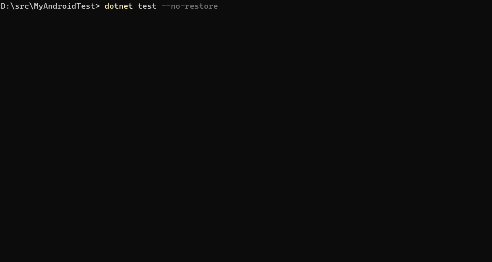

# .NET MAUI in .NET 11 RC 1 - Release Notes

.NET 11 RC 1 includes a broader testing experience, faster and smaller Android
apps, XAML Hot Reload reliability, new .NET MAUI control capabilities,
asset-processing options, and Apple NativeAOT improvements:

- [Mobile and desktop testing with `dotnet test`](#mobile-and-desktop-testing-with-dotnet-test)
- [Faster and more reliable Android builds](#faster-and-more-reliable-android-builds)
- [Smaller Android packages](#smaller-android-packages)
- [Faster Android apps](#faster-android-apps)
- [TabbedPage badges](#tabbedpage-badges)
- [Themed splash screens](#themed-splash-screens)
- [Explicit SwipeItem colors](#explicit-swipeitem-colors)
- [Opt-in BlazorWebView static content caching](#opt-in-blazorwebview-static-content-caching)
- [XAML Incremental Hot Reload reliability](#xaml-incremental-hot-reload-reliability)
- [Configurable Resizetizer quality](#configurable-resizetizer-quality)
- [Android system bars can follow .NET MAUI chrome](#android-system-bars-can-follow-net-maui-chrome)
- [Android app launch and shutdown](#android-app-launch-and-shutdown)
- [FlyoutPage adopts handlers on Apple platforms](#flyoutpage-adopts-handlers-on-apple-platforms)
- [Apple platforms (.NET for iOS, Mac Catalyst, macOS, tvOS)](#apple-platforms-net-for-ios-mac-catalyst-macos-tvos)
- [Breaking changes](#breaking-changes)
- [Community contributors](#community-contributors)

## Mobile and desktop testing with `dotnet test`

.NET 11 extends the familiar `dotnet test` workflow to Android, iOS, tvOS,
macOS, and Mac Catalyst projects. Tests run in an app process on mobile devices
or simulators and on desktop targets
([dotnet/android #11130](https://github.com/dotnet/android/pull/11130),
[dotnet/macios #25320](https://github.com/dotnet/macios/pull/25320),
[dotnet/macios #25963](https://github.com/dotnet/macios/pull/25963)).

The new MSTest-configured template short names are `androidtest`, `iostest`,
`tvostest`, `macostest`, and `maccatalysttest`
([Android template](https://github.com/dotnet/android/pull/10862),
[Apple templates](https://github.com/dotnet/macios/pull/25195)). For example,
create and run an Android test project on a connected device or emulator:

```console
dotnet new androidtest -n MyTests
cd MyTests
dotnet test
```



You can configure any
[Microsoft.Testing.Platform-supported test framework](https://learn.microsoft.com/dotnet/core/testing/#testing-tools)
instead. For example, configure NUnit:

```csharp
builder.ConfigureTestApplication(testApplication =>
    testApplication.AddNUnit(() => [GetType().Assembly]));
```

Instrumentation-only Android projects can also use `dotnet run` without
declaring an `Activity`. This enables headless on-device harnesses such as
BenchmarkDotNet and forwards arguments after `--` to the instrumentation
process
([dotnet/android #12261](https://github.com/dotnet/android/pull/12261)).

## Faster and more reliable Android builds

Several Android build-pipeline changes reduce work in clean and incremental
builds. For a Release CoreCLR .NET MAUI sample-content app using trimmable type
maps, an ordinary managed source change improved from 68.32 to 52.31 seconds,
and an Android manifest change improved from 39.74 to 10.97 seconds
([dotnet/android #12229](https://github.com/dotnet/android/pull/12229)).

Type-map generation also improved from 3,204 to 792 milliseconds in a clean
CoreCLR .NET MAUI sample-content build
([dotnet/android #12279](https://github.com/dotnet/android/pull/12279)).

RC 1 also fixes two incremental-build correctness issues. APK archive updates
now retain unchanged JAR resources, replace changed resources, and remove stale
resources. In-place post-link processing no longer writes satellite assemblies
into the shared NuGet package cache, which avoids concurrent-build `XAAMP7024`
failures
([dotnet/android #12463](https://github.com/dotnet/android/pull/12463)).

## Smaller Android packages

The Android trimmer now removes unused methods from user-defined
`IJavaObject` types while preserving the constructors and overrides that Java
can call. In the tested ARM64 .NET MAUI app, this reduced package size by
664,926 bytes without R8 and 718,174 bytes with R8. A minimal app was unchanged
([dotnet/android #12272](https://github.com/dotnet/android/pull/12272)).

## Faster Android apps

CoreCLR Release builds now include most methods from the app assembly in
partial ReadyToRun compilation. The basic .NET MAUI template started 19.8
milliseconds, or 2.4%, faster with a 65,536-byte package-size increase. The
sample-content template started 75.4 milliseconds, or 4.5%, faster with a
266,240-byte increase
([dotnet/android #12248](https://github.com/dotnet/android/pull/12248)).

.NET MAUI apps can also opt into full ReadyToRun compilation:

```xml
<PropertyGroup>
  <MauiEnableFullReadyToRun>true</MauiEnableFullReadyToRun>
</PropertyGroup>
```

Full compilation trades additional package size for startup performance. The
default remains partial ReadyToRun compilation
([dotnet/maui #37094](https://github.com/dotnet/maui/pull/37094),
[dotnet/android #12299](https://github.com/dotnet/android/pull/12299)).

Single-page Shell apps on Android also defer unused tab infrastructure. In a
matched 80-launch test on a Pixel 5, this reduced mean cold-start time by 35.95
milliseconds, or 3.26%
([dotnet/maui #37321](https://github.com/dotnet/maui/pull/37321)).

Cached virtual JNI invocations improved from 221.4 to 180.7 nanoseconds, an 18%
reduction, on a Pixel 5 using .NET 11 CoreCLR. The tested APK size did not
change. The paired cold-start delta was -2.77 milliseconds, with a 95%
confidence interval of -7.61 to +2.06 milliseconds
([dotnet/android #12377](https://github.com/dotnet/android/pull/12377)).

## TabbedPage badges

`TabbedPage` children can display badge text, background color, and text color
through the `TabbedPage.BadgeText`, `TabbedPage.BadgeColor`, and
`TabbedPage.BadgeTextColor` attached properties
([dotnet/maui #37755](https://github.com/dotnet/maui/pull/37755)).

```xaml
<ContentPage
    Title="Inbox"
    TabbedPage.BadgeText="3"
    TabbedPage.BadgeColor="Red"
    TabbedPage.BadgeTextColor="White" />
```

Android, iOS, Mac Catalyst, and Windows support initial values and runtime
updates. On iOS and Mac Catalyst 18 or later, UIKit might render its system
badge colors instead of custom colors even though .NET MAUI uses the supported
per-item APIs.

## Themed splash screens

`MauiSplashScreen` supports separate images, colors, and tint colors for dark
mode. Android generates `night`-qualified resources. iOS, iPadOS, and Mac
Catalyst generate asset-catalog launch resources when the minimum supported OS
version is 14 or later
([dotnet/maui #35710](https://github.com/dotnet/maui/pull/35710)).

```xml
<MauiSplashScreen Include="Resources\Splash\splash.svg"
                  Color="#FFFFFF"
                  DarkFile="Resources\Splash\splash-dark.svg"
                  DarkColor="#000000"
                  DarkTintColor="#FFFFFF"
                  BaseSize="128,128" />
```

Projects without dark-mode metadata retain the existing splash-screen
behavior. Apple targets earlier than version 14 emit a warning and use the
existing fallback.

## Explicit SwipeItem colors

`SwipeItem.IconColor` explicitly tints supported icon sources, and
`SwipeItem.TextColor` controls the label color. Both properties support
`AppThemeBinding`
([dotnet/maui #36884](https://github.com/dotnet/maui/pull/36884)).

```xaml
<SwipeItem Text="Delete"
           IconImageSource="delete.svg"
           BackgroundColor="{AppThemeBinding Light=White, Dark=Black}"
           IconColor="{AppThemeBinding Light=Black, Dark=White}"
           TextColor="{AppThemeBinding Light=Black, Dark=White}" />
```

When `IconColor` isn't set, PNG, SVG, and other non-font images retain their
authored colors. Font icons continue to use their configured color and the
existing fallback behavior.

Android, iOS, and Mac Catalyst apply `IconColor` to resolved platform images.
Windows supports explicit tinting for font and packaged-file icons; URI,
rooted, and stream-backed images retain their original colors. Tizen also
retains original icon colors.

## Opt-in BlazorWebView static content caching

`BlazorWebView.StaticContentCacheControlProvider` can opt local static assets
into caching. Returning `null`, an empty string, or whitespace preserves the
existing `no-store` behavior
([dotnet/maui #35706](https://github.com/dotnet/maui/pull/35706)).

```csharp
blazorWebView.StaticContentCacheControlProvider = request =>
    request.ContentType.StartsWith("image/", StringComparison.Ordinal)
        ? "public, max-age=86400"
        : null;
```

.NET MAUI uses a bounded per-WebView cache on Android, iOS, Mac Catalyst,
Windows, and Tizen. It doesn't cache authenticated, range, non-`GET`, or `no-store`
requests.

Thank you [@Kebechet](https://github.com/Kebechet) for this contribution!

## XAML Incremental Hot Reload reliability

> XAML Incremental Hot Reload is a preview feature in .NET 11.

RC 1 improves the source-generated XAML Incremental Hot Reload path introduced
in Preview 7. Application-level resource edits now reach both existing and new
`DynamicResource` consumers. Changing a literal value or binding to a
`DynamicResource` also removes the old local state so later resource changes
continue to update the property
([dotnet/maui #37896](https://github.com/dotnet/maui/pull/37896),
[dotnet/maui #37898](https://github.com/dotnet/maui/pull/37898)).

Structural updates now reconcile original `x:Name` fields and namescope entries
with the new visual tree. Non-structural property edits inside a direct
`CollectionView.ItemTemplate` also update already-realized cells without
replacing the template or resetting selection, focus, or scroll position
([dotnet/maui #37897](https://github.com/dotnet/maui/pull/37897),
[dotnet/maui #37899](https://github.com/dotnet/maui/pull/37899)).

## Configurable Resizetizer quality

The new `ResizeQuality` metadata controls image sampling during Resizetizer
build tasks. `Auto` preserves the existing default, `Best` uses higher-quality
sampling, and `Fastest` uses nearest-neighbor sampling without mipmaps
([dotnet/maui #34559](https://github.com/dotnet/maui/pull/34559)).

```xml
<MauiImage Include="Resources\Images\photo.png" ResizeQuality="Best" />
<MauiImage Include="Resources\Images\pixel-art.png"
           ResizeQuality="Fastest" />
```

The setting applies to raster and SVG images, app icons, and splash assets.

## Android system bars can follow .NET MAUI chrome

Android apps can opt in to matching the status-bar and navigation-bar
backgrounds to the effective colors of `NavigationPage`, Shell, `TabbedPage`,
and modal chrome
([dotnet/maui #35463](https://github.com/dotnet/maui/pull/35463)).

```xml
<PropertyGroup>
  <MauiAndroidSystemBarsUseMauiChrome>true</MauiAndroidSystemBarsUseMauiChrome>
</PropertyGroup>
```

The option changes system-bar backgrounds only. Icon appearance remains under
app or theme control. The default is `false`, which preserves the existing
Android behavior.

## Android app launch and shutdown

When `dotnet run` launches an Android activity on a connected device, it now
wakes a sleeping device and dismisses a non-secure keyguard before launching
the app
([dotnet/android #12322](https://github.com/dotnet/android/pull/12322)).

When you stop `dotnet run` with Ctrl+C, it now waits for the Android
`force-stop` operation to complete before the command exits
([dotnet/android #12318](https://github.com/dotnet/android/pull/12318)).

See the
[full Android RC 1 compare](https://github.com/dotnet/android/compare/37.0.0-preview.7.2131...b65b55d5357abb23960a999c7c5ffaceb75c4515)
for the complete set of changes.

## FlyoutPage adopts handlers on Apple platforms

`FlyoutPage` now uses `FlyoutViewHandler` by default on iOS and Mac Catalyst,
completing the Apple-platform handler migration for the primary multi-page
controls. The handler adds custom `FlyoutWidth` support and keeps flyout
subscriptions isolated between multiple page instances
([dotnet/maui #36676](https://github.com/dotnet/maui/pull/36676)).

Apps that depend on a custom `PhoneFlyoutPageRenderer` can register the
renderer explicitly:

```csharp
builder.ConfigureMauiHandlers(handlers =>
{
    handlers.AddHandler<FlyoutPage, MyCustomFlyoutPageRenderer>();
});
```

Thank you
[@Vignesh-SF3580](https://github.com/Vignesh-SF3580)
for this contribution!

See the
[full MAUI RC 1 compare](https://github.com/dotnet/maui/compare/release/11.0.1xx-preview7...484132f9e51f4d1eae72dba038575d6102639730)
for the complete set of changes.

## Apple platforms (.NET for iOS, Mac Catalyst, macOS, tvOS)

- **NativeAOT registrar default** - NativeAOT apps that target .NET 11 now use
  the trimmable-static registrar and assembly preparation by default. CoreCLR
  and Mono keep their existing registrar defaults in this RC 1 build
  ([dotnet/macios #26346](https://github.com/dotnet/macios/pull/26346)).
- **NativeAOT debug symbols** - macOS and Mac Catalyst NativeAOT builds now
  generate dSYM files by default, even when `ArchiveOnBuild` is not enabled.
  dSYM files supplied by XCFrameworks are also copied next to the app dSYM so
  they are included in archives
  ([dotnet/macios #26197](https://github.com/dotnet/macios/pull/26197),
  [dotnet/macios #25979](https://github.com/dotnet/macios/pull/25979)).
- **Failable Objective-C initializers** - Binding authors can combine
  `[FactoryMethod]` with `[return: NullAllowed]` to expose a failable
  initializer as a nullable static factory method instead of a constructor that
  cannot represent a `nil` result
  ([dotnet/macios #26196](https://github.com/dotnet/macios/pull/26196)).

RC 1 also includes reliability and packaging work across Hot Reload, linking,
the registrar, bindings, and MSBuild. See the
[full Apple platforms RC 1 compare](https://github.com/dotnet/macios/compare/release/11.0.1xx-preview7...36cc717537e7deaf6a8161bd96a977195cacd434)
for the complete set of changes.

<!-- Filtered features (significant work considered for these notes):
  - Additional custom-platform backend APIs (#35068, #36657, #37420, #37671,
    #37853, #37854, #37855, #37858, #37861, #37862, #37863, #37945, #37946,
    #38039): provider extensibility that continues the Preview 7 theme, without
    a new default or broad user-facing state change.
  - ShellContent static query parameters (#37689): a narrow declarative
    navigation scenario that does not meet the shared-audience threshold.
  - AndroidEnableFastDeployment (#12363): an advanced explicit inverse for an
    existing property, with no change to the default deployment behavior.
  - Common Apple ApplicationArtifact metadata (#26110): useful to downstream
    tooling authors, but too narrow for the main release highlights.
  - MAUI fixes introduced and reverted within the same range (#34598/#36508,
    #35533/#36580, #33192/#36585, #35086/#37115, #34702/#36715): no net
    shipped behavior change.
-->

## Breaking changes

- The `Color` record type is now sealed. Code that derives from `Color` must
  use composition instead
  ([dotnet/maui #36443](https://github.com/dotnet/maui/pull/36443)).
- Non-font `SwipeItem` icons are no longer automatically recolored white or
  black to contrast with `BackgroundColor`. Set `IconColor` explicitly if an
  app relied on that .NET 10 behavior
  ([dotnet/maui #36884](https://github.com/dotnet/maui/pull/36884)).
- `FlyoutPage` uses `FlyoutViewHandler` instead of
  `PhoneFlyoutPageRenderer` by default on iOS and Mac Catalyst. Apps that
  subclassed or customized the renderer should register their renderer
  explicitly
  ([dotnet/maui #36676](https://github.com/dotnet/maui/pull/36676)).
- Apple app builds now remove the `Headers`, `PrivateHeaders`, and `Modules`
  directories from bundled frameworks before code signing. Set
  `StripFrameworkHeaders=false` if your app needs these directories
  ([dotnet/macios #26253](https://github.com/dotnet/macios/pull/26253)).
- .NET for Android now marks `Java.Lang.Object.JavaFinalize()` as obsolete.
  Override `Dispose(bool)` or use a C# finalizer instead
  ([dotnet/android #11424](https://github.com/dotnet/android/pull/11424)).
- When an Android manifest contains a partial `<uses-sdk>` element without
  `android:targetSdkVersion`, the build now writes the value from
  `$(TargetSdkVersion)`. Android previously defaulted the target SDK to the
  minimum SDK in this case. Apps with a partial `<uses-sdk>` element should
  test behavior that Android gates by target SDK, or set
  `android:targetSdkVersion` explicitly
  ([dotnet/android #12290](https://github.com/dotnet/android/pull/12290)).

## Community contributors

Thank you contributors!

- [@AdamEssenmacher](https://github.com/dotnet/maui/pulls?q=is%3Apr+is%3Amerged+author%3AAdamEssenmacher)
- [@Ahamed-Ali](https://github.com/dotnet/maui/pulls?q=is%3Apr+is%3Amerged+author%3AAhamed-Ali)
- [@AustinWise](https://github.com/dotnet/android/pulls?q=is%3Apr+is%3Amerged+author%3AAustinWise)
- [@BagavathiPerumal](https://github.com/dotnet/maui/pulls?q=is%3Apr+is%3Amerged+author%3ABagavathiPerumal)
- [@Chagrins](https://github.com/dotnet/android/pulls?q=is%3Apr+is%3Amerged+author%3AChagrins)
- [@devanathan-vaithiyanathan](https://github.com/dotnet/maui/pulls?q=is%3Apr+is%3Amerged+author%3Adevanathan-vaithiyanathan)
- [@Dhivya-SF4094](https://github.com/dotnet/maui/pulls?q=is%3Apr+is%3Amerged+author%3ADhivya-SF4094)
- [@erikzhang](https://github.com/dotnet/maui/pulls?q=is%3Apr+is%3Amerged+author%3Aerikzhang)
- [@HarishKumarSF4517](https://github.com/dotnet/maui/pulls?q=is%3Apr+is%3Amerged+author%3AHarishKumarSF4517)
- [@HarishwaranVijayakumar](https://github.com/dotnet/maui/pulls?q=is%3Apr+is%3Amerged+author%3AHarishwaranVijayakumar)
- [@IlGalvo](https://github.com/dotnet/maui/pulls?q=is%3Apr+is%3Amerged+author%3AIlGalvo)
- [@jpd21122012](https://github.com/dotnet/maui/pulls?q=is%3Apr+is%3Amerged+author%3Ajpd21122012)
- [@KarthikRajaKalaimani](https://github.com/dotnet/maui/pulls?q=is%3Apr+is%3Amerged+author%3AKarthikRajaKalaimani)
- [@Kebechet](https://github.com/dotnet/maui/pulls?q=is%3Apr+is%3Amerged+author%3AKebechet)
- [@kevin68](https://github.com/dotnet/maui/pulls?q=is%3Apr+is%3Amerged+author%3Akevin68)
- [@LogishaSelvarajSF4525](https://github.com/dotnet/maui/pulls?q=is%3Apr+is%3Amerged+author%3ALogishaSelvarajSF4525)
- [@NafeelaNazhir](https://github.com/dotnet/maui/pulls?q=is%3Apr+is%3Amerged+author%3ANafeelaNazhir)
- [@NanthiniMahalingam](https://github.com/dotnet/maui/pulls?q=is%3Apr+is%3Amerged+author%3ANanthiniMahalingam)
- [@NirmalKumarYuvaraj](https://github.com/dotnet/maui/pulls?q=is%3Apr+is%3Amerged+author%3ANirmalKumarYuvaraj)
- [@pictos](https://github.com/dotnet/maui/pulls?q=is%3Apr+is%3Amerged+author%3Apictos)
- [@prakashKannanSf3972](https://github.com/dotnet/maui/pulls?q=is%3Apr+is%3Amerged+author%3AprakashKannanSf3972)
- [@praveenkumarkarunanithi](https://github.com/dotnet/maui/pulls?q=is%3Apr+is%3Amerged+author%3Apraveenkumarkarunanithi)
- [@Shalini-Ashokan](https://github.com/dotnet/maui/pulls?q=is%3Apr+is%3Amerged+author%3AShalini-Ashokan)
- [@SubhikshaSf4851](https://github.com/dotnet/maui/pulls?q=is%3Apr+is%3Amerged+author%3ASubhikshaSf4851)
- [@SuthiYuvaraj](https://github.com/dotnet/maui/pulls?q=is%3Apr+is%3Amerged+author%3ASuthiYuvaraj)
- [@SyedAbdulAzeemSF4852](https://github.com/dotnet/maui/pulls?q=is%3Apr+is%3Amerged+author%3ASyedAbdulAzeemSF4852)
- [@TamilarasanSF4853](https://github.com/dotnet/maui/pulls?q=is%3Apr+is%3Amerged+author%3ATamilarasanSF4853)
- [@tw4](https://github.com/dotnet/maui/pulls?q=is%3Apr+is%3Amerged+author%3Atw4)
- [@Vignesh-SF3580](https://github.com/dotnet/maui/pulls?q=is%3Apr+is%3Amerged+author%3AVignesh-SF3580)

<!-- Mobile source ranges and shipped workload versions:
     dotnet/maui release/11.0.1xx-preview7...484132f9e51f4d1eae72dba038575d6102639730
       Microsoft.NET.Sdk.Maui.Manifest 11.0.0-rc.1.26451.6
     dotnet/android release/11.0.1xx-preview7...b65b55d5357abb23960a999c7c5ffaceb75c4515
       Microsoft.NET.Sdk.Android.Manifest 37.0.0-rc.1.2257
     dotnet/macios release/11.0.1xx-preview7...36cc717537e7deaf6a8161bd96a977195cacd434
       Apple workload manifests 26.5.12124-net11-rc.1
-->
