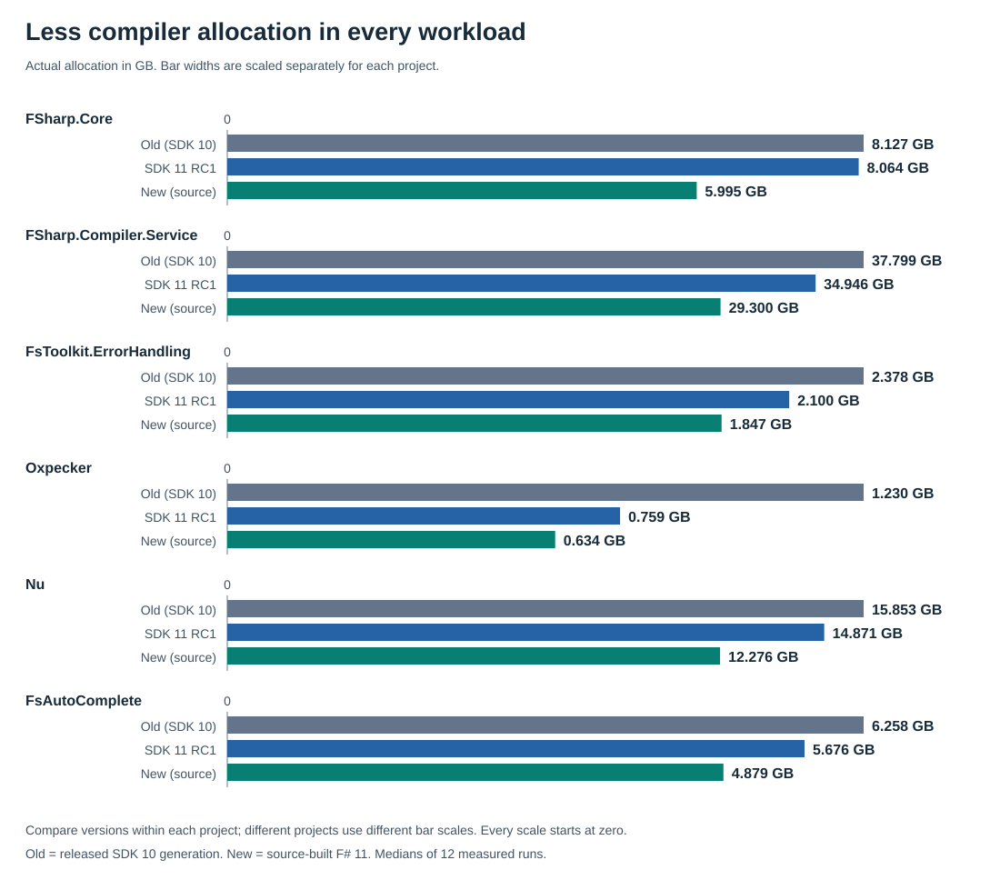
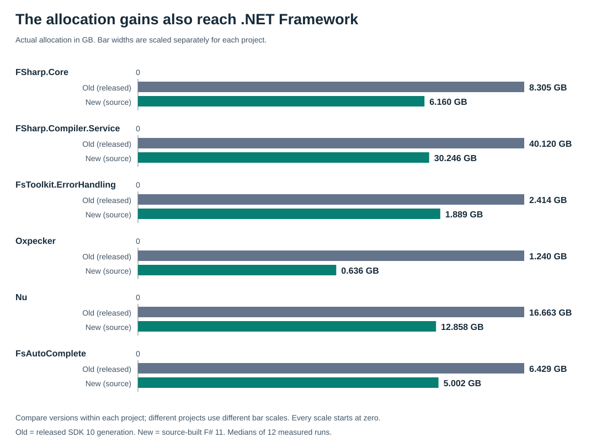
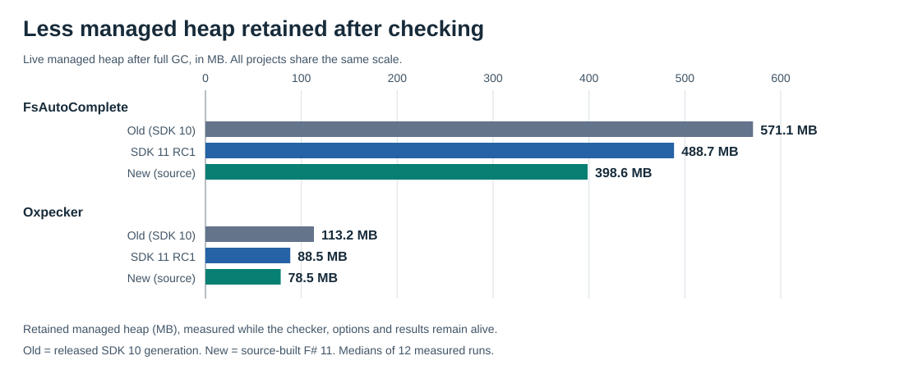

# Performance improvements in the F# 11 compiler

<!-- generated:opening -->
F# 11 brings **roughly 20-50% less allocation during compilation** across six real-world projects and **about 30% less memory retained after IDE project checks**. **And this is a win for your F# code, too!** Better [inlining of `FSharp.Core` calls](https://github.com/dotnet/fsharp/pull/20422) eliminates closure allocations in everyday functional code. Recompile with the new compiler and `FSharp.Core`, and these optimizations reach your applications and libraries, not just the compiler.

Behind these gains are **49 performance and supporting PRs**, merged between **Aug 12 and Sep 21, 2026**. **12 are already in RC1**; the remaining **37 are in the RC2 source**, headed for .NET 11 and F# 11 GA.
<!-- /generated:opening -->

These are author-provided measurements of a source-built compiler, not an official .NET 11 RC2 SDK benchmark.
The **New** payload uses [F# source commit `9cd6167a7`](https://github.com/dotnet/fsharp/commit/9cd6167a7265ce7264b22719503b7dfa9eb8f83c), the production source used by the pinned RC2 build.
The SDK comparison also changes runtime and packaging: Old runs on .NET 10, while RC1 and New run on .NET 11 RC1.
The .NET Framework comparison is separate and keeps the runtime family fixed.

## Less allocation during compilation

**Old:** SDK 10.0.100. **RC1:** SDK 11 RC1. **New:** optimized, source-built F# 11 from the RC2/main snapshot. Old runs on .NET 10; RC1 and new run on .NET 11 RC1.

<!-- generated:compilation -->
| Compilation workload | Old GB | RC1 GB | New GB | RC1 vs old: less allocation | New vs old: less allocation |
| --- | ---: | ---: | ---: | ---: | ---: |
| FSharp.Core | 8.127 | 8.064 | 5.995 | 0.8% | 26.2% |
| FSharp.Compiler.Service | 37.799 | 34.946 | 29.300 | 7.5% | 22.5% |
| FsToolkit.ErrorHandling | 2.378 | 2.100 | 1.847 | 11.7% | 22.3% |
| Oxpecker | 1.230 | 0.759 | 0.634 | 38.3% | 48.5% |
| Nu | 15.853 | 14.871 | 12.276 | 6.2% | 22.6% |
| FsAutoComplete | 6.258 | 5.676 | 4.879 | 9.3% | 22.0% |
<!-- /generated:compilation -->



<!-- generated:sdk-caveat -->
Peak compilation RAM rose in 4 of six SDK workloads, and FCS used more CPU time.
<!-- /generated:sdk-caveat -->

## The allocation gains also reach .NET Framework

FCS-hosted compilation on **x64 .NET Framework 4.8.1**, comparing released and source-built compiler packages.

<!-- generated:framework -->
| Compilation workload | Old GB | New GB | New vs old: less allocation |
| --- | ---: | ---: | ---: |
| FSharp.Core | 8.305 | 6.160 | 25.8% |
| FSharp.Compiler.Service | 40.120 | 30.246 | 24.6% |
| FsToolkit.ErrorHandling | 2.414 | 1.889 | 21.7% |
| Oxpecker | 1.240 | 0.636 | 48.7% |
| Nu | 16.663 | 12.858 | 22.8% |
| FsAutoComplete | 6.429 | 5.002 | 22.2% |
<!-- /generated:framework -->



FCS peak RAM also increased on Framework.

## Less memory held after IDE project checks

FCS now [shares imported assemblies](https://github.com/dotnet/fsharp/pull/20296) across projects instead of keeping a separate copy for each one.

<!-- generated:ide -->
| Project graph | Old MB | RC1 MB | New MB | New vs old: less retained memory |
| --- | ---: | ---: | ---: | ---: |
| FsAutoComplete | 571.1 | 488.7 | 398.6 | 30.2% |
| Oxpecker | 113.2 | 88.5 | 78.5 | 30.6% |
<!-- /generated:ide -->

*Managed memory retained after typechecking the project graphs.*



<!-- generated:portable-ide -->
On .NET Framework, retained memory falls by **30.1%-30.6%** too.
<!-- /generated:portable-ide -->

Editors and language servers pick up these gains by updating FCS.

## Fewer closure allocations in your F# code

A **closure** combines a function with values from surrounding code, such as `discount`, which the compiler used to store in a new object for this fold.
[Inlining](https://github.com/dotnet/fsharp/pull/20422) replaces a function call with its body, and `[<InlineIfLambda>]` tells the compiler to inline known lambda arguments too.

```fsharp
let discountedTotal discount prices =
    prices |> List.fold (fun total price -> total + price * (100 - discount) / 100) 0
```

For operations such as `List.fold` that otherwise allocate nothing, the closure can be their entire allocation cost.
`List.map` and other collection builders allocate a new collection anyway, so removing a closure usually saves a smaller share.

<!-- generated:programs -->
<!-- markdownlint-disable MD033 -->
| F# code (simplified) | Old B/op | New B/op |
| --- | ---: | ---: |
| `List.fold (fun s struct (p, q) -> s + p * q * (100 - d) / 100) 0 items` | 24 | 0 |
| `let any = List.exists (fun x -> x > lo) xs`<br>`List.forall (fun x -> x < hi) xs && any` | 48 | 0 |
| `Array.fold (fun s x -> s + x * k) 0 xs + Array.fold2 (fun s x w -> s + x * w * k) 0 xs ws` | 48 | 0 |
| `Option.defaultValue 0 (Option.map (addOffset k) opt)` | 0 | 0 |
| `List.fold (fun s xs -> s + List.fold (fun t x -> t + x * k) 0 xs) 0 groups` | 48 | 0 |
| `List.sum (List.map (fun x -> x + k) (List.filter (fun x -> x > lo) xs))` | 146 | 146 |
| `saved <- fun x -> x + offset`<br>`saved n` | 24 | 24 |
| `List.fold (+) seed xs` | 0 | 0 |
<!-- /generated:programs -->
<!-- markdownlint-enable MD033 -->

*List and array operations use four-element collections.*

### Which functions benefit?

`Option` and `ValueOption` (for `voption`) already inline lambda arguments in functions such as `map`, `bind`, and `fold`; this is not new in F# 11.

<!-- generated:function-inlining -->
These existing functions gained explicit lambda inlining in [#20422](https://github.com/dotnet/fsharp/pull/20422) and the earlier [`Array.init` change](https://github.com/dotnet/fsharp/pull/19869):

| Module | Functions gaining explicit lambda inlining |
| --- | --- |
| `List` (14) | `exists`, `exists2`, `find`, `findIndex`, `fold`, `fold2`, `forall`, `forall2`, `iter2`, `iteri2`, `pick`, `reduce`, `skipWhile`, `tryPick` |
| `Array` (19) | `exists2`, `find`, `findBack`, `findIndex`, `findIndexBack`, `fold`, `fold2`, `foldBack`, `foldBack2`, `forall`, `forall2`, `init`, `iter2`, `iteri`, `iteri2`, `pick`, `reduce`, `reduceBack`, `tryPick` |
<!-- /generated:function-inlining -->

### Partially applied functions, too

Previously, `InlineIfLambda` handled explicit lambdas, but some partial applications still left a closure behind.

```fsharp
type Settings(offset: int) =
    member _.Offset = offset

let add offset x = x + offset

let adjust (settings: Settings) value =
    value |> Option.map (add settings.Offset)
```

`add settings.Offset` supplies only the first argument and captures the current offset inside `adjust`, leaving a function waiting for `x`.
The [new compiler](https://github.com/dotnet/fsharp/pull/20487) handles this partial application like a lambda and no longer generates the extra closure object.

Recompile with the new compiler and FSharp.Core to bring these improvements to your own code.

## Contributing changes

<!-- generated:contributions -->
### Already in RC1

- **Aug 12** - [#20090](https://github.com/dotnet/fsharp/pull/20090): Import: Don't walk non-F# assemblies when labelling trait constraint sources.
- **Aug 12** - [#20088](https://github.com/dotnet/fsharp/pull/20088): Avoid per-instance lock object in InterruptibleLazy and DelayInitArrayMap.
- **Aug 12** - [#20092](https://github.com/dotnet/fsharp/pull/20092): IL: add ILPreNamespace, make ILPreTypeDef creation lazy.
- **Aug 13** - [#20250](https://github.com/dotnet/fsharp/pull/20250): IL: fix leaking binary view.
- **Aug 13** - [#20249](https://github.com/dotnet/fsharp/pull/20249): IL: use empty tables for members when possible.
- **Aug 19** - [#20254](https://github.com/dotnet/fsharp/pull/20254): IL: share ILCallingConv instances.
- **Aug 19** - [#20256](https://github.com/dotnet/fsharp/pull/20256): IL: cache C# extension methods per CCU.
- **Aug 19** - [#20244](https://github.com/dotnet/fsharp/pull/20244): Fix super-linear compilation of guarded shared-or active-pattern matches.
- **Aug 20** - [#20286](https://github.com/dotnet/fsharp/pull/20286): Make Entity's adhoc members list lazy.
- **Aug 24** - [#20301](https://github.com/dotnet/fsharp/pull/20301): IL: share the pickled references.
- **Aug 24** - [#20298](https://github.com/dotnet/fsharp/pull/20298): Name resolution: group C#-style extension members per 'open' and extended type.
- **Aug 24** - [#20259](https://github.com/dotnet/fsharp/pull/20259): IL: cache the ILTypeRef of a type def.

---

### In the RC2 source, headed for GA

- **Aug 26** - [#20285](https://github.com/dotnet/fsharp/pull/20285): Calculate Entity.PublicPath instead of storing.
- **Aug 26** - [#20337](https://github.com/dotnet/fsharp/pull/20337): Replace the stringified pattern-match memo key with a typed one.
- **Aug 27** - [#20255](https://github.com/dotnet/fsharp/pull/20255): IL: reuse the cached ILTypeRef in ILTypeInfo.FromType.
- **Aug 27** - [#20364](https://github.com/dotnet/fsharp/pull/20364): Unpickling: share one EntityRef per non-local reference row.
- **Aug 27** - [#20296](https://github.com/dotnet/fsharp/pull/20296): Import: share assembly CCUs between projects.
- **Aug 28** - [#20348](https://github.com/dotnet/fsharp/pull/20348): Four profiler-guided hot-path wins from self-build tracing.
- **Aug 28** - [#20350](https://github.com/dotnet/fsharp/pull/20350): Avoid Choice allocation in fslib entity/val-ref equality.
- **Aug 28** - [#20351](https://github.com/dotnet/fsharp/pull/20351): Reduce Detuple usage-analysis allocation with a mutable Dictionary.
- **Aug 31** - [#20354](https://github.com/dotnet/fsharp/pull/20354): Avoid redundant FreeVars record allocation for local vals.
- **Aug 31** - [#20363](https://github.com/dotnet/fsharp/pull/20363): Fuse the optimizer inlining copy + type-instantiation passes.
- **Aug 31** - [#20367](https://github.com/dotnet/fsharp/pull/20367): Inline TryD to remove constraint-solver closure allocations.
- **Aug 31** - [#20368](https://github.com/dotnet/fsharp/pull/20368): eliminate per-call closure in StackGuard.Guard via InlineIfLambda.
- **Sep 1** - [#20287](https://github.com/dotnet/fsharp/pull/20287): IL: hold custom attributes in fields rather than a union case.
- **Sep 4** - [#20353](https://github.com/dotnet/fsharp/pull/20353): Cache IL method parameter attributes during overload resolution.
- **Sep 4** - [#20384](https://github.com/dotnet/fsharp/pull/20384): Avoid per-call closure allocation in type-hierarchy traversal.
- **Sep 8** - [#20385](https://github.com/dotnet/fsharp/pull/20385): Inline the free-variable typar foldBacks.
- **Sep 9** - [#20447](https://github.com/dotnet/fsharp/pull/20447): Remove per-call closure allocations in post-inference checks.
- **Sep 9** - [#20423](https://github.com/dotnet/fsharp/pull/20423): Eliminate closure allocations in well-known-attribute queries.
- **Sep 9** - [#20415](https://github.com/dotnet/fsharp/pull/20415): Make List.vMapFold inline to drop the nullness-import closure.
- **Sep 9** - [#20372](https://github.com/dotnet/fsharp/pull/20372): Eliminate closure allocations in List.mapq and List.lengthsEqAndForall2.
- **Sep 9** - [#20349](https://github.com/dotnet/fsharp/pull/20349): Reverse instead of sort already-ordered branch fixups in IL writer.
- **Sep 10** - [#20374](https://github.com/dotnet/fsharp/pull/20374): Inline the static-abstract interface-constraint predicate.
- **Sep 10** - [#20437](https://github.com/dotnet/fsharp/pull/20437): Drop the per-call closure in generic type-argument codegen.
- **Sep 10** - [#20421](https://github.com/dotnet/fsharp/pull/20421): Drop accessibility and attribute-scan closures via ListInline.
- **Sep 10** - [#20426](https://github.com/dotnet/fsharp/pull/20426): Avoid per-call FSharpFunc closure in remapVal member-info remap.
- **Sep 11** - [#20487](https://github.com/dotnet/fsharp/pull/20487): Eliminate per-call closure for InlineIfLambda partial applications.
- **Sep 16** - [#20422](https://github.com/dotnet/fsharp/pull/20422): Inline List/Array higher-order functions and adapt function arguments.
- **Sep 16** - [#20388](https://github.com/dotnet/fsharp/pull/20388): Share the empty-array singleton for zero-length Array results.
- **Sep 17** - [#20490](https://github.com/dotnet/fsharp/pull/20490): Name resolution: CheckIWSAM only needs the intrinsic methods.
- **Sep 17** - [#20489](https://github.com/dotnet/fsharp/pull/20489): IL: map the short-lived metadata-only PE reader.
- **Sep 17** - [#20486](https://github.com/dotnet/fsharp/pull/20486): IL: intern the attributes and type references read from metadata.
- **Sep 17** - [#20481](https://github.com/dotnet/fsharp/pull/20481): FCS: fix races that made the background builder repeat work.
- **Sep 17** - [#20494](https://github.com/dotnet/fsharp/pull/20494): Typed tree: create a type's augmentation on first use.
- **Sep 17** - [#20261](https://github.com/dotnet/fsharp/pull/20261): IL: fix the per-reader string cache sizing.
- **Sep 18** - [#20571](https://github.com/dotnet/fsharp/pull/20571): Stabilize OptimizeClosureIfNotInlined for F# 11.
- **Sep 18** - [#20555](https://github.com/dotnet/fsharp/pull/20555): Ship net10.0 FSharp.Core with the SDK tools.
- **Sep 21** - [#20506](https://github.com/dotnet/fsharp/pull/20506): Support multithreaded MSBuild in F# build tasks (concurrency benefit not measured here).
<!-- /generated:contributions -->

Special thanks to [Eugene](https://github.com/auduchinok) for his substantial work reducing allocations during cold compiles and IDE typechecks, and reducing the memory retained per project.

We hope you enjoy the lower allocations, smaller IDE memory footprint, and more room for your own F# code. Keep enjoying F#!
