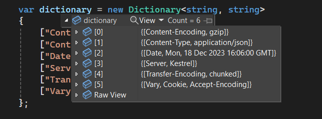
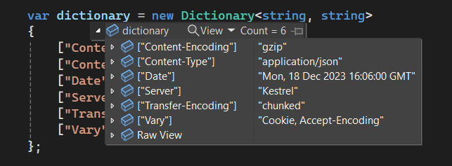

# ASP.NET Core in .NET 9 Preview 1 Release Notes

Here's a summary of what's new in ASP.NET Core in this preview release:

- Dictionary debugging improvements
- JSON polymorphic type support in SignalR Hubs
- General quality improvements and bug fixes

ASP.NET Core updates in .NET 9 Preview 1:

* [Discussion](https://github.com/dotnet/aspnetcore/discussions/54007)
* [What's new in ASP.NET Core in .NET 9](https://learn.microsoft.com/aspnet/core/release-notes/aspnetcore-9.0) documentation.
* [Breaking changes](https://docs.microsoft.com/dotnet/core/compatibility/9.0#aspnet-core)
* [Roadmap](https://aka.ms/aspnet/roadmap)

.NET 9 Preview 1:
* [Discussion](https://aka.ms/dotnet/9/preview1)
* [Release notes](README.md) 

## Dictionary debugging improvements

The debugging display of dictionaries and other key-value collections has an improved layout. The key is displayed in the debugger's key column instead of being concatenated with the value. The following images show the old and new display of a dictionary in the debugger.

Before:



After: 



ASP.NET Core has many key-value collections. This improved debugging experience applies to:

- HTTP headers
- Query strings
- Forms
- Cookies
- View data
- Route data
- Features

## JSON polymorphic type support in SignalR Hubs

Hub methods can now accept a base class instead of the derived class to enable polymorphic scenarios. The base type needs to be [annotated to allow polymorphism](https://learn.microsoft.com/dotnet/standard/serialization/system-text-json/polymorphism).

```csharp
public class MyHub : Hub
{
    public void Method(JsonPerson person)
    {
        if (person is JsonPersonExtended)
        {
        }
        else if (person is JsonPersonExtended2)
        {
        }
        else
        {
        }
    }
}

[JsonPolymorphic]
[JsonDerivedType(typeof(JsonPersonExtended), nameof(JsonPersonExtended))]
[JsonDerivedType(typeof(JsonPersonExtended2), nameof(JsonPersonExtended2))]
private class JsonPerson
{
    public string Name { get; set; }
    public Person Child { get; set; }
    public Person Parent { get; set; }
}

private class JsonPersonExtended : JsonPerson
{
    public int Age { get; set; }
}

private class JsonPersonExtended2 : JsonPerson
{
    public string Location { get; set; }
}
```

## Community contributors

Thank you contributors! ❤️

- [@abc516](https://github.com/dotnet/aspnetcore/pulls?q=is%3Apr+is%3Amerged+milestone%3A9.0-preview1+author%3Aabc516)
- [@afshinm](https://github.com/dotnet/aspnetcore/pulls?q=is%3Apr+is%3Amerged+milestone%3A9.0-preview1+author%3Aafshinm)
- [@aleksvujic](https://github.com/dotnet/aspnetcore/pulls?q=is%3Apr+is%3Amerged+milestone%3A9.0-preview1+author%3Aaleksvujic)
- [@alexbeeston](https://github.com/dotnet/aspnetcore/pulls?q=is%3Apr+is%3Amerged+milestone%3A9.0-preview1+author%3Aalexbeeston)
- [@alex-inftx](https://github.com/dotnet/aspnetcore/pulls?q=is%3Apr+is%3Amerged+milestone%3A9.0-preview1+author%3Aalex-inftx)
- [@aligoren](https://github.com/dotnet/aspnetcore/pulls?q=is%3Apr+is%3Amerged+milestone%3A9.0-preview1+author%3Aaligoren)
- [@alrz](https://github.com/dotnet/aspnetcore/pulls?q=is%3Apr+is%3Amerged+milestone%3A9.0-preview1+author%3Aalrz)
- [@bfriesen](https://github.com/dotnet/aspnetcore/pulls?q=is%3Apr+is%3Amerged+milestone%3A9.0-preview1+author%3Abfriesen)
- [@brianrourkeboll](https://github.com/dotnet/aspnetcore/pulls?q=is%3Apr+is%3Amerged+milestone%3A9.0-preview1+author%3Abrianrourkeboll)
- [@BurkusCat](https://github.com/dotnet/aspnetcore/pulls?q=is%3Apr+is%3Amerged+milestone%3A9.0-preview1+author%3ABurkusCat)
- [@campersau](https://github.com/dotnet/aspnetcore/pulls?q=is%3Apr+is%3Amerged+milestone%3A9.0-preview1+author%3Acampersau)
- [@charytech](https://github.com/dotnet/aspnetcore/pulls?q=is%3Apr+is%3Amerged+milestone%3A9.0-preview1+author%3Acharytech)
- [@CollinAlpert](https://github.com/dotnet/aspnetcore/pulls?q=is%3Apr+is%3Amerged+milestone%3A9.0-preview1+author%3ACollinAlpert)
- [@cremor](https://github.com/dotnet/aspnetcore/pulls?q=is%3Apr+is%3Amerged+milestone%3A9.0-preview1+author%3Acremor)
- [@damirault](https://github.com/dotnet/aspnetcore/pulls?q=is%3Apr+is%3Amerged+milestone%3A9.0-preview1+author%3Adamirault)
- [@DanielCordell](https://github.com/dotnet/aspnetcore/pulls?q=is%3Apr+is%3Amerged+milestone%3A9.0-preview1+author%3ADanielCordell)
- [@davhdavh](https://github.com/dotnet/aspnetcore/pulls?q=is%3Apr+is%3Amerged+milestone%3A9.0-preview1+author%3Adavhdavh)
- [@david-acker](https://github.com/dotnet/aspnetcore/pulls?q=is%3Apr+is%3Amerged+milestone%3A9.0-preview1+author%3Adavid-acker)
- [@DavidKlempfner](https://github.com/dotnet/aspnetcore/pulls?q=is%3Apr+is%3Amerged+milestone%3A9.0-preview1+author%3ADavidKlempfner)
- [@GeorgiPopovIT](https://github.com/dotnet/aspnetcore/pulls?q=is%3Apr+is%3Amerged+milestone%3A9.0-preview1+author%3AGeorgiPopovIT)
- [@gfoidl](https://github.com/dotnet/aspnetcore/pulls?q=is%3Apr+is%3Amerged+milestone%3A9.0-preview1+author%3Agfoidl)
- [@glen-84](https://github.com/dotnet/aspnetcore/pulls?q=is%3Apr+is%3Amerged+milestone%3A9.0-preview1+author%3Aglen-84)
- [@GreyFogSamurai](https://github.com/dotnet/aspnetcore/pulls?q=is%3Apr+is%3Amerged+milestone%3A9.0-preview1+author%3AGreyFogSamurai)
- [@HavenDV](https://github.com/dotnet/aspnetcore/pulls?q=is%3Apr+is%3Amerged+milestone%3A9.0-preview1+author%3AHavenDV)
- [@Issung](https://github.com/dotnet/aspnetcore/pulls?q=is%3Apr+is%3Amerged+milestone%3A9.0-preview1+author%3AIssung)
- [@jirikanda](https://github.com/dotnet/aspnetcore/pulls?q=is%3Apr+is%3Amerged+milestone%3A9.0-preview1+author%3Ajirikanda)
- [@joegoldman2](https://github.com/dotnet/aspnetcore/pulls?q=is%3Apr+is%3Amerged+milestone%3A9.0-preview1+author%3Ajoegoldman2)
- [@Kahbazi](https://github.com/dotnet/aspnetcore/pulls?q=is%3Apr+is%3Amerged+milestone%3A9.0-preview1+author%3AKahbazi)
- [@kaotoby](https://github.com/dotnet/aspnetcore/pulls?q=is%3Apr+is%3Amerged+milestone%3A9.0-preview1+author%3Akaotoby)
- [@kirides](https://github.com/dotnet/aspnetcore/pulls?q=is%3Apr+is%3Amerged+milestone%3A9.0-preview1+author%3Akirides)
- [@KonH](https://github.com/dotnet/aspnetcore/pulls?q=is%3Apr+is%3Amerged+milestone%3A9.0-preview1+author%3AKonH)
- [@ladeak](https://github.com/dotnet/aspnetcore/pulls?q=is%3Apr+is%3Amerged+milestone%3A9.0-preview1+author%3Aladeak)
- [@lofcz](https://github.com/dotnet/aspnetcore/pulls?q=is%3Apr+is%3Amerged+milestone%3A9.0-preview1+author%3Alofcz)
- [@MaceWindu](https://github.com/dotnet/aspnetcore/pulls?q=is%3Apr+is%3Amerged+milestone%3A9.0-preview1+author%3AMaceWindu)
- [@mariusz96](https://github.com/dotnet/aspnetcore/pulls?q=is%3Apr+is%3Amerged+milestone%3A9.0-preview1+author%3Amariusz96)
- [@naeemaei](https://github.com/dotnet/aspnetcore/pulls?q=is%3Apr+is%3Amerged+milestone%3A9.0-preview1+author%3Anaeemaei)
- [@onurkanbakirci](https://github.com/dotnet/aspnetcore/pulls?q=is%3Apr+is%3Amerged+milestone%3A9.0-preview1+author%3Aonurkanbakirci)
- [@paulomorgado](https://github.com/dotnet/aspnetcore/pulls?q=is%3Apr+is%3Amerged+milestone%3A9.0-preview1+author%3Apaulomorgado)
- [@pentp](https://github.com/dotnet/aspnetcore/pulls?q=is%3Apr+is%3Amerged+milestone%3A9.0-preview1+author%3Apentp)
- [@rameel](https://github.com/dotnet/aspnetcore/pulls?q=is%3Apr+is%3Amerged+milestone%3A9.0-preview1+author%3Arameel)
- [@RyanGaudion](https://github.com/dotnet/aspnetcore/pulls?q=is%3Apr+is%3Amerged+milestone%3A9.0-preview1+author%3ARyanGaudion)
- [@simon-curtis](https://github.com/dotnet/aspnetcore/pulls?q=is%3Apr+is%3Amerged+milestone%3A9.0-preview1+author%3Asimon-curtis)
- [@tmds](https://github.com/dotnet/aspnetcore/pulls?q=is%3Apr+is%3Amerged+milestone%3A9.0-preview1+author%3Atmds)
- [@vanillajonathan](https://github.com/dotnet/aspnetcore/pulls?q=is%3Apr+is%3Amerged+milestone%3A9.0-preview1+author%3Avanillajonathan)
- [@vhatuncev](https://github.com/dotnet/aspnetcore/pulls?q=is%3Apr+is%3Amerged+milestone%3A9.0-preview1+author%3Avhatuncev)
- [@viliml](https://github.com/dotnet/aspnetcore/pulls?q=is%3Apr+is%3Amerged+milestone%3A9.0-preview1+author%3Aviliml)
- [@Vishwanatha-HD](https://github.com/dotnet/aspnetcore/pulls?q=is%3Apr+is%3Amerged+milestone%3A9.0-preview1+author%3AVishwanatha-HD)
- [@WeihanLi](https://github.com/dotnet/aspnetcore/pulls?q=is%3Apr+is%3Amerged+milestone%3A9.0-preview1+author%3AWeihanLi)
- [@Who-Code](https://github.com/dotnet/aspnetcore/pulls?q=is%3Apr+is%3Amerged+milestone%3A9.0-preview1+author%3AWho-Code)
- [@xaberue](https://github.com/dotnet/aspnetcore/pulls?q=is%3Apr+is%3Amerged+milestone%3A9.0-preview1+author%3Axaberue)
- [@zcxsythenew](https://github.com/dotnet/aspnetcore/pulls?q=is%3Apr+is%3Amerged+milestone%3A9.0-preview1+author%3Azcxsythenew)
- [@zorix](https://github.com/dotnet/aspnetcore/pulls?q=is%3Apr+is%3Amerged+milestone%3A9.0-preview1+author%3Azorix)
