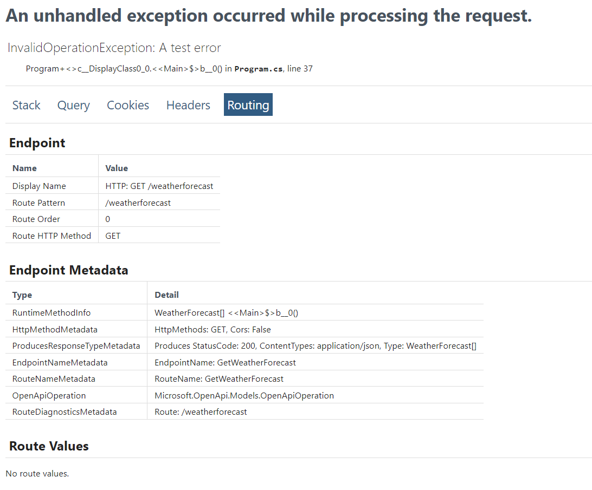

# ASP.NET Core in .NET 9 Preview 3 - Release Notes

Here's a summary of what's new in ASP.NET Core in this preview release:

- Endpoint metadata on the developer exception page
- Added `InternalServerError` and `InternalServerError<TValue>` to `TypedResults`
- Handle keyboard composition events in Blazor

ASP.NET Core updates in .NET 9 Preview 3:

- [What's new in ASP.NET Core in .NET 9](https://learn.microsoft.com/aspnet/core/release-notes/aspnetcore-9.0) documentation.
- [Breaking changes](https://docs.microsoft.com/dotnet/core/compatibility/9.0#aspnet-core)
- [Roadmap](https://aka.ms/aspnet/roadmap)

.NET 9 Preview 3:

- [Discussion](https://aka.ms/dotnet/9/preview3)
- [Release notes](./README.md)

## Endpoint metadata on the developer exception page

ASP.NET Core endpoints have associated metadata that can be used for a variety of purposes, like configuring routing, authentication and authorization, response caching, rate limiting, OpenAPI generation, and much more. The Routing tab of the ASP.NET Core [developer exception page](https://learn.microsoft.com/aspnet/core/fundamentals/error-handling#developer-exception-page) now desplays endpoint metadata alongside other routing information to facilitate debugging.



Thank you [@Kahbazi](https://github.com/Kahbazi) for this contribution!

## Added `InternalServerError` and `InternalServerError<TValue>` to `TypedResults`

`TypedResults` are a helpful vehicle for returning strongly-typed HTTP status code-based responses from a minimal API. The `TypedResults` class now includes factory methods and types for returning "500 Internal Server Error" responses from your endpoints.

```csharp
var app = WebApplication.Create();

app.MapGet("/", () => TypedResults.InternalServerError("Something went wrong!"));

app.Run();
```

Thank you [@onurmicoogullari](https://github.com/onurmicoogullari) for this contribution!

## Handle keyboard composition events in Blazor

The new `KeyboardEventArgs.IsComposing` property indicates if the keyboard event [is part of a composition session](https://w3c.github.io/uievents/#dom-keyboardevent-iscomposing). This is useful for tracking the composition state of keyboard events, which is crucial for handling international character input methods.

Thank you [@BattlefieldDuck](https://github.com/BattlefieldDuck) for this contribution!

## Community contributors

Thank you contributors! ❤️

- [omajid](https://github.com/dotnet/aspnetcore/pulls?q=is%3Apr+is%3Amerged+milestone%3A9.0-preview3+author%3Aomajid)
- [tcortega](https://github.com/dotnet/aspnetcore/pulls?q=is%3Apr+is%3Amerged+milestone%3A9.0-preview3+author%3Atcortega)
- [marcin-burak](https://github.com/dotnet/aspnetcore/pulls?q=is%3Apr+is%3Amerged+milestone%3A9.0-preview3+author%3Amarcin-burak)
- [BattlefieldDuck](https://github.com/dotnet/aspnetcore/pulls?q=is%3Apr+is%3Amerged+milestone%3A9.0-preview3+author%3ABattlefieldDuck)
- [JamieMagee](https://github.com/dotnet/aspnetcore/pulls?q=is%3Apr+is%3Amerged+milestone%3A9.0-preview3+author%3AJamieMagee)
- [khellang](https://github.com/dotnet/aspnetcore/pulls?q=is%3Apr+is%3Amerged+milestone%3A9.0-preview3+author%3Akhellang)
- [MythoclastBM](https://github.com/dotnet/aspnetcore/pulls?q=is%3Apr+is%3Amerged+milestone%3A9.0-preview3+author%3AMythoclastBM)
- [merijndejonge](https://github.com/dotnet/aspnetcore/pulls?q=is%3Apr+is%3Amerged+milestone%3A9.0-preview3+author%3Amerijndejonge)
- [onurmicoogullari](https://github.com/dotnet/aspnetcore/pulls?q=is%3Apr+is%3Amerged+milestone%3A9.0-preview3+author%3Aonurmicoogullari)
- [johatuni](https://github.com/dotnet/aspnetcore/pulls?q=is%3Apr+is%3Amerged+milestone%3A9.0-preview3+author%3Ajohatuni)
- [andrewjsaid](https://github.com/dotnet/aspnetcore/pulls?q=is%3Apr+is%3Amerged+milestone%3A9.0-preview3+author%3Aandrewjsaid)
- [Kahbazi](https://github.com/dotnet/aspnetcore/pulls?q=is%3Apr+is%3Amerged+milestone%3A9.0-preview3+author%3AKahbazi)
- [hakenr](https://github.com/dotnet/aspnetcore/pulls?q=is%3Apr+is%3Amerged+milestone%3A9.0-preview3+author%3Ahakenr)
- [WeihanLi](https://github.com/dotnet/aspnetcore/pulls?q=is%3Apr+is%3Amerged+milestone%3A9.0-preview3+author%3AWeihanLi)
- [StevenTCramer](https://github.com/dotnet/aspnetcore/pulls?q=is%3Apr+is%3Amerged+milestone%3A9.0-preview3+author%3AStevenTCramer)
