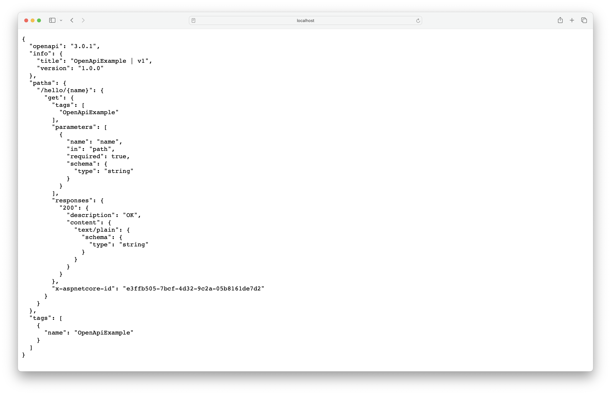
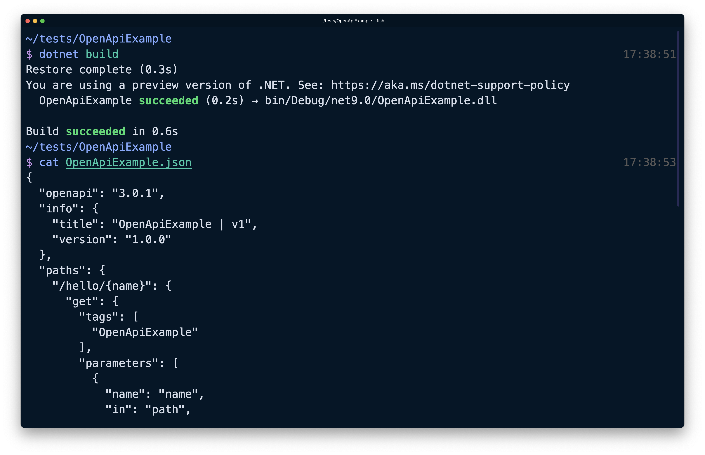
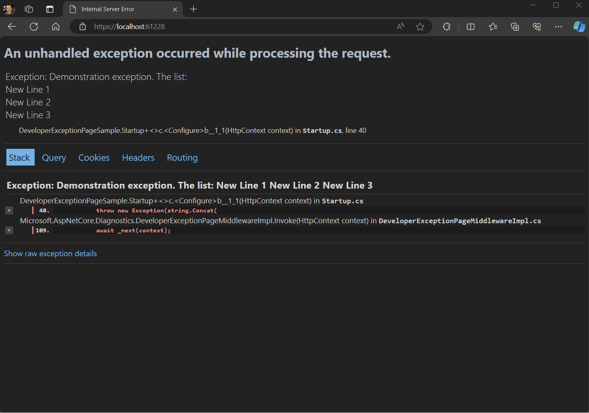

# ASP.NET Core in .NET 9 Preview 4 - Release Notes

Here's a summary of what's new in ASP.NET Core in this preview release:

- [Built-in support for OpenAPI document generation](#built-in-support-for-openapi-document-generation)
- [Introducing `HybridCache`](#introducing-hybridcache)
- [Developer exception page improvements](#developer-exception-page-improvements)
- [Added `OverscanCount` parameter to `QuickGrid`](#added-overscancount-parameter-to-quickgrid)
- [Add static SSR pages to a globally-interactive Blazor Web app](#add-static-ssr-pages-to-a-globally-interactive-blazor-web-app)
- [Avoid 503's during app recycle in IIS](#avoid-503s-during-app-recycle-in-iis)

ASP.NET Core updates in .NET 9 Preview 4:

- [What's new in ASP.NET Core in .NET 9](https://learn.microsoft.com/aspnet/core/release-notes/aspnetcore-9.0) documentation.
- [Breaking changes](https://docs.microsoft.com/dotnet/core/compatibility/9.0#aspnet-core)
- [Roadmap](https://aka.ms/aspnet/roadmap)

.NET 9 Preview 4:

- [Discussion](https://aka.ms/dotnet/9/preview4)
- [Release notes](./README.md)

## Built-in support for OpenAPI document generation

The [OpenAPI specification](https://www.openapis.org/) is a standard for describing HTTP APIs. The standard allows developers to define the shape of APIs that can be plugged into client generators, server generators, testing tools, documentation, and more. In .NET 9 Preview 4, ASP.NET Core provides built-in support for generating OpenAPI documents representing controller-based or minimal APIs via the [Microsoft.AspNetCore.OpenApi](https://nuget.org/packages/Microsoft.AspNetCore.OpenApi) package.

To take advantage of this feature, install the `Microsoft.AspNetCore.OpenApi` package in your web project of choice.

```console
dotnet add package Microsoft.AspNetCore.OpenApi --prerelease
```

In your app's `Program.cs`:

- Call `AddOpenApi` to register the required dependencies into your app's DI container.
- Call `MapOpenApi` to register the required OpenAPI endpoints in your app's routes.

```csharp
var builder = WebApplication.CreateBuilder();

builder.Services.AddOpenApi();

var app = builder.Build();

app.MapOpenApi();

app.MapGet("/hello/{name}", (string name) => $"Hello {name}"!);

app.Run();
```

Run your application and navigate to `openapi/v1.json` to view the generated OpenAPI document:



You can also generate OpenAPI documents at build-time using the `Microsoft.Extensions.ApiDescription.Server` package. Add the required dependency to your project:

```console
dotnet add package Microsoft.Extensions.ApiDescription.Server --prerelease
```

In your app's project file, add the following:

```xml
<PropertyGroup>
    <OpenApiDocumentsDirectory>$(MSBuildProjectDirectory)</OpenApiDocumentsDirectory>
    <OpenApiGenerateDocuments>true</OpenApiGenerateDocuments>
</PropertyGroup>
```

Then, run `dotnet build` and inspect the generated JSON file in your project directory.



ASP.NET Core's built-in OpenAPI document generation provides support for various customizations and options, including document and operation transformers and the ability to manage multiple OpenAPI documents for the same application.

To learn more about ASP.NET Core's new OpenAPI document capabilities, check out [the new Microsoft.AspNetCore.OpenApi docs](https://aka.ms/aspnet/openapi).

## Introducing `HybridCache`

.NET 9 Preview 4 includes the first release of the new `HybridCache` API. This API bridges some gaps in the existing `IDistributedCache` and `IMemoryCache` APIs, while also adding new capabilities including "stampede" protection (to prevent parallel fetches of the same work) and configurable serialization - all with a simple, clean API. `HybridCache` uses multiple tiers of cache storage, with a limited in-process (L1) cache supplemented by a separate (usually larger) out-of-process (L2) cache. This "hybrid" approach to cache storage gives the best of both worlds, where most fetches are served efficiently from L1, but cold-start and less-frequently-accessed data still doesn't hammer the underlying backend, thanks to L2. `HybridCache` is designed to be a drop-in replacement for most `IDistributedCache` scenarios, while providing more features, better usability, and improved performance.

The best way to illustrate `HybridCache` is by comparison to existing `IDistributedCache` code. Here's an example of what using `IDistributedCache` looks like:

```csharp
public class SomeService(IDistributedCache cache)
{
    public async Task<SomeInformation> GetSomeInformationAsync(string name, int id, CancellationToken token = default)
    {
        var key = $"someinfo:{name}:{id}"; // unique key for this combination
        var bytes = await cache.GetAsync(key, token); // try to get from cache
        SomeInformation info;
        if (bytes is null)
        {
            // cache miss; get the data from the real source
            info = await SomeExpensiveOperationAsync(name, id, token);

            // serialize and cache it
            bytes = SomeSerializer.Serialize(info);
            await cache.SetAsync(key, bytes, token);
        }
        else
        {
            // cache hit; deserialize it
            info = SomeSerializer.Deserialize<SomeInformation>(bytes);
        }
        return info;
    }

    // this is the work we're trying to cache
    private async Task<SomeInformation> SomeExpensiveOperationAsync(string name, int id,
        CancellationToken token = default)
    { /* ... */ }

    // ...
}
```

That's a lot of work to get right each time! You have to manually handle serialization, and in the "cache miss" scenario, a busy system could easily end up with multiple concurrent threads *all* getting a cache miss, *all* fetching the underlying data, *all* serializing it, and *all* sending that data to the cache.

To simplify and improve this code with `HybridCache`, we first need to add a reference to the new [Microsoft.Extensions.Caching.Hybrid](https://nuget.org/packages/Microsoft.Extensions.Caching.Hybrid)` package:

```console
dotnet add package Microsoft.Extensions.Caching.Hybrid --prerelease
```

Then register the `HybridCache` service:

```csharp
services.AddHybridCache(); // not shown: optional configuration API
```

Now we can offload most of our caching concerns to `HybridCache`:

```csharp
public class SomeService(HybridCache cache)
{
    public async Task<SomeInformation> GetSomeInformationAsync(string name, int id, CancellationToken token = default)
    {
        return await cache.GetOrCreateAsync(
            $"someinfo:{name}:{id}", // unique key for this combination
            async cancel => await SomeExpensiveOperationAsync(name, id, cancel),
            token: token
        );
    }

    // ...
}
```

`HybridCache` deals with combining concurrent operations. The `cancel` token represents the combined cancellation of *all* concurrent callers, not just the cancellation of the caller we can see via `token`.

For high throughput scenarios, we can further optimize this code to avoid some overhead from captured variables and per-instance callbacks:

```csharp
public class SomeService(HybridCache cache)
{
    public async Task<SomeInformation> GetSomeInformationAsync(string name, int id, CancellationToken token = default)
    {
        return await cache.GetOrCreateAsync(
            $"someinfo:{name}:{id}", // unique key for this combination
            (name, id), // all of the state we need for the final call, if needed
            static async (state, token) =>
                await SomeExpensiveOperationAsync(state.name, state.id, token),
            token: token
        );
    }

    // ...
}
```

`HybridCache` will use your configured `IDistributedCache` implementation, if any, for the secondary out-of-process caching. For example, you might use [Redis](https://learn.microsoft.com/aspnet/core/performance/caching/distributed). But even without an `IDistributedCache`, the `HybridCache` service will still provide in-process caching and "stampede" protection.

### Note on object reuse with `HybridCache`

Note that when adapting existing `IDistributedCache` code to use `HybridCache`, the existing code will usually be deserializing with every call, which means that concurrent callers will get separate object instances that cannot interact and are inherently thread-safe. To avoid introducing concurrency bugs into code, `HybridCache` preserves this behavior by default. If your scenario is thread-safe (either because the types are fundamentally immutable, or because you're just not mutating them), you can hint to `HybridCache` that it can safely reuse instances by marking the type (`SomeInformation` in this case) as `sealed` and using the `[ImmutableObject(true)]` annotation,
which can significantly reduce the deserialization overhead.

### Additional `HybridCache` features

For parity with `IDistributedCache`, `HybridCache` supports explicit removal by key using `cache.RemoveKeyAsync(...)`.

`HybridCache` also introduces new optional APIs for `IDistributedCache` implementations to avoid `byte[]` allocations. This feature is implemented by the preview versions of `Microsoft.Extensions.Caching.StackExchangeRedis` and `Microsoft.Extensions.Caching.SqlServer`.

Serialization is configured as part of registering the service, with support for type-specific and generalized serializers via the `.WithSerializer(...)` and `.WithSerializerFactory(...)` methods chained from the `AddHybridCache(...)` call. By default, the library handles `string` and `byte[]` internally and uses `System.Text.Json` for everything else, but if you want to use protobuf, XML, or something else that's easy to do.

`HybridCache` includes support for older .NET runtimes down to .NET Framework 4.7.2 and .NET Standard 2.0.

## Developer exception page improvements

.NET 9 Preview 4 improves how endpoint metadata is displayed in the [ASP.NET Core developer exception page](https://learn.microsoft.com/aspnet/core/fundamentals/error-handling):

- Better text wrapping: Long cookies, query string values, and method names no longer add horizontal browser scroll bars.
- Bigger text: This page has a long history (10+ years) and web design has changed over time. The text felt a little small compared to modern designs.
- More consistent table sizes.



Thank you [@ElderJames](https://github.com/ElderJames) for this contribution.

## Added `OverscanCount` parameter to `QuickGrid`

The Blazor `QuickGrid` component now exposes an `OverscanCount` property that can be used to specify how many additional rows are rendered before and after the visible region when virtualization is enabled.

The default `OverscanCount` is 3. The following example increases the `OverscanCount` to 4:

```razor
<QuickGrid ItemsProvider="itemsProvider" Virtualize="true" OverscanCount="4">
    ...
</QuickGrid>
```

Thanks you [@MattyLeslie](https://github.com/MattyLeslie) for this contribution!

## Add static SSR pages to a globally-interactive Blazor Web app

Blazor Web Apps can enable *global interactivity*, which means that all pages in the app use an interactive render mode: Server, WebAssembly, or Auto (which combines both). You can now have a page opt out of global interactivity using the new `[ExcludeFromInteractiveRouting]` attribute. For example:

```razor
@page "/weather"
@attribute [ExcludeFromInteractiveRouting]

<h1>The rest of the page</h1>
```

The `[ExcludeFromInteractiveRouting]` attribute causes navigations to the page to exit from interactive routing. Navigations to the page will be forced to perform a full-page reload. This means that your top-level *App.razor* will re-run, allowing you to switch to a different top-level render mode. For example, in `App.razor`, you can use the following pattern to use static server-side rendering (SSR) for pages that are excluded from interactive routing:

```razor
<!DOCTYPE html>
<html>
<head>
    ... other head content here ...
    <HeadOutlet @rendermode="PageRenderMode" />
</head>
<body>
    <Routes @rendermode="@PageRenderMode" />
    <script src="_framework/blazor.web.js"></script>
</body>
</html>

@code {
    [CascadingParameter]
    private HttpContext HttpContext { get; set; } = default!;

    private IComponentRenderMode? PageRenderMode
        => HttpContext.AcceptsInteractiveRouting() ? InteractiveServer : null;
}
```

When set up like this, all pages default to the `InteractiveServer` render mode, retaining global interactivity, except for pages annotated with `[ExcludeFromInteractiveRouting]`, which will use static SSR. The `HttpContext.AcceptsInteractiveRouting()` extension method detects whether `[ExcludeFromInteractiveRouting]` is applied to the current page as endpoint metadata. Of course, you can replace `InteractiveServer` with `InteractiveWebAssembly` or `InteractiveAuto` to specify a different default global mode as desired.

### When to exclude pages from interactive routing

Excluding pages from interactive routing is useful only if you have certain pages that can't work with interactive Server or WebAssembly rendering. For example, those pages might include code that depends on reading/writing HTTP cookies, and hence can only work in a request/response cycle. Forcing those pages to use static SSR mode will force them into this traditional request/response cycle instead of interactive SPA-style rendering.

For pages that do work with interactive rendering, you shouldn't force them to use static SSR, as it would result in a less efficient and responsive experience for the end user.

## Avoid 503's during app recycle in IIS

By default, there's now a one second delay between when IIS is notified of an app recycle or shutdown and when the ASP.NET Core Module (ANCM) tells the managed server to start shutting down. The delay reduces the likelihood of a race between when IIS starts queuing requests to go to the new app and when ANCM starts rejecting new requests that come into the old app.

Slower machines or machines with heavier CPU usage may want to adjust the duration of this delay to reduce the likelihood of returning 503 errors. The delay is configurable via the `ANCM_shutdownDelay` environment variable or by setting the `shutdownDelay` handler setting. Both values are specified in milliseconds.

Example of setting `shutdownDelay`:

```xml
<aspNetCore processPath="dotnet" arguments="myapp.dll" stdoutLogEnabled="false" stdoutLogFile=".logsstdout">
  <handlerSettings>
    <!--
    Milliseconds to delay shutdown of the old app app instance while the new instance starts.
    Note: This doesn't delay the handling of incoming requests.
    -->
    <handlerSetting name="shutdownDelay" value="5000" />
  </handlerSettings>
</aspNetCore>
```

## Community contributors

Thank you contributors! ❤️

- [michaelstaib](https://github.com/dotnet/aspnetcore/pulls?q=is%3Apr+is%3Amerged+milestone%3A9.0-preview4+author%3Amichaelstaib)
- [MattyLeslie](https://github.com/dotnet/aspnetcore/pulls?q=is%3Apr+is%3Amerged+milestone%3A9.0-preview4+author%3AMattyLeslie)
- [ElderJames](https://github.com/dotnet/aspnetcore/pulls?q=is%3Apr+is%3Amerged+milestone%3A9.0-preview4+author%3AElderJames)
- [ladeak](https://github.com/dotnet/aspnetcore/pulls?q=is%3Apr+is%3Amerged+milestone%3A9.0-preview4+author%3Aladeak)
- [bseptember](https://github.com/dotnet/aspnetcore/pulls?q=is%3Apr+is%3Amerged+milestone%3A9.0-preview4+author%3Abseptember)
- [AliKhalili](https://github.com/dotnet/aspnetcore/pulls?q=is%3Apr+is%3Amerged+milestone%3A9.0-preview4+author%3AAliKhalili)
- [martincostello](https://github.com/dotnet/aspnetcore/pulls?q=is%3Apr+is%3Amerged+milestone%3A9.0-preview4+author%3Amartincostello)
- [lyndaidaii](https://github.com/dotnet/aspnetcore/pulls?q=is%3Apr+is%3Amerged+milestone%3A9.0-preview4+author%3Alyndaidaii)
- [Prologh](https://github.com/dotnet/aspnetcore/pulls?q=is%3Apr+is%3Amerged+milestone%3A9.0-preview4+author%3APrologh)
- [gfoidl](https://github.com/dotnet/aspnetcore/pulls?q=is%3Apr+is%3Amerged+milestone%3A9.0-preview4+author%3Agfoidl)
