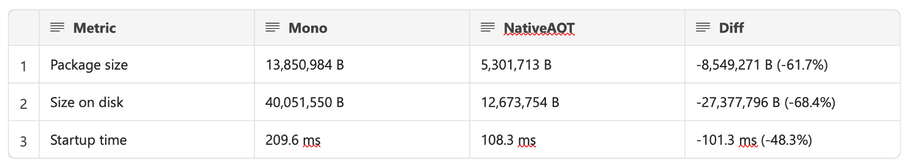

# .NET MAUI in .NET 9 Preview 4 - Release Notes

Here's a summary of what's new in .NET MAUI in this preview release:

- [New Input Keyboards](#new-input-keyboards)
- [Android 15 Beta 1 Support](#android-15-beta-1-support)
- [NativeAOT improvements for iOS & Mac Catalyst](#native-aot-for-ios--mac-catalyst)

.NET MAUI updates in .NET 9 Preview 4:

* [What's new in .NET MAUI in .NET 9](https://learn.microsoft.com/dotnet/maui/whats-new/dotnet-9) documentation
* [GitHub Release](https://aka.ms/maui9p4)

.NET 9 Preview 4:
* [Discussion](https://aka.ms/dotnet/9/preview4)
* [Release notes](./README.md)


## New Input Keyboards

In this release we have added new soft keyboard input support for `Password`, `Date`, and `Time`. Enable these on the `Editor` and `Entry` input controls like:

```xml
<Entry Keyboard="Date" />
```

## .NET for Android

### Android 15 Beta 1 Support

This release introduces .NET bindings for Beta 1 of Android 15 codenamed "Vanilla Ice Cream". To build for these APIs, update the target framework of your project.

```xml
<TargetFramework>net9.0-android35</TargetFramework>
```

Additional release information can be found on [GitHub releases](https://github.com/dotnet/android/releases/).

## .NET for iOS

### Native AOT for iOS & Mac Catalyst

Native AOT (Ahead of Time) compilation for iOS and Mac Catalyst now takes advantage of full trimming to greatly reduce your application's package size and startup performance. This is a publishing feature that you can use when you're ready to ship your application. Your application and all dependencies must be fully trimmable in order to utilize this feature.

```
dotnet publish -f net9.0-maccatalyst -r maccatalyst-arm64
```



This release was focused on quality, additional information can be found on [GitHub releases](https://github.com/xamarin/xamarin-macios/releases/) and [known issues in .NET 9](https://github.com/xamarin/xamarin-macios/wiki/Known-issues-in-.NET9).

## Community Contributions

Thanks to contributors [@MartyIX](https://github.com/MartyIX), [@beeradmoore](https://github.com/beeradmoore), [@atoghyani](https://github.com/atoghyani), [@taublast](https://github.com/taublast), [@VladislavAntonyuk](https://github.com/VladislavAntonyuk), [@Axemasta](https://github.com/Axemasta), [@kubaflo](https://github.com/kubaflo), and [@ivanpovazan](https://github.com/ivanpovazan).
