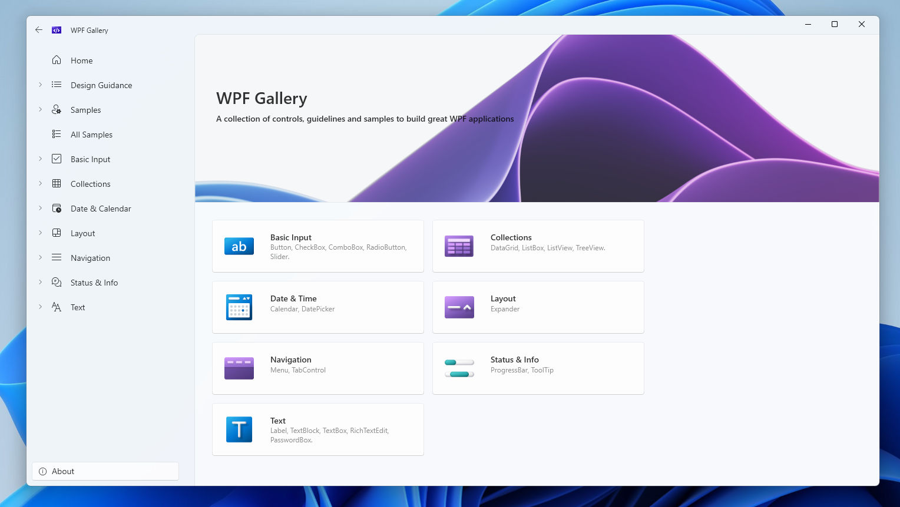
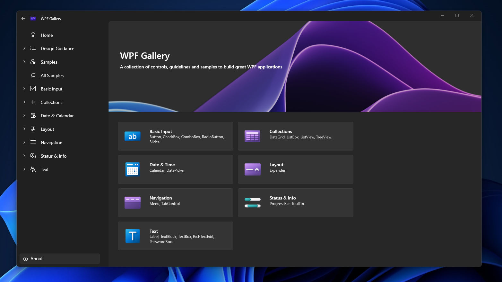

# WPF in .NET 9 Preview 4 - Release Notes

This release includes several new features for WPF developers including:

- [Theming improvements – Support for Windows 11 theming for WPF apps](#support-for-windows-11-theming)
- [Hyphen based ligature support](#hyphen-based-ligature-support)

.NET 9 Preview 4:

- [Discussion](https://aka.ms/dotnet/9/preview4)
- [Release notes](./README.md)

## Support for Windows 11 theming 

For consumer applications built on WPF and running on Windows 11, this feature enables them to leverage modern design elements and behaviors. This includes features such as: 

- Light and dark theme support 
- Rounded corners for controls, and 
- Windows 11 design styles for controls 




This can be enabled by adding the following to your `App.xaml`

```xml
<Application.Resources>
    <ResourceDictionary>
        <ResourceDictionary.MergedDictionaries>
            <ResourceDictionary Source="pack://application:,,,/PresentationFramework.Fluent;component/Themes/Fluent.xaml" />
        </ResourceDictionary.MergedDictionaries>
    </ResourceDictionary>
</Application.Resources>
```

## Hyphen based ligature support 

Based on the WPF community feedback, we have now fixed the issue with Hyphen based ligatures not working in WPF. Summary: A call to LsTxtFmt (Text Formatter) is made when a line is being created. Previously, in LsTxtFmt, glyphing was only performed for regular characters. However, after the fix, glyphing will also be performed for special characters, such as hyphens. 

## Community Contributions 

- Thanks [pomianowski](https://github.com/pomianowski) for all the support and collaboration on the theming front. 
- Thanks [Jan Kucera](https://github.com/miloush) for all the support and validation on Hyphen-Ligatures. 
