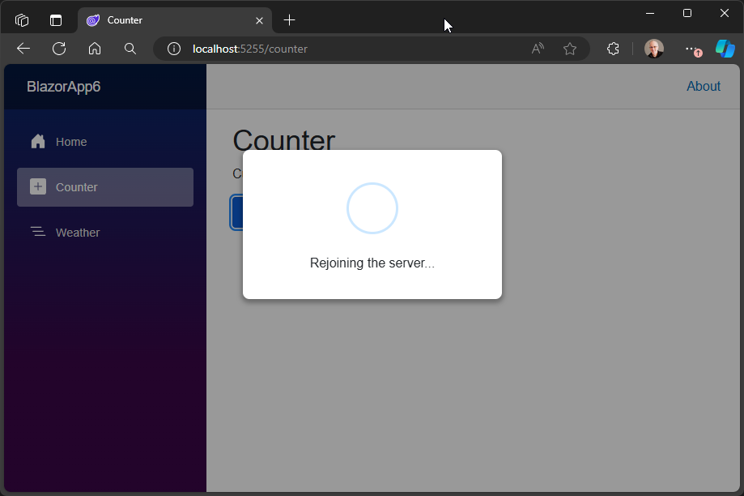
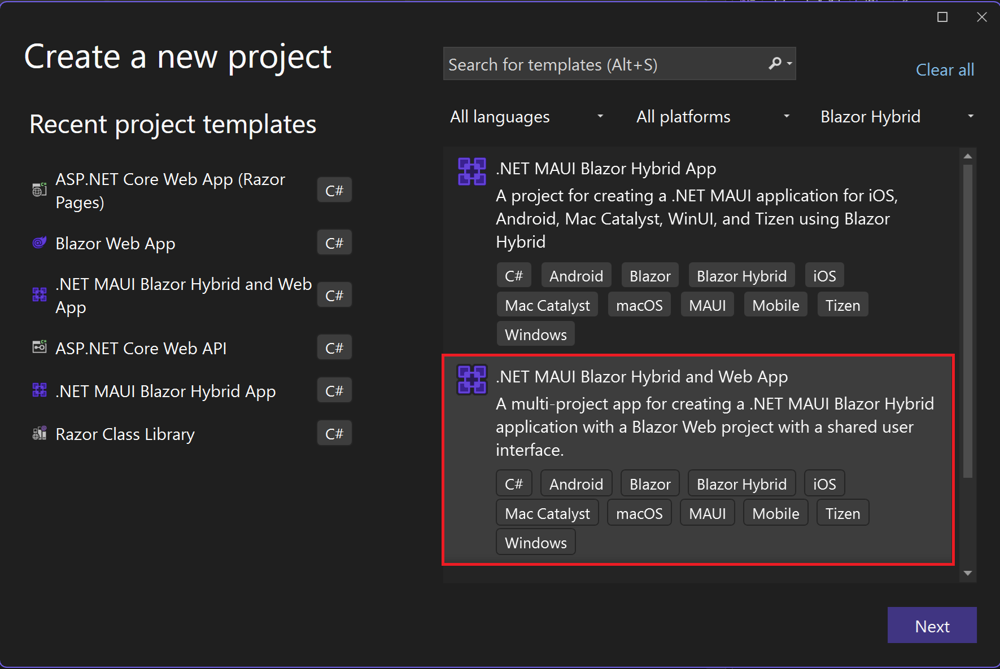

# ASP.NET Core in .NET 9 Preview 5 - Release Notes

Here's a summary of what's new in ASP.NET Core in this preview release:

- [Optimized static web asset delivery](#optimized-static-web-asset-delivery)
- [Improved Blazor Server reconnection experience](#improved-blazor-server-reconnection-experience)
- [Detect the current component render mode at runtime](#detect-the-current-component-render-mode-at-runtime)
- [Simplified authentication state serialization for Blazor Web Apps](#simplified-authentication-state-serialization-for-blazor-web-apps)
- [New .NET MAUI Blazor Hybrid and Web solution template](#new-net-maui-blazor-hybrid-and-web-solution-template)

ASP.NET Core updates in .NET 9 Preview 5:

- [What's new in ASP.NET Core in .NET 9](https://learn.microsoft.com/aspnet/core/release-notes/aspnetcore-9.0) documentation.
- [Breaking changes](https://docs.microsoft.com/dotnet/core/compatibility/9.0#aspnet-core)
- [Roadmap](https://aka.ms/aspnet/roadmap)

.NET 9 Preview 5:

- [Discussion](https://aka.ms/dotnet/9/preview5)
- [Release notes](./README.md)

## Optimized static web asset delivery

A big part of delivering performant web apps involves optimizing static web asset delivery to the browser. This process entails many aspects, including:

- Using ETags and the Last-Modified header.
- Setting up proper caching headers.
- Serving compressed versions of the assets when possible.

To this effect, we're introducing a new API for handling static web assets called `MapStaticAssets`. `MapStaticAssets` works by combining work done at build or publish time to gather information about all the static web assets in your app with a runtime library that is capable of processing that information and using it to better serve the files to the browser.

`MapStaticAssets` can replace `UseStaticFiles` in most situations. However, it's optimized for serving the assets that your app has knowledge of at build and publish time. This means that if your app serves assets from other locations on disk, or embedded resources, etc. then using `UseStaticFiles` is still the right choice.


What are the things that `MapStaticAssets` does that `UseStaticFiles` doesn't?

- **Build and publish time compression for all the assets.** Uncompressed static web assets are precompressed using gzip as part of the build and then also with brotli during publish to reduce the download size.

- **Content based ETags.** The Etags for each resource are setup to be the Base64 encoded string of the SHA-256 hash of the content. This ensures that the browser doesn't have to download the file again unless its contents change.

What are some of the gains that you can expect when using `MapStaticAssets`? Here are some examples:

Default Razor Pages template:

File | Original (KB) | Compressed (KB) | % Reduction
-- | -- | -- | --
bootstrap.min.css | 163 | 17.5 | 89.26%
jquery.js | 89.6 | 28 | 68.75%
bootstrap.min.js | 78.5 | 20 | 74.52%
**Total** | **331.1** | **65.5** | **80.22%**

[Fluent UI Blazor components](https://www.fluentui-blazor.net/):

File | Original | Compressed | % Reduction
-- | -- | -- | --
fluent.js | 384 | 73 | 80.99%
fluent.css | 94 | 11 | 88.30%
**Total** | **478** | **84** | **82.43%**

[MudBlazor](https://mudblazor.com):

File | Original | Compressed | Reduction
-- | -- | -- | --
MudBlazor.min.css | 541 | 37.5 | 93.07%
MudBlazor.min.js | 47.4 | 9.2 | 80.59%
**Total** | **588.4** | **46.7** | **92.06%**

The best part is that the improvements happen automatically after switching to use `MapStaticAssets`. When you decide to bring in a new library or copy some new JS/CSS library to your project, you don't have to do anything. It'll get optimized as part of the build and served to the browser faster, which is especially important for mobile environments with lower bandwidth or spotty connections.

Even apps that currently use dynamic compression from the server can benefit from using `MapStaticAssets`. With `MapStaticAssets` there's no need for server specific configuration to enable compression. The compression ratio is also higher because you're able to spend extra time during the build process to ensure that the assets are as small as they can be. How much smaller? If we take MudBlazor as an example, IIS will compress the CSS bundle to around 90KB, while brotli with max settings will compress to 37KB.


## Improved Blazor Server reconnection experience

A Blazor Server app (or a Blazor Web App using interactive server rendering) requires a real-time connection with the server in order to function. If this connection is lost, the app tries to reconnect.

The following changes have been made to the default Blazor Server reconnection experience:

- Reconnect timing now uses an exponential backoff strategy. The first several reconnection attempts happen in rapid succession, and then a delay gradually gets introduced between attempts. This behavior can be customized by specifying a function to compute the retry interval. For example:

    ```js
    Blazor.start({
        circuit: {
            reconnectionOptions: {
            retryIntervalMilliseconds: (previousAttempts, maxRetries) => previousAttempts >= maxRetries ? null : previousAttempts * 1000,
            },
        },
    });
    ```

- A reconnect attempt is immediate when the user navigates back to an app with a disconnected circuit. In this case, the automatic retry interval is ignored. This behavior especially improves the user experience when navigating to an app in a browser tab that has gone to sleep.
- If a reconnection attempt reaches the server, but reconnection fails because the server had already released the circuit, a refresh occurs automatically. A manual refresh isn't needed if successful reconnection is likely.
- The styling of the default reconnection UI has been modernized to be more friendly to end users.



## Detect the current component render mode at runtime

We've introduced an API to make it easier for component authors to detect:

- Where is my component currently running?
- Is my component running in an interactive environment?
- What is the assigned render mode for my component?

`ComponentBase` (and by extension your components) offers a new `Platform` property (soon to be renamed `RendererInfo`) that exposes `Name` and `IsInteractive` properties.

- `Platform.Name` answers the question "Where is my component currently running?" and it can be `Static`, `Server`, `WebAssembly`, or `WebView`.
- `Platform.IsInteractive` indicates whether the component is currently interactive (not `Static`).

`ComponentBase` also exposes a new `AssignedRenderMode` property, which provides the `IComponentRenderMode` value defined in the component hierarchy (if any). This value is most useful during prerendering, as it lets you know how the component will render after prerendering so that you can render different content.

For example, if you create a form component and the form is going to be rendered interactively, you might choose to disable the inputs during prerendering and then enable them when the component becomes interactive. Alternatively, if the component is not going to be rendered in an interactive context, you might render markup to support performing any action through regular web mechanics.

## Simplified authentication state serialization for Blazor Web Apps

New APIs make it easier to add authentication to an existing Blazor web app. When you create a new Blazor web app project with authentication using **Individual Accounts** and you enable WebAssembly-based interactivity, the project includes a custom `AuthenticationStateProvider` in both the server and client projects.

These providers flow the user's authentication state to the browser. Authenticating on the server rather than the client allows the app to access authentication state during prerendering and before the WebAssembly runtime is initialized.

The custom `AuthenticationStateProvider` implementations use the `PersistentComponentState` service to serialize the authentication state into HTML comments and then read it back from WebAssembly to create a new `AuthenticationState` instance. This works well if you've started from the Blazor web app project template and selected the **Individual Accounts** option, but it's a lot of code to implement yourself or copy if you're trying to add authentication to an existing project.

There are now APIs that can be called in the server and client projects to add this functionality:

* In the server project, use [`AddAuthenticationStateSerialization`](https://source.dot.net/#Microsoft.AspNetCore.Components.WebAssembly.Server/WebAssemblyRazorComponentsBuilderExtensions.cs,5557151694ca7c07) in `Program.cs` to add the necessary services to serialize the authentication state on the server.

  ```csharp
  builder.Services.AddRazorComponents()
      .AddInteractiveWebAssemblyComponents()
      .AddAuthenticationStateSerialization();
  ```

* In the client project, use [`AddAuthenticationStateDeserialization`](https://apisof.net/catalog/4a296157ae3e0f6f0c352bfb4a0c5d5a?) in `Program.cs` to add the necessary services to deserialize the authentication state in the browser.

  ```csharp
  builder.Services.AddAuthorizationCore();
  builder.Services.AddCascadingAuthenticationState();
  builder.Services.AddAuthenticationStateDeserialization();
  ```

By default, these APIs only serialize the server-side name and role claims for access in the browser. To include all claims, use [AuthenticationStateSerializationOptions](https://source.dot.net/#Microsoft.AspNetCore.Components.WebAssembly.Server/AuthenticationStateSerializationOptions.cs,f2703f443f0954f5) on the server:

```csharp
builder.Services.AddRazorComponents()
    .AddInteractiveWebAssemblyComponents()
    .AddAuthenticationStateSerialization(options => options.SerializeAllClaims = true);
```

The Blazor Web App project template has been updated to use these APIs.

## New .NET MAUI Blazor Hybrid and Web solution template

The new ".NET MAUI Blazor Hybrid and Web App" solution template makes it easier to create a .NET MAUI Blazor Hybrid app and a Blazor web app that share the same UI. This template shows how to create apps that target Android, iOS, Mac, Windows, and Web while maximizing code reuse.


Key features of this template include:

* The ability to choose a Blazor interactive render mode for the web app.
* Automatic creation of the appropriate projects, including a Blazor Web App and a .NET MAUI Blazor Hybrid app.
* The created projects are wired up to use a shared Razor Class Library that contains all of the UI components and pages.
* Sample code that demonstrates how to use service injection to provide different interface implementations for the Blazor Hybrid and Blazor Web App. In .NET 8 this is a manual process documented in [Build a .NET MAUI Blazor Hybrid app with a Blazor Web App](https://aka.ms/maui-blazor-web).

To get started, install the [.NET 9 SDK](https://get.dot.net/9) (Preview 5 or later) then install the .NET MAUI workload, which contains the template.

```console
dotnet workload install maui
```

You can then create the template from the commandline like this:

```console
dotnet new maui-blazor-web -n AllTheTargets
```

Alternatively, you can use the template from Visual Studio:




> **Note:** Currently Blazor Hybrid apps throw an exception if the Blazor rendering modes are defined at the page/component level. For more information, see [#51235](https://github.com/dotnet/aspnetcore/issues/51235).

## Community contributors

- [@ranma42](https://github.com/dotnet/aspnetcore/pulls?q=is%3Apr+is%3Amerged+milestone%3A9.0-preview5+author%3Aranma42)
- [@andrewjsaid](https://github.com/dotnet/aspnetcore/pulls?q=is%3Apr+is%3Amerged+milestone%3A9.0-preview5+author%3Aandrewjsaid)
- [@ctyar](https://github.com/dotnet/aspnetcore/pulls?q=is%3Apr+is%3Amerged+milestone%3A9.0-preview5+author%3Actyar)
- [@GiovanniBraconi](https://github.com/dotnet/aspnetcore/pulls?q=is%3Apr+is%3Amerged+milestone%3A9.0-preview5+author%3AGiovanniBraconi)
- [@AhmedKabbary](https://github.com/dotnet/aspnetcore/pulls?q=is%3Apr+is%3Amerged+milestone%3A9.0-preview5+author%3AAhmedKabbary)
- [@ascott18](https://github.com/dotnet/aspnetcore/pulls?q=is%3Apr+is%3Amerged+milestone%3A9.0-preview5+author%3Aascott18)
- [@xt0rted](https://github.com/dotnet/aspnetcore/pulls?q=is%3Apr+is%3Amerged+milestone%3A9.0-preview5+author%3Axt0rted)
- [@Haidar0096](https://github.com/dotnet/aspnetcore/pulls?q=is%3Apr+is%3Amerged+milestone%3A9.0-preview5+author%3AHaidar0096)
- [@MattyLeslie](https://github.com/dotnet/aspnetcore/pulls?q=is%3Apr+is%3Amerged+milestone%3A9.0-preview5+author%3AMattyLeslie)
- [@martincostello](https://github.com/dotnet/aspnetcore/pulls?q=is%3Apr+is%3Amerged+milestone%3A9.0-preview5+author%3Amartincostello)

Thank you contributors! ❤️
