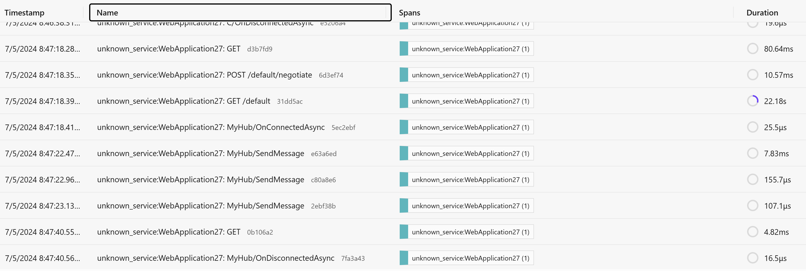
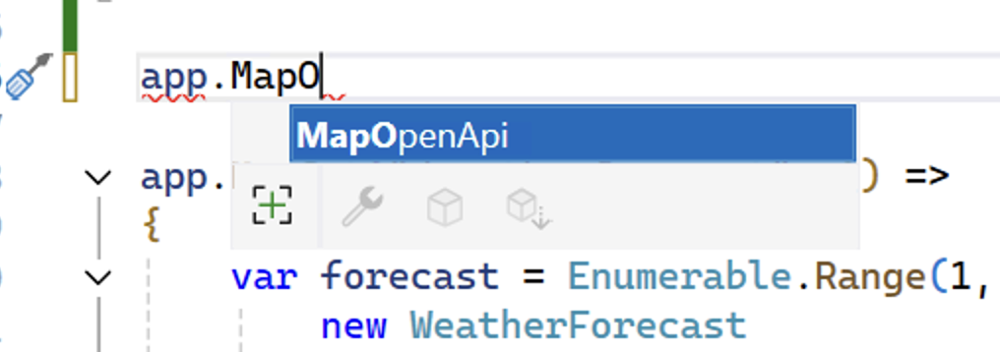
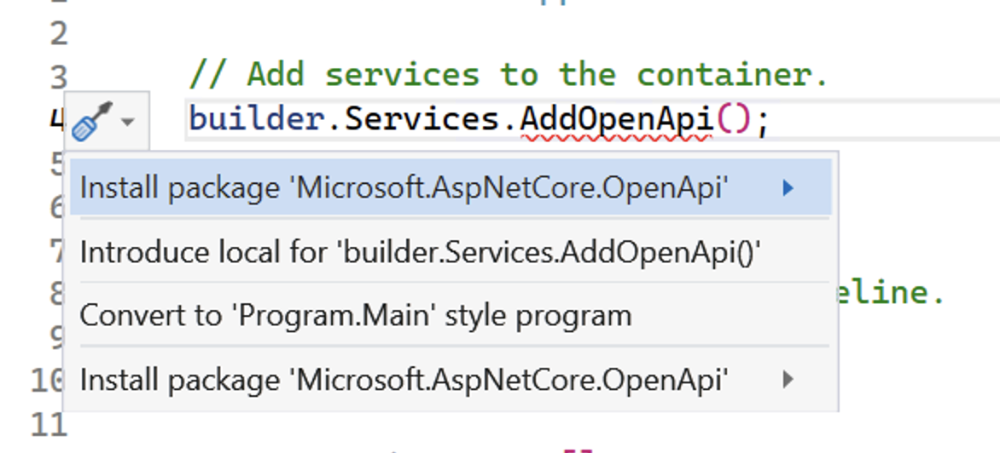

# ASP.NET Core updates in .NET 9 Preview 6

Here's a summary of what's new in ASP.NET Core in this preview release:

- [Fingerprinting of static web assets](#fingerprinting-of-static-web-assets) ensuring that stale assets aren't used and enables improved caching behavior for faster load time
- [Improved distributed tracing for SignalR](#improved-distributed-tracing-for-signalr) with a new `ActivitySource`
- [Enhancements to Microsoft.AspNetCore.OpenAPI](#enhancements-to-microsoftaspnetcoreopenapi) including [completion enhancements](#completion-enhancements-and-package-install-recommendations-for-openapi-package), support for [`[Required]` and `[DefaultValue]` attributes](#support-for-required-and-defaultvalue-attributes-on-parameters-or-properties), [schema transforms](#support-for-schema-transformers-on-openapi-document) on OpenAPI documents, 
- [Analyzer to warn when `[Authorize]` is overridden by `[AllowAnonymous]`](#analyzer-to-warn-when-authorize-is-overridden-by-allowanonymous-from-farther-away), and new [analyzers](#analyzer-to-warn-when-authorize-is-overridden-by-allowanonymous-from-farther-away), 
- [`ComponentPlatform` renamed to `RendererInfo`](#componentplatform-renamed-to-rendererinfo)
- [Split large HTTP/2 headers across frames](#split-large-http2-headers-across-frames)

ASP.NET Core updates in .NET 9 Preview 6:

- [What's new in ASP.NET Core in .NET 9](https://learn.microsoft.com/aspnet/core/release-notes/aspnetcore-9.0) documentation.
- [Breaking changes](https://docs.microsoft.com/dotnet/core/compatibility/9.0#aspnet-core)
- [Roadmap](https://aka.ms/aspnet/roadmap)

.NET 9 Preview 6:

- [Discussion](https://aka.ms/dotnet/9/preview6)
- [Release notes](./README.md)

## Fingerprinting of static web assets

ASP.NET Core will now generate fingerprinted versions of static web assets when the app is published. The fingerprinted static web assets contain a unique hash of their content in their filename, so that they never clash with earlier versions of the file. ASP.NET Core then exposes the fingerprinted static web assets as endpoints with appropriate cache headers to ensure the content is cached for a long time. Fingerprinting static web assets helps ensure that stale assets aren't used and enables improved caching behavior for faster load times.

Use of fingerprinted static web assets in Blazor is enabled automatically. To enable using fingerprinted static web assets in MVC & Razor Pages apps, switch to use `MapStaticAssets` instead of `UseStaticFiles` and add a call to `WithStaticAssets`:

```diff
app.MapStaticAssets();

app.MapRazorPages()
+   .WithStaticAssets();
```

In Blazor, the fingerprinted static web assets can be consumed using the `Assets` property in `ComponentBase`, which exposes an indexer (case-sensitive) to resolve the fingerprinted URL for a given asset.

```html
<link rel="stylesheet" href="@Assets["app.css"]" />
<link rel="stylesheet" href="@Assets["BlazorWeb-CSharp.styles.css"]" />
```

In MVC & Razor Pages apps, the fingerprinted static web assets are consumed via the existing `script`, `image`, `link`, and URL tag helpers.

When importing JavaScript modules in a Blazor app, the new `ImportMap` component can be used to generate an appropriate import map for importing the fingerprinted JavaScript files:

```razor
<ImportMap />
```

In an MVC or Razor Pages app, you can generate the required import map using the existing `script` tag helper and an empty `script` block of type `importmap`:

```razor
<script type="importmap"></script>
```

The project templates for Blazor, MVC, and Razor Pages have all been updated to use the fingerprinted static web assets and to generate the appropriate import map by default.

## Improved distributed tracing for SignalR

SignalR now has an `ActivitySource` named "Microsoft.AspNetCore.SignalR.Server" that emits events for hub method calls. Every method is its own activity, so anything that emits an activity during the hub method call will be under the hub method activity. Hub method activities don't have a parent, so they won't be bundled under the long running SignalR connection.

Here's how these new activities look in the [.NET Aspire dashboard](https://learn.microsoft.com/dotnet/aspire/fundamentals/dashboard/overview?tabs=bash#standalone-mode):



To try this out yourself, add the [OpenTelemetry](https://www.nuget.org/packages/OpenTelemetry.Extensions.Hosting) packages to your project:

```xml
<PackageReference Include="OpenTelemetry.Exporter.OpenTelemetryProtocol" Version="1.9.0" />
<PackageReference Include="OpenTelemetry.Extensions.Hosting" Version="1.9.0" />
<PackageReference Include="OpenTelemetry.Instrumentation.AspNetCore" Version="1.9.0" />
```

And then add the following code in startup:

```csharp
// Set OTEL_EXPORTER_OTLP_ENDPOINT environment variable depending on where your OTEL endpoint is
var builder = WebApplication.CreateBuilder(args);

builder.Services.AddRazorPages();
builder.Services.AddSignalR();

builder.Services.AddOpenTelemetry()
    .WithTracing(tracing =>
    {
        if (builder.Environment.IsDevelopment())
        {
            // We want to view all traces in development
            tracing.SetSampler(new AlwaysOnSampler());
        }

        tracing.AddAspNetCoreInstrumentation();
        tracing.AddSource("Microsoft.AspNetCore.SignalR.Server");
    });

builder.Services.ConfigureOpenTelemetryTracerProvider(tracing => tracing.AddOtlpExporter());
```

## Enhancements to Microsoft.AspNetCore.OpenApi

### Completion enhancements and package install recommendations for OpenAPI package

ASP.NET Core's OpenAPI support ships in an independent package outside of the shared framework. This means that it is difficult for users to independently discover built-in OpenAPI support by leveraging code-completion aids like IntelliSense. In .NET 9 Preview 6, we're shipping a completion provider/codefixer combination to help users discover built-in OpenAPI support more easily.

When a user is typing a statement where an OpenAPI-related API is available, the completion provider will provide a recommendation for said API. For example, in the screenshots below, completions for `AddOpenApi` and `MapOpenApi` are provided when a user is entering an invocation statement on a supported type, such as `IEndpointConventionBuilder`.



When the completion is accepted and the Microsoft.AspNetCore.OpenApi package is not installed, a codefixer will provide a shortcut for automatically installing the dependency in the project.



### Support for `[Required]` and `[DefaultValue]` attributes on parameters or properties

When `[Required]` and `[DefaultValue]` attributes are applied on parameters or properties within complex types, the OpenAPI implementation will map these to the `required` and `default` properties in the OpenAPI document associated with the parameter or type schema.

For example, the following API will produce the accompanying schema for the `Todo` type.

```csharp
using System.ComponentModel;
using System.ComponentModel.DataAnnotations;

var builder = WebApplication.CreateBuilder();

builder.Services.AddOpenApi();

var app = builder.Build();

if (app.Environment.IsDevelopment())
{
    app.MapOpenApi();
}

app.MapPost("/todos", (Todo todo) => { });

app.Run();

class Todo
{
    public int Id { get; init; }
    public required string Title { get; init; }
    [DefaultValue("A new todo")]
    public required string Description { get; init; }
    [Required]
    public DateTime CreatedOn { get; init; }
}
```

```json
{
    "required": [
        "title",
        "description",
        "createdOn"
    ],
    "type": "object",
    "properties": {
        "id": {
            "type": "integer",
            "format": "int32"
        },
        "title": {
            "type": "string"
        },
        "description": {
            "type": "string",
            "default": "A new todo"
        },
        "createdOn": {
            "type": "string",
            "format": "date-time"
        }
    }
}
```

### Support for schema transformers on OpenAPI document

In .NET 9 Preview 6, built-in OpenAPI support ships with support for schema transformers that can be used to modify schemas generated by System.Text.Json and the OpenAPI implementation. Like document and operation transformers, schema transformers can be registered on the `OpenApiOptions` object. For example, the code sample below demonstrates using a schema transformer to add an example to a type's schema.

```csharp
using System.ComponentModel;
using System.ComponentModel.DataAnnotations;
using Microsoft.OpenApi.Any;

var builder = WebApplication.CreateBuilder();

builder.Services.AddOpenApi(options =>
{
    options.UseSchemaTransformer((schema, context, cancellationToken) =>
    {
        if (context.Type == typeof(Todo))
        {
            schema.Example = new OpenApiObject
            {
                ["id"] = new OpenApiInteger(1),
                ["title"] = new OpenApiString("A short title"),
                ["description"] = new OpenApiString("A long description"),
                ["createdOn"] = new OpenApiDateTime(DateTime.Now)
            };
        }
        return Task.CompletedTask;
    });
});

var app = builder.Build();

if (app.Environment.IsDevelopment())
{
    app.MapOpenApi();
}

app.MapPost("/todos", (Todo todo) => { });

app.Run();

class Todo
{
    public int Id { get; init; }
    public required string Title { get; init; }
    [DefaultValue("A new todo")]
    public required string Description { get; init; }
    [Required]
    public DateTime CreatedOn { get; init; }
}
```

## Analyzer to warn when `[Authorize]` is overridden by `[AllowAnonymous]` from farther away

The `[Authorize]` attribute is commonly used on controllers and actions to require authorization. The `[AllowAnonymous]` attribute can then be used to allow anonymous access when authorization would otherwise be required. However, once anonymous access has been enabled, applying the `[Authorize]` attribute does not then reenable authorization. Incorrectly assuming that applying `[Authorize]` closer to an action than [AllowAnonymous] will still force authorization can lead to possible security bugs. For example:

```csharp
[AllowAnonymous]
public class MyController
{
    [Authorize] // Possible bug
    public IActionResult Privacy() => null;
}

[AllowAnonymous]
public class MyControllerAnon : ControllerBase
{
}

[Authorize] // Possible bug
public class MyControllerInherited : MyControllerAnon
{
}

public class MyControllerInherited2 : MyControllerAnon
{
    [Authorize] // Possible bug
    public IActionResult Privacy() => null;
}

[AllowAnonymous]
[Authorize] // Possible bug
public class MyControllerMultiple : ControllerBase
{
}
```

We've introduced an analyzer that will highlight instances like these where a closer `[Authorize]` attribute gets overridden by an `[AllowAnonymous]` attribute that is farther away from the action and emit a warning pointing to the overridden `[Authorize]` attribute with the following message:

```console
ASP0026 [Authorize] overridden by [AllowAnonymous] from farther away
```

The correct action to take if you see this warning depends on the intention behind the attributes. The further `[AllowAnonymous]` attribute should be removed if it's unintentionally exposing the endpoint to anonymous users. If the `[AllowAnonymous]` attribute was intended to override a closer `[Authorize]` attribute, you can repeat the `[AllowAnonymous]` attribute after the `[Authorize]` attribute to clarify intent.

```csharp
[AllowAnonymous]
public class MyController
{
    // Specifying AuthenticationSchemes can still be useful for endpoints that allow but don't require authenticated users.
    // This produces no warning because the second "closer" [AllowAnonymous] clarifies that [Authorize] is intentionally overridden.
    [Authorize(AuthenticationSchemes = "Cookies")]
    [AllowAnonymous]
    public IActionResult Privacy() => null;
}
```

## `ComponentPlatform` renamed to `RendererInfo`

The `ComponentPlatform` class was renamed to `RendererInfo`. The `Platform` properties on `ComponentBase` and `RenderHandle` were also renamed to `RendererInfo`.

## Split large HTTP/2 headers across frames

Kestrel will now split HTTP/2 headers that are too large for a single HEADER or CONTINUATION frame.

Thank you [@ladeak](https://github.com/ladeak) for this contribution!

## Community contributors

Thank you contributors! ❤️

- [@hamidrezahy](https://github.com/dotnet/aspnetcore/pulls?q=is%3Apr+is%3Amerged+milestone%3A9.0-preview6+author%3Ahamidrezahy)
- [@joegoldman2](https://github.com/dotnet/aspnetcore/pulls?q=is%3Apr+is%3Amerged+milestone%3A9.0-preview6+author%3Ajoegoldman2)
- [@k3min](https://github.com/dotnet/aspnetcore/pulls?q=is%3Apr+is%3Amerged+milestone%3A9.0-preview6+author%3Ak3min)
- [@kendaleiv](https://github.com/dotnet/aspnetcore/pulls?q=is%3Apr+is%3Amerged+milestone%3A9.0-preview6+author%3Akendaleiv)
- [@ladeak](https://github.com/dotnet/aspnetcore/pulls?q=is%3Apr+is%3Amerged+milestone%3A9.0-preview6+author%3Aladeak)
- [@martincostello](https://github.com/dotnet/aspnetcore/pulls?q=is%3Apr+is%3Amerged+milestone%3A9.0-preview6+author%3Amartincostello)
- [@MatthiasHuygelen](https://github.com/dotnet/aspnetcore/pulls?q=is%3Apr+is%3Amerged+milestone%3A9.0-preview6+author%3AMatthiasHuygelen)
- [@MrXhh](https://github.com/dotnet/aspnetcore/pulls?q=is%3Apr+is%3Amerged+milestone%3A9.0-preview6+author%3AMrXhh)
- [@paulomorgado](https://github.com/dotnet/aspnetcore/pulls?q=is%3Apr+is%3Amerged+milestone%3A9.0-preview6+author%3Apaulomorgado)
- [@petterh](https://github.com/dotnet/aspnetcore/pulls?q=is%3Apr+is%3Amerged+milestone%3A9.0-preview6+author%3Apetterh)
- [@tmds](https://github.com/dotnet/aspnetcore/pulls?q=is%3Apr+is%3Amerged+milestone%3A9.0-preview6+author%3Atmds)
