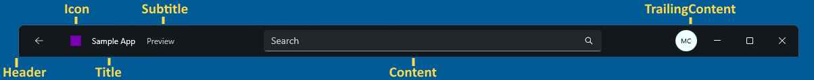
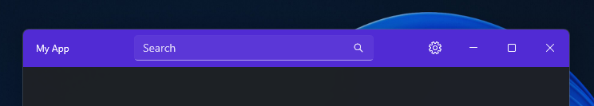

# .NET MAUI updates in .NET 9 Preview 7

Here's a summary of what's new in .NET MAUI in this preview release:

* [Introduction of `HybridWebview`](#introduction-of-hybridwebview)
* [New `TitleBar` Control and `Window.TitleBar` for Windows](#new-titlebar-control-and-windowtitlebar-for-windows)
* [`CollectionView` & `CarouselView` improvements with a new opt-in handler for iOS and Mac Catalyst](#collectionview--carouselview-improvements-with-a-new-opt-in-handler-for-ios-and-mac-catalyst)
* [Ability to bring a `Window` to the foregrond with `ActivateWindow`](#activatewindow-added-to-bring-a-window-to-foreground)
* [`BackButtonBehavior` `OneWay` binding mode](#backbuttonbehavior-oneway-binding-mode)
* [`BlazorWebView` backward compatibility host address](#blazorwebview-backward-compatibility-host-address)
* [Native Embedding improvements](#native-embedding-improvements)
* [`MainPage` is Obsolete](#mainpage-is-obsolete)
* [New Handler Disconnect Policy](#new-handler-disconnect-policy)
* [New `ProcessTerminated` event on `WebView` Control](#new-processterminated-event-on-webview-control)
* [New lifecycle methods for remote notifications on iOS & Mac Catalyst](#new-lifecycle-methods-for-remote-notifications-on-ios--mac-catalyst)
* [Xcode Sync for CLI and Visual Studio Code](#xcode-sync-for-cli-and-visual-studio-code)

.NET MAUI updates in .NET 9 Preview 7:
* [Release notes](dotnetmaui.md)
* [What's new in .NET MAUI in .NET 9](https://learn.microsoft.com/dotnet/maui/whats-new/dotnet-9) documentation.
* [GitHub Release](https://aka.ms/maui9p7)

.NET 9 Preview 7:
* [Discussion](https://aka.ms/dotnet/9/preview7)
* [Release notes](README.md)

## Introduction of `HybridWebView`

`HybridWebView` enables hosting arbitrary HTML/JS/CSS content in a WebView, and enables communication between the code in the WebView (JavaScript) and the code that hosts the WebView (C#/.NET). For example, if you have an existing React JS application, you could host it in a cross-platform .NET MAUI native application, and build the back-end of the application using C# and .NET.

To build a .NET MAUI app with `HybridWebView` you need a few pieces:

1. The web content of the app, which consists of static HTML, JavaScript, CSS, images, and other files.
2. Using the `HybridWebView` control as part of the app's UI, such as by referencing it in the app's XAML.
3. Adding code to the "web" portion and the C#/.NET portion of the app to use the `HybridWebView`'s APIs to send messages between them, thus making it a hybrid application.

The entire app, including the web content, is packaged and then runs locally on the device, and can be published to applicable app stores. The web content is hosted within a native web view control and runs within the context of the app. Any part of the app can access external web services, but it is not required. Let's take a look at how to use the new `HybridWebView` in a new .NET MAUI application.

1. **Create a new project**

    Open up your existing .NET MAUI project or create a new **.NET MAUI Application** project in Visual Studio, Visual Studio Code, or using command line tools.

1. **Adding web content to the app**

    Your app's web content is included as part of the .NET MAUI project as "raw assets." A raw asset is any file in the app's `Resources\Raw` folder, including sub-folders.

    For `HybridWebView` the default location is to place files in the `Resources\Raw\wwwroot` folder, with the main file named `index.html`.

    A simple application might have the following files and contents:

    `Resources\Raw\wwwroot\index.html` with content for the main UI:

    ```html
    <!DOCTYPE html>

    <html lang="en" xmlns="http://www.w3.org/1999/xhtml">
    <head>
        <meta charset="utf-8" />
        <title></title>
        <link rel="icon" href="data:,">
        <script src="scripts/HybridWebView.js"></script>
        <script>
            window.addEventListener(
                "HybridWebViewMessageReceived",
                function (e) {
                    var messageFromCSharp = document.getElementById("messageFromCSharp");
                    messageFromCSharp.value += '\r\n' + e.detail.message;
                });
        </script>
    </head>
    <body>
        <h1>HybridWebView app!</h1>
        <div>
            <button onclick="window.HybridWebView.SendRawMessage('Message from JS!')">Send message to C#</button>
        </div>
        <div>
            Messages from C#: <textarea readonly id="messageFromCSharp" style="width: 80%; height: 300px;"></textarea>
        </div>
    </body>
    </html>
    ```

    `Resources\Raw\wwwroot\scripts\HybridWebView.js` with the standard HybridWebView JavaScript library:

    ```js
    function HybridWebViewInit() {

        function DispatchHybridWebViewMessage(message) {
            const event = new CustomEvent("HybridWebViewMessageReceived", { detail: { message: message } });
            window.dispatchEvent(event);
        }

        if (window.chrome && window.chrome.webview) {
            // Windows WebView2
            window.chrome.webview.addEventListener('message', arg => {
                DispatchHybridWebViewMessage(arg.data);
            });
        }
        else if (window.webkit && window.webkit.messageHandlers && window.webkit.messageHandlers.webwindowinterop) {
            // iOS and MacCatalyst WKWebView
            window.external = {
                "receiveMessage": message => {
                    DispatchHybridWebViewMessage(message);
                }
            };
        }
        else {
            // Android WebView
            window.addEventListener('message', arg => {
                DispatchHybridWebViewMessage(arg.data);
            });
        }
    }

    window.HybridWebView = {
        "SendRawMessage": function (message) {

            if (window.chrome && window.chrome.webview) {
                // Windows WebView2
                window.chrome.webview.postMessage(message);
            }
            else if (window.webkit && window.webkit.messageHandlers && window.webkit.messageHandlers.webwindowinterop) {
                // iOS and MacCatalyst WKWebView
                window.webkit.messageHandlers.webwindowinterop.postMessage(message);
            }
            else {
                // Android WebView
                hybridWebViewHost.sendRawMessage(message);
            }
        }
    }

    HybridWebViewInit();
    ```

    And you can then add any other files for CSS, images, additional HTML files, and so on.

    > [!TIP] In some cases the IDE or code editor might add entries to the project's `.csproj` file that are incorrect. When using the default locations for the raw assets there should be no entries for any of these files or folders in the `.csproj` file. You might need to look at source control diffs to undo any such changes.


1. **Adding the HybridWebView control**

    In the app's `MainPage.xaml` file replace the default code within the `<ContentPage>` tag with this XAML that has a grid layout, a button, and the `HybridWebView` control:


    ```xml
    <Grid RowDefinitions="Auto,*" ColumnDefinitions="*">
        <Button Text="Send message to JavaScript" Clicked="OnSendMessageButtonClicked" />

        <HybridWebView x:Name="hybridWebView" RawMessageReceived="OnHybridWebViewRawMessageReceived" Grid.Row="1" />
    </Grid>
    ```

1. **Use HybridWebView APIs to send messages between the JavaScript and C# code**

    The sample HTML code above already include JavaScript code to send messages to the C# code.

    Edit the `MainPage.xaml.cs` file and replace the default counter code with the following code to send and receive messages:

    ```c#
    private void OnSendMessageButtonClicked(object sender, EventArgs e)
    {
        hybridWebView.SendRawMessage($"Hello from C#!");
    }

    private async void OnHybridWebViewRawMessageReceived(object sender, HybridWebViewRawMessageReceivedEventArgs e)
    {
        await DisplayAlert("Raw Message Received", e.Message, "OK");
    }
    ```

    The message are "raw" because no additional processing is performed. You can encode data within the message to perform more advanced messaging.


## New `TitleBar` Control and `Window.TitleBar` for Windows


The new `TitleBar` control enables developers the ability to create custom title bars in their applications. There are two parts to this new control, first is the control itself which inherits from `ContentView` and can be placed anywhere in an application. Second, is a new `Window.TitleBar` property on `Window` that enables developers to set a `TitleBar` control that users will see at the top of their application. `Window.TitleBar` is available in Windows projects today and will come to Mac Catalyst in a future release. Thanks to Mike Corsaro ([@Foda](https://github.com/Foda)) for the contribution.





The `TitleBar` control can now be set for the `Window.TitleBar` property for any `Window`.

```xml
<Window.TitleBar>
  <TitleBar
    x:Name="TeamsTitleBar"
    HeightRequest="46"
    Title="Hello World">
    <TitleBar.Content>
      <Entry
        x:Name="SearchTitleBar"
        Placeholder="Search"
        VerticalOptions="Center"
        MinimumWidthRequest="300"
        MaximumWidthRequest="450"
        HeightRequest="32"/>
    </TitleBar.Content>
  </TitleBar>
</Window.TitleBar>
```

It can also be set in C# code:

```cs
protected override void OnAppearing()
{
    base.OnAppearing();

    Window.TitleBar = new TitleBar
    {
        Title = "MAUI App",
        Icon = "appicon.png",
        LeadingContent = new AvatarButton()
    };
}
```

The `TitleBar.Content` and `TitleBar.LeadingContent` are extremely customizable as seen in this sample:



```xml
<TitleBar
    Title="My App"
    BackgroundColor="#512BD4"
    HeightRequest="48">
    <TitleBar.Content>
        <SearchBar
            Placeholder="Search"
            MaximumWidthRequest="300"
            HorizontalOptions="FillAndExpand"
            VerticalOptions="Center" />
    </TitleBar.Content>
    <TitleBar.TrailingContent>
        <ImageButton
            HeightRequest="36"
            WidthRequest="36"
            BorderWidth="0"
            Background="Transparent">
            <ImageButton.Source>
                <FontImageSource
                    Size="16"
                    Glyph="&#xE713;"
                    FontFamily="SegoeMDL2"/>
            </ImageButton.Source>
        </ImageButton>
    </TitleBar.TrailingContent>
</TitleBar>
```

Here is an overview of different settings in action:


https://github.com/user-attachments/assets/2623e4a0-27b5-45b1-bbe8-59ddb2f2ab14


## `ActivateWindow` Added to bring a `Window` to foreground

A specific window can be brought to the front on Mac Catalyst and Windows with the `Application.Current.ActivateWindow` method:

```csharp
Application.Current?.ActivateWindow(secondWindow);
```

## `BackButtonBehavior` OneWay binding mode

The binding mode for `IsVisible` and `IsEnabled` on the `BackButtonBehavior` is now `BindingMode.OneWay` instead of `BindingMode.OneTime`. This allows you to more easily control the behavior of the back button at runtime using data bindings.

```xml
<ContentPage ...>
    <Shell.BackButtonBehavior>
        <BackButtonBehavior Command="{Binding BackCommand}"
                            IsVisible="{Binding IsBackButtonVisible}"
                            IconOverride="back.png" />
    </Shell.BackButtonBehavior>
    ...
</ContentPage>
```

## `BlazorWebView` backward compatibility host address

.NET 9 Preview 7 changes the default behavior for hosting content to be `localhost` on iOS and Mac Catalyst 18 and newer. Starting with iOS and Mac Catalyst 18 the internal `0.0.0.0` address used to host the `BlazorWebView`'s content no longer works and causes the `BlazorWebView` to not load and render as an empty rectangle.


In order to continue using `0.0.0.0`, activate this behavior using a switch in `MauiProgram.cs`:

```c#
// Set this switch to use the LEGACY behavior of always using 0.0.0.0 to host BlazorWebView
AppContext.SetSwitch("BlazorWebView.AppHostAddressAlways0000", true);
```

## `MainPage` is Obsolete

Instead of setting a `MainPage` property on the `Application`, developers should now set the `Page` on the `Window` to which it belongs. This is what actually happens when you set `MainPage` today in a .NET MAUI application, so the behavior is the same and the usage is now more clear. `MainPage` has been retained for .NET 9 in order to facilitate upgrading projects from Xamarin.Forms, but will be completely removed in a future release.


New projects now see the recommended pattern in the .NET MAUI template:

```csharp
public partial class App : Application
{
	public App()
	{
		InitializeComponent();
	}

	protected override Window CreateWindow(IActivationState? activationState)
	{
		return new Window(new AppShell());
	}
}
```

## CollectionView & CarouselView improvements with a new opt-in handler for iOS and Mac Catalyst

This release introduces two new handlers for developers to try that bring sweeping performance and stability improvements for both `CollectionView` and `CarouselView`. These new implementations are based on newer `UICollectionView` APIs. Opt-in by adding the following into your `Program.cs`:

```csharp
#if IOS || MACCATALYST
appBuilder.ConfigureMauiHandlers(handlers =>
{
  handlers.AddHandler<Microsoft.Maui.Controls.CollectionView, Microsoft.Maui.Controls.Handlers.Items2.CollectionViewHandler2>();
  handlers.AddHandler<Microsoft.Maui.Controls.CarouselView, Microsoft.Maui.Controls.Handlers.Items2.CarouselViewHandler2>();
});
#endif
```

## Native Embedding improvements

[Native Embedding](https://learn.microsoft.com/dotnet/maui/platform-integration/native-embedding) enables you to bring .NET MAUI controls into .NET for Android/iOS/MacCatalyst or WinUI applications, rather than an entire .NET MAUI application. Now in .NET 9 Preview 7 this no longer requires the compatibility package. To start using embedding you only need:

```csharp
public static class MauiProgram
{
	public static MauiApp CreateMauiApp()
	{
		var builder = MauiApp.CreateBuilder();

		builder
			.UseMauiEmbeddedApp<App>();

		return builder.Build();
	}
}
```

### Creating a `MauiContext` and getting a native view

Before instantiating the view, you need a `MauiContext`.

```csharp
var mauiApp = MauiProgram.CreateMauiApp();

#if ANDROID
var mauiContext = new MauiContext(mauiApp.Services, window);
#else
var mauiContext = new MauiContext(mauiApp.Services);
#endif

var mauiView = new MyMauiContent();
var nativeView = mauiView.ToPlatform(mauiContext);
```

Alternatively, you can use the `ToPlatformEmbedded` method passing in the window for the platform on which the app is running.

```csharp
var mauiApp = MauiProgram.CreateMauiApp();
var mauiView = new MyMauiContent();
var nativeView = mauiView.ToPlatformEmbedded(mauiApp, window);
```

In both cases, `nativeView` is the platform-specific view described by the `mauiView`.

## New Handler disconnect policy

There have been improvements to how a handler disconnect including new automatic disconnection, which is enabled in this release by default. Take the following user interface:

```xml
<ContentPage>
    <Grid>
        <Button/>
    </Grid>
</ContentPage>
```

When you navigate away from this page, previously the `ButtonHandler.DisconnectHandler();` was not called. Now with automatic handler disconnect, it will be called automatically as soon as possible.

In rare scenarios you may not want automatic handler disconnection and want the old behavior and need to perform this operation manually. By changing the policy to `Manual` you can keep views around until you are done with them, for example when navigating between many pages in a `FlyoutPage`.

Example with a `VerticalStackLayout`:

```csharp
var layout2 = new VerticalStackLayout()
{
	new Button(),
	new Button()
};

HandlerProperties.SetDisconnectPolicy(layout2, HandlerDisconnectPolicy.Manual);
```

To clean up the native views, call the `DisconnectHandler` method.

```csharp
layout2.DisconnectHandler();
```

When disconnecting, the action will continue down the tree until it completes or arrives at a control that has set a manual policy.

## New `ProcessTerminated` event on `WebView` Control

`WebView` adds a `ProcessTerminated` event that's raised when a `WebView` process ends unexpectedly. The `WebViewProcessTerminatedEventArgs` object that accompanies this event defines platform-specific properties that indicate why the process failed.


## New lifecycle methods for remote notifications on iOS & Mac Catalyst


When working with remote notifications it is now easier to get insight into when a user registers or receives remove notifications.

* `ReceivedRemoteNotifications` - Invoked when a remote notification is received.
* `RegisteredForRemoteNotifications` - Invoked when the app has successfully registered for remote notifications.

```csharp
using Microsoft.Maui.LifecycleEvents;

namespace PlatformLifecycleDemo;

public static class MauiProgram
{
    public static MauiApp CreateMauiApp()
    {
        var builder = MauiApp.CreateBuilder();
        builder
            .UseMauiApp<App>()
            .ConfigureLifecycleEvents(events =>
            {
#if IOS || MACCATALYST
                events.AddiOS(ios => ios
                    .ReceivedRemoteNotifications((app, dictionary) => LogEvent(nameof(iOSLifecycle.OnReceivedRemoteNotifications)))
                    .RegisteredForRemoteNotifications((app, data) => LogEvent(nameof(iOSLifecycle.OnRegisteredForRemoteNotifications)));
#endif
                static bool LogEvent(string eventName, string type = null)
                {
                    System.Diagnostics.Debug.WriteLine($"Lifecycle event: {eventName}{(type == null ? string.Empty : $" ({type})")}");
                    return true;
                }
            });

        return builder.Build();
    }
}
```

For more information see the [App Lifecycle documentation](https://learn.microsoft.com/dotnet/maui/fundamentals/app-lifecycle)

## Xcode Sync for CLI and Visual Studio Code

Xcode sync (xcsync) is a tool that enables developers to leverage Xcode for managing Apple specific files with .NET projects including asset catalogs, plist, storyboard, and xib files. The tool has two main commandes to generates a temporary Xcode project from a .NET project and to synchronize changes to the Xcode files back to the .NET project for iOS, tvOS, macOS, or Mac Catalyst.

To generate or sync these files you can use the `dotnet build` command with `xcsync-generate` or `xcsync-sync` and passing in a project file and additional parameters for the project TFM in a multi-targeted project, Xcode location, and verbosity.

```bash
dotnet build /t:xcsync-generate
    /p:xcSyncProjectFile=<PROJECT>
    /p:xcSyncXcodeFolder=<TARGET_XCODE_DIRECTORY>
    /p:xcSyncTargetFrameworkMoniker=<FRAMEWORK>
    /p:xcSyncVerbosity=<LEVEL>
```

For more information browse the [Xcode sync documentation](https://learn.microsoft.com/dotnet/maui/macios/xcsync).


## .NET for Android

This release was focused on quality improvements.

- [GitHub Release](https://github.com/xamarin/xamarin-android/releases/)

## .NET for iOS

This release was focused on quality improvements. Using this release requires the use of Xcode 15.4 for building apps.

- [GitHub Release](https://github.com/xamarin/xamarin-macios/releases/)
- [Known issues](https://github.com/xamarin/xamarin-macios/wiki/Known-issues-in-.NET9)

## Community Contributions

Thank you to community contributors [@albyrock87](https://github.com/albyrock87), [@MartyIX](https://github.com/MartyIX), [@symbiogenesis](https://github.com/symbiogenesis), [@BurningLights](https://github.com/BurningLights), [@Takym](https://github.com/Takym), [@pictos](https://github.com/pictos), [@kubaflo](https://github.com/kubaflo), and [@rs-lkroneman](https://github.com/rs-lkroneman).
