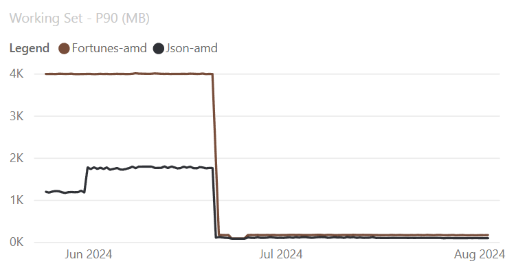
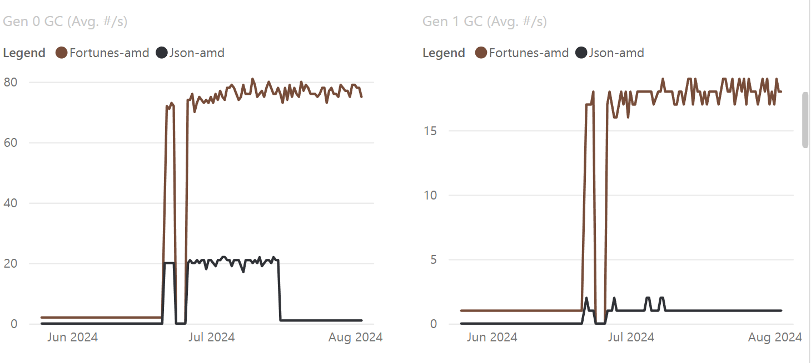

# Runtime updates in .NET 9 Preview 7

.NET 9 Preview 7 includes several new runtime features. We focused on the following areas:

- [ARM64 SVE Support](#arm64-sve-support)
- [Post-Indexed Addressing on ARM64](#post-indexed-addressing-on-arm64)
- [Strength Reduction in Loops](#strength-reduction-in-loops)
- [Object Stack Allocation for Boxes](#object-stack-allocation-for-boxes)
- [GC Dynamic Adaptation To Application Sizes](#gc-dynamic-adaptation-to-application-sizes)

Runtime updates in .NET 9 Preview 7:

- [Release notes](runtime.md)
- [What's new in the .NET Runtime in .NET 9](https://learn.microsoft.com/dotnet/core/whats-new/dotnet-9/overview) documentation

.NET 9 Preview 7:

- [Discussion](https://aka.ms/dotnet/9/preview7)
- [Release notes](README.md)
- [Libraries release notes](libraries.md)
- [SDK release notes](sdk.md)


## ARM64 SVE Support
.NET 9 introduces experimental support for the [Scalable Vector Extension (SVE)](https://en.wikipedia.org/wiki/AArch64#Scalable_Vector_Extension_(SVE)), a SIMD instruction set for ARM64 CPUs. .NET already supports the [NEON instruction set](https://en.wikipedia.org/wiki/AArch64#AArch64_features), so on NEON-capable hardware, your applications can leverage 128-bit vector registers. SVE supports flexible vector lengths all the way up to 2048 bits, unlocking more data processing per instruction; in .NET 9, `System.Numerics.Vector<T>` is 128 bits wide when targeting SVE, and future work will enable scaling of its width to match the target machine's vector register size. You can accelerate your .NET applications on SVE-capable hardware using the new `System.Runtime.Intrinsics.Arm.Sve` APIs. To learn more about SVE in .NET, check out [dotnet/runtime #93095](https://github.com/dotnet/runtime/issues/93095), and to track which APIs are completed, check out [dotnet/runtime #99957](https://github.com/dotnet/runtime/issues/99957).

Note that SVE support in .NET 9 is experimental. The APIs under `System.Runtime.Intrinsics.Arm.Sve` are marked with [`ExperimentalAttribute`](https://learn.microsoft.com/dotnet/fundamentals/apicompat/preview-apis#experimentalattribute), which means they are subject to change in future releases. Additionally, debugger stepping and breakpoints through SVE-generated code may not function properly, resulting in application crashes or corruption of data.

## Post-Indexed Addressing on ARM64
In .NET code, we frequently use index variables to read sequential regions of memory.

Consider the idiomatic `for` loop:
```csharp
static int Sum(int[] nums)
{
    int sum = 0;

    for (int i = 0; i < nums.Length; i++)
    {
        sum += nums[i];
    }

    return sum;
}
```

For each iteration of the loop, we use `i` to read an integer in `nums`, and then increment `i`. In ARM64 assembly, these two operations look like this:
```asm
ldr w0, [x1]
add x1, x1, #4
```

`ldr w0, [x1]` loads the integer at the memory address in `x1` into `w0`; this corresponds to the access of `nums[i]` in the above example. Then, `add x1, x1, #4` increases the address in `x1` by four bytes, moving to the next integer in `nums`. This corresponds to the `i++` operation executed at the end of each iteration.

ARM64 supports post-indexed addressing, where the "index" register is automatically incremented after its address is used. This means we can combine the above instructions into one, making the loop more efficient: The CPU only needs to decode one instruction instead of two, and the loop's code is now more cache-friendly.

Here's what the updated assembly looks like:
```asm
ldr w0, [x1], #0x04
```

The `#0x04` at the end means the address in `x1` will be incremented by four bytes after it is used to load an integer into `w0`. In Preview 7, RyuJIT now uses post-indexed addressing when generating ARM64 code. While x64 does not support post-indexed addressing, Preview 2 introduced [induction variable widening](../preview2/runtime.md#loop-optimizations-iv-widening), which is similarly useful for optimizing memory accesses with loop index variables.

To learn more about post-indexed addressing support in RyuJIT, check out [dotnet/runtime #105181](https://github.com/dotnet/runtime/pull/105181).

## Strength Reduction in Loops
Strength reduction is a compiler optimization where an operation is replaced with a faster, logically-equivalent operation. This technique is especially useful for optimizing loops.

Let's revisit the example from above:
```csharp
static int Sum(int[] nums)
{
    int sum = 0;

    for (int i = 0; i < nums.Length; i++)
    {
        sum += nums[i];
    }

    return sum;
}
```

Here is a snippet of the code generated for the loop's body, in x64 assembly:
```asm
add ecx, dword ptr [rax+4*rdx+0x10]
inc edx
```

These instructions correspond to the expressions `sum += nums[i]` and `i++`, respectively. `rcx` contains the value of `sum`, `rax` contains the base address of `nums`, and `rdx` contains the value of `i`. To compute the address of `nums[i]`, we multiply the index in `rdx` by four (the size of an integer), and then add this offset to the base address in `rax`, plus some padding. After we've read the integer at `nums[i]` and added it to `rcx`, we increment the index in `rdx`.

In other words, imagine an array with a dozen integers. Given an index in the range `[0, 11]`, the above algorithm multiplies it by four to determine the integer's offset from the beginning of the array. So to get the first integer, we compute its address with `base_address + (4 * 0)`, and to get the last integer, we compute `base_address + (4 * 11)`. With this approach, each array access requires a multiplication and an addition operation.

Multiplication is more expensive than addition, and replacing the former with the latter is a classic motivation for strength reduction. Imagine if we rewrote our example to access the integers in `nums` using a pointer, rather than an index variable. With this approach, each memory access wouldn't require us to compute the element's address.

Here's the updated example:
```csharp
static int Sum(Span<int> nums)
{
    int sum = 0;
    ref int p = ref MemoryMarshal.GetReference(nums);
    ref int end = ref Unsafe.Add(ref p, nums.Length);
    while (Unsafe.IsAddressLessThan(ref p, ref end))
    {
        sum += p;
        p = ref Unsafe.Add(ref p, 1);
    }

    return sum;
}
```

The source code is quite a bit more complicated, but it is logically equivalent to our initial implementation, and the assembly looks better:
```asm
add ecx, dword ptr [rdx]
add rdx, 4
```

`rcx` still holds the value of `sum`, but `rdx` now holds the address pointed to by `p`, so accessing elements in `nums` just requires us to dereference `rdx` -- all the multiplication and addition from the first example has been replaced by a single `add` instruction to move the pointer forward.

In Preview 7, RyuJIT now transforms the first indexing pattern into the second, without requiring you to rewrite any code. To learn more about strength reduction in RyuJIT, check out [dotnet/runtime #100913](https://github.com/dotnet/runtime/issues/100913).

## Object Stack Allocation for Boxes
Value types, such as `int` and `struct`, are typically allocated on the stack instead of the heap. However, we frequently need to "box" these value types by wrapping them in objects to enable various code patterns.

Consider the following snippet:
```csharp
static bool Compare(object? x, object? y)
{
    if ((x == null) || (y == null))
    {
        return x == y;
    }

    return x.Equals(y);
}

public static int Main()
{
    bool result = Compare(3, 4);
    return result ? 0 : 100;
}
```

`Compare` is conveniently written such that if we wanted to compare other types, like `strings` or `doubles`, we could reuse the same implementation. But in this example, it has the performance drawback of requiring us to box any value types we pass to it.

Let's look at the code generated for `Main`, in x64 assembly:
```asm
push     rbx
sub      rsp, 32
mov      rcx, 0x7FFB9F8074D0      ; System.Int32
call     CORINFO_HELP_NEWSFAST
mov      rbx, rax
mov      dword ptr [rbx+0x08], 3
mov      rcx, 0x7FFB9F8074D0      ; System.Int32
call     CORINFO_HELP_NEWSFAST
mov      dword ptr [rax+0x08], 4
add      rbx, 8
mov      ecx, dword ptr [rbx]
cmp      ecx, dword ptr [rax+0x08]
sete     al
movzx    rax, al
xor      ecx, ecx
mov      edx, 100
test     eax, eax
mov      eax, edx
cmovne   eax, ecx
add      rsp, 32
pop      rbx
ret
```

Notice the calls to `CORINFO_HELP_NEWSFAST` -- those are the heap allocations for the boxed integer arguments. Also notice that there isn't any call to `Compare`; RyuJIT decided to inline it into `Main`. This means the boxes never "escape." In other words, throughout the execution of `Compare`, we know `x` and `y` are actually integers, and we can safely unbox them without affecting the comparison logic (`System.Int32:Equals` just compares the raw integers under-the-hood, anyway). In Preview 7, RyuJIT now allocates unescaped boxes on the stack, unlocking several other optimizations. In our example, not only does RyuJIT avoid the heap allocations, but it also evaluates the expressions `x.Equals(y)` and `result ? 0 : 100` at compile-time.

Here's the updated assembly:
```asm
mov      eax, 100
ret
```

To learn more about object stack allocation in RyuJIT, check out [dotnet/runtime #104936](https://github.com/dotnet/runtime/issues/104936).


## GC Dynamic Adaptation To Application Sizes

Dynamic Adaptation To Application Sizes ([DATAS](https://github.com/dotnet/runtime/issues/79658)) is now [enabled by default](https://github.com/dotnet/runtime/issues/103110). It aims to adapt to application memory requirements, meaning the application heap size should be roughly proportional to the long lived data size. DATAS was introduced as an opt-in feature in .NET 8 and has been significantly updated and improved in .NET 9. Any .NET 8 DATAS users should move to .NET 9.

The existing Server GC mode takes a different approach than DATAS. It aims to improve throughput and treats the process as the dominant one on the machine. The amount of allocations it allows before triggering the next GC is based on throughput, not application size. So it can grow the heap very aggressively if it needs to and there’s memory available. This can result in very different heap sizes when you run the process on machines with different hardware specs. What some folks have observed is the heap can grow much bigger when they move their process to a machine with many more cores and more memory. Server GC also doesn’t necessarily adjust the heap down aggressively if the workload becomes much lighter.

Because DATAS aims to adapt to the application memory requirement, it means if your application is doing the same work, the heap size should be the same or similar when you run your app on machines with different specs. And if your workload becomes lighter or heavier the heap size is adjusted accordingly.

DATAS helps most with bursty workloads where the heap size should be adjusted according to how demanding the workload is, particularly as demand decreases. This is especially important in memory-constrained environments where it’s important to fit more processes when some processes’ workloads lighten. It also helps with capacity planning.


### DATAS Feature Description

To achieve this adaptation and still maintain reasonable performance, DATAS does the following:

- It sets the maximum amount of allocations allowed before the next GC is triggered based on the long lived data size. This helps with constraining the heap size.
- It sets the actual amount of allocations allowed based on throughput.
- It adjusts the number of heaps when needed. It starts with one heap which means if there are many threads allocating, some will need to wait and that negatively affects throughput. DATAS will grow and reduce the number of heaps as needed. In this way, it is a hybrid between the existing GC modes, capable of using as few as one heap (like workstation GC) and as many as matches the machine core count (like server GC).

- When needed it does full compacting GCs to prevent fragmentation from getting too high which also helps with constraining the heap size.

### Benchmark Results

Here are some benchmarks results for TechEmpower JSON and Fortunes Benchmarks. Notice the significant reduction in working set when running the benchmarks on a 48 core machine with Linux. Max throughput (measured in rps) shows about a 2-3% reduction, but with an working set improvement of 80%+.




With DATAS enabled # of Gen0 and Gen1 GCs are significantly higher



Full .NET TechEmpower benchmark results are published [here](https://aka.ms/aspnet/benchmarks)

### How to Disable DATAS

If you notice a reduction in throughput, DATAS can be disabled using the following:

- `DOTNET_GCDynamicAdaptationMode=0` environment variable
- setting `System.GC.DynamicAdaptationMode` to `0` in `runtimeconfig.json`
- `GarbageCollectionAdaptationMode` msbuild property set to `0`

