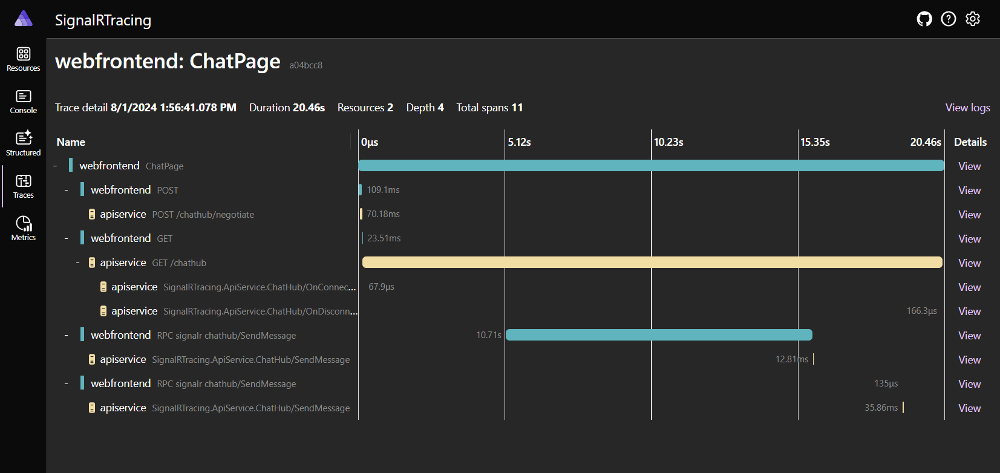

# ASP.NET Core updates in .NET 9 Release Candidate 1

Here's a summary of what's new in ASP.NET Core in this release:

* [Improvements to SignalR distributed tracing](#improvements-to-signalr-distributed-tracing)
* [Keep-alive timeout for WebSockets](#keep-alive-timeout-for-websockets)
* [Keyed DI in middleware](#keyed-di-in-middleware)
* [Override `InputNumber` type attribute](#override-inputnumber-type-attribute)
* [Trust the ASP.NET Core HTTPS development certificate on Linux](#trust-the-aspnet-core-https-development-certificate-on-linux)

ASP.NET Core updates in .NET 9 Release Candidate 1:

* [Release notes](aspnetcore.md)
* [What's new in ASP.NET Core in .NET 9](https://learn.microsoft.com/aspnet/core/release-notes/aspnetcore-9.0) documentation.
* [Breaking changes](https://docs.microsoft.com/dotnet/core/compatibility/9.0#aspnet-core)
* [Roadmap](https://aka.ms/aspnet/roadmap)

.NET 9 Release Candidate 1:

* [Discussion](https://aka.ms/dotnet/9/rc1)
* [Release notes](README.md)

## Improvements to SignalR distributed tracing

.NET 9 preview 6 added [initial support for SignalR distributed tracing](../preview6/aspnetcore.md#improved-distributed-tracing-for-signalr). RC1 improves SignalR tracing with new capabilities:

* .NET SignalR client has an `ActivitySource` named "Microsoft.AspNetCore.SignalR.Client". Hub invocations now create a client span. Note that other SignalR clients, such as the JavaScript client, don't support tracing. This feature will be added to more clients in future releases.
* Hub invocations from the client to the server now support [context propagation](https://opentelemetry.io/docs/concepts/context-propagation/). Propagating the trace context enables true distributed tracing. It's now possible to see invocations flow from the client to the server and back.

Here's how these new activities look in the [.NET Aspire dashboard](https://learn.microsoft.com/dotnet/aspire/fundamentals/dashboard/overview?tabs=bash#standalone-mode):



## Keep-alive timeout for WebSockets

The [WebSockets middleware](https://learn.microsoft.com/aspnet/core/fundamentals/websockets#configure-the-middleware) can now be configured with keep-alive timeouts.

The keep-alive timeout aborts the WebSocket connection and throws an exception from `WebSocket.ReceiveAsync` if both of the following conditions are met:

* The server sends a ping frame using the websocket protocol.
* The client doesn't reply with a pong frame within the specified timeout.

The server automatically sends the ping frame and configures it with `KeepAliveInterval`.

The keep-alive timeout setting is useful for detecting connections that might be slow or ungracefully disconnected.

The keep-alive timeout can be configured globally for the WebSocket middleware:

```csharp
app.UseWebSockets(new WebSocketOptions { KeepAliveTimeout = TimeSpan.FromSeconds(15) });
```

Or configured per accepted WebSocket:

```csharp
app.Run(async (context) =>
{
    using var webSocket = await context.WebSockets.AcceptWebSocketAsync(
        new WebSocketAcceptContext { KeepAliveTimeout = TimeSpan.FromSeconds(15) });

    // ...
}
```

## Keyed DI in middleware

Middleware now supports [Keyed DI](https://learn.microsoft.com/aspnet/core/fundamentals/dependency-injection#keyed-services) in both the constructor and the `Invoke`/`InvokeAsync` method.

```csharp
var builder = WebApplication.CreateBuilder(args);
builder.Services.AddKeyedSingleton<MySingletonClass>("test");
builder.Services.AddKeyedScoped<MyScopedClass>("test2");

var app = builder.Build();
app.UseMiddleware<MyMiddleware>();
app.Run();

internal class MyMiddleware
{
    private readonly RequestDelegate _next;

    public MyMiddleware(RequestDelegate next, [FromKeyedServices("test")] MySingletonClass service)
    {
        _next = next;
    }

    public Task Invoke(HttpContext context, [FromKeyedServices("test2")] MyScopedClass scopedService) => _next(context);
}
```

See [Write custom ASP.NET Core middleware](https://learn.microsoft.com/aspnet/core/fundamentals/middleware/write) for more information on writing custom middleware.

Thank you [@NicoBrabers](https://github.com/NicoBrabers) for this contribution!

## Override `InputNumber` type attribute

The `InputNumber` component now supports overriding the type attribute. For example, you can specify `type="range"` to create a range input that supports model binding and form validation:

```razor
<InputNumber type="range" min="1" max="10" step="1" @bind-Value="Model.Rating" />
```

Thank you [@MattyLeslie](https://github.com/MattyLeslie) for the contribution!

## Trust the ASP.NET Core HTTPS development certificate on Linux

On Ubuntu and Fedora based Linux distros, `dotnet dev-certs https --trust` will now configure ASP.NET Core HTTPS development certificate as a trusted certificate for Chromium (Edge, Chrome, Chromium, etc) and Mozilla (Firefox, etc) browsers, as well as for use with .NET APIs (`HttpClient`, etc).  Previously, `--trust` only worked on Windows and macOS. Certificate trust is applied per-user.

To establish trust in OpenSSL, the tool puts the certificate in *~/.aspnet/dev-certs/trust*, runs a simplified version of OpenSSL's c_rehash tool on the directory, and asks the user to update the `SSL_CERT_DIR` environment variable accordingly.

To establish trust in dotnet, the tool puts the certificate in the *My/Root* certificate store.

To establish trust in NSS databases (nssdb), the tool searches the home directory for Firefox profiles, *~/.pki/nssdb*, and *~/snap/chromium/current/.pki/nssdb*. For each one found, the tool adds an entry to the nssdb.

## Community contributors

Thank you contributors! ❤️

* [@martincostello](https://github.com/dotnet/aspnetcore/pulls?q=is%3Apr+is%3Amerged+milestone%3A9.0-rc1+author%3Amartincostello)
* [@NoahMoritz](https://github.com/dotnet/aspnetcore/pulls?q=is%3Apr+is%3Amerged+milestone%3A9.0-rc1+author%3ANoahMoritz)
* [@ladeak](https://github.com/dotnet/aspnetcore/pulls?q=is%3Apr+is%3Amerged+milestone%3A9.0-rc1+author%3Aladeak)
* [@voroninp](https://github.com/dotnet/aspnetcore/pulls?q=is%3Apr+is%3Amerged+milestone%3A9.0-rc1+author%3Avoroninp)
* [@MauriceChocoSwiss](https://github.com/dotnet/aspnetcore/pulls?q=is%3Apr+is%3Amerged+milestone%3A9.0-rc1+author%3AMauriceChocoSwiss)
* [@NicoBrabers](https://github.com/dotnet/aspnetcore/pulls?q=is%3Apr+is%3Amerged+milestone%3A9.0-rc1+author%3ANicoBrabers)
* [@MattyLeslie](https://github.com/dotnet/aspnetcore/pulls?q=is%3Apr+is%3Amerged+milestone%3A9.0-rc1+author%3AMattyLeslie)