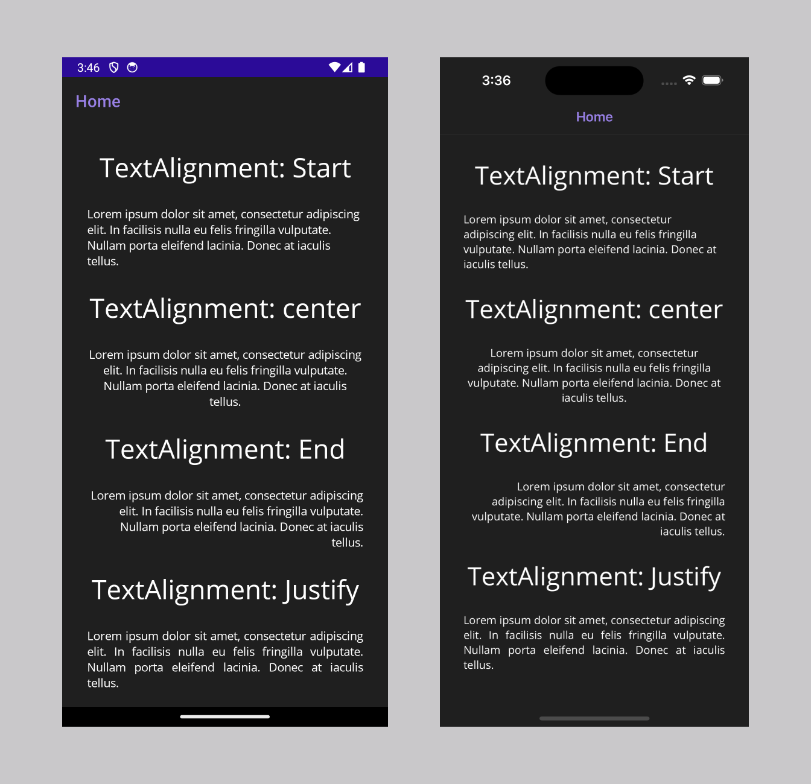

# .NET MAUI updates in .NET 9 Release Candidate 1

Here's a summary of what's new in .NET MAUI in this release:

* [Added `HorizontalTextAlignment.Justify`](#added-horizontaltextalignmentjustify)
* [Updates to HybridWebView to invoke JavaScript methods, and updated HybridWebView.js](#hybridwebview-updates)

.NET MAUI updates in .NET 9 Release Candidate 1:

This release is focused on quality, housekeeping, and resolving issues to stabilize the impending GA release.

* [Release notes](dotnetmaui.md)
* [What's new in .NET MAUI in .NET 9](https://learn.microsoft.com/dotnet/maui/whats-new/dotnet-9) documentation.
* [GitHub Release](https://aka.ms/maui9rc1)

.NET 9 Release Candidate 1:

* [Discussion](https://aka.ms/dotnet/9/rc1)
* [Release notes](README.md)

## Added `HorizontalTextAlignment.Justify`

In addition to `Start`, `Center`, and `End` you can now use `Justify` to horizontally align your text in `Label`s.

```xml
<Label
  Text="Lorem ipsum dolor sit amet, consectetur adipiscing elit. In facilisis nulla eu felis fringilla vulputate. Nullam porta eleifend lacinia. Donec at iaculis tellus."
  HorizontalTextAlignment="Justify"/>
```



## HybridWebView Updates

### Update to .NET 9 RC1 script

To update your HybridWebView app from .NET 9 Preview 7 to .NET 9 RC1, update the contents of your app's `HybridWebView.js` file to match these contents: https://github.com/dotnet/maui/blob/release/9.0.1xx-rc1/src/Controls/samples/Controls.Sample/Resources/Raw/HybridSamplePage/scripts/HybridWebView.js

### Invoke JavaScript methods from C#

Your app's C# code can directly invoke JavaScript methods within the HybridWebView. Both synchronous and asynchronous method invokation are supported. Internally, the parameters and return values are JSON encoded. Both synchronous and asynchronous JavaScript methods are supported.

For example, this JavaScript method (as defined in a file such as `index.html`):

```js
function AddNumbers(a, b) {
    return a + b;
}
```

Can be invoked from C# using this code:

```csharp
var x = 123d;
var y = 321d;
var result = await hwv.InvokeJavaScriptAsync<double>(
	"AddNumbers",
	HybridSampleJsContext.Default.Double,
	[x, y],
	[HybridSampleJsContext.Default.Double, HybridSampleJsContext.Default.Double]);
```

The method invokation requires specifying `JsonTypeInfo` objects that include serialization information for the types used in the operation. These objects are automatically created by including this partial class in the project:

```csharp
	[JsonSourceGenerationOptions(WriteIndented = true)]
	[JsonSerializable(typeof(double))]
	internal partial class HybridSampleJsContext : JsonSerializerContext
	{
	}
```

Note: This type must be marked as `partial` so that code generation can provide the implementation when the project is compiled. If this type is nested into another type, then that type must also be marked as `partial`.

## .NET for Android

This release was focused on quality improvements.

* [GitHub Release](https://github.com/xamarin/xamarin-android/releases/)

## .NET for iOS

This release was focused on quality improvements. Using this release requires the use of Xcode 15.4 for building apps.

* [GitHub Release](https://github.com/xamarin/xamarin-macios/releases/)
* [Known issues](https://github.com/xamarin/xamarin-macios/wiki/Known-issues-in-.NET9)

## Community Contributions

Thank you to our community contributors [@MartyIX](https://github.com/MartyIX), [@albyrock87](https://github.com/albyrock87), [@jpiechowiak](https://github.com/jpiechowiak), [@dhindrik](https://github.com/dhindrik), [@TommiGustafsson-HMP](https://github.com/TommiGustafsson-HMP), [@kubaflo](https://github.com/kubaflo), [@Tamilarasan-Paranthaman](https://github.com/Tamilarasan-Paranthaman), [@Vignesh-SF3580](https://github.com/Vignesh-SF3580), and [@daltzctr](https://github.com/daltzctr).
